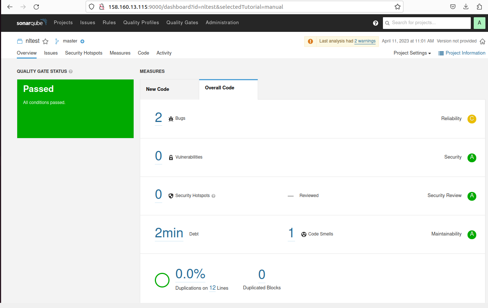
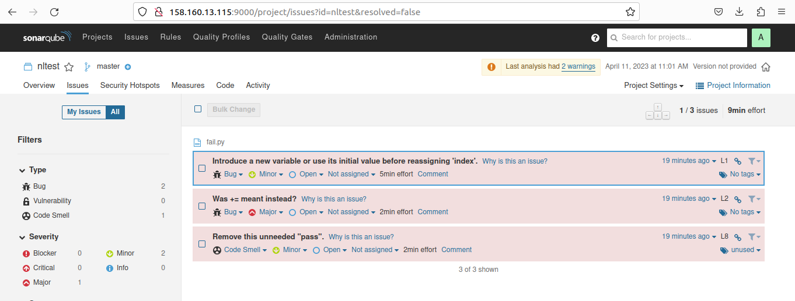
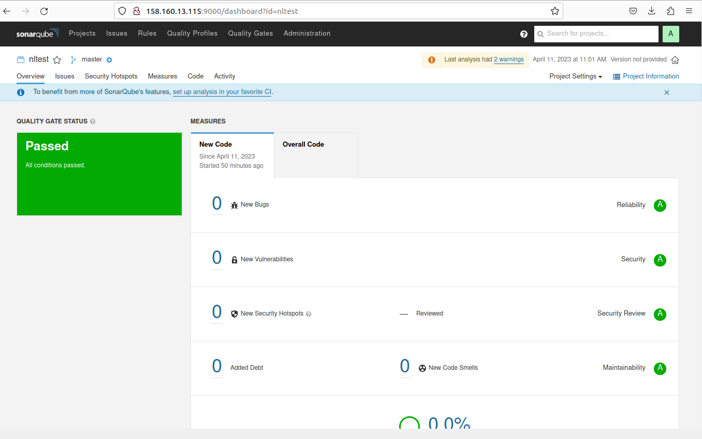
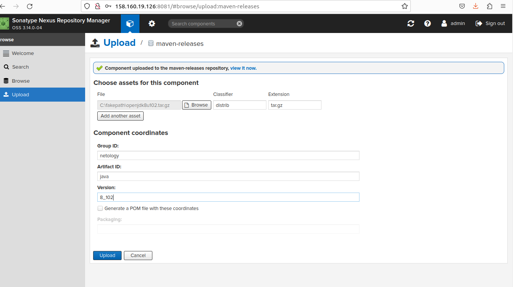
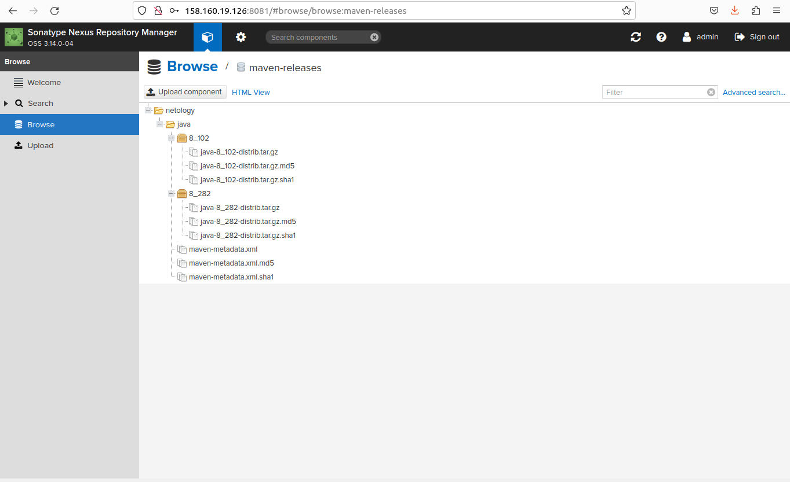

# Домашнее задание к занятию "9.Процессы CI/CD"

## Подготовка к выполнению

1. Создаём 2 VM в yandex cloud со следующими параметрами: 2CPU 4RAM Centos7(остальное по минимальным требованиям)
2. Прописываем в [inventory](./infrastructure/inventory/cicd/hosts.yml) [playbook'a](./infrastructure/site.yml) созданные хосты
3. Добавляем в [files](./infrastructure/files/) файл со своим публичным ключом (id_rsa.pub). Если ключ называется иначе - найдите таску в плейбуке, которая использует id_rsa.pub имя и исправьте на своё
4. Запускаем playbook, ожидаем успешного завершения
5. Проверяем готовность Sonarqube через [браузер](http://localhost:9000)
6. Заходим под admin\admin, меняем пароль на свой
7.  Проверяем готовность Nexus через [бразуер](http://localhost:8081)
8. Подключаемся под admin\admin123, меняем пароль, сохраняем анонимный доступ

## Знакомоство с SonarQube

### Основная часть

1. Создаём новый проект, название произвольное
2. Скачиваем пакет sonar-scanner, который нам предлагает скачать сам sonarqube
3. Делаем так, чтобы binary был доступен через вызов в shell (или меняем переменную PATH или любой другой удобный вам способ)
4. Проверяем `sonar-scanner --version`

```commandline
sonar-scanner --version
INFO: Scanner configuration file: /home/oleg/soft/sonar-scanner/conf/sonar-scanner.properties
INFO: Project root configuration file: NONE
INFO: SonarScanner 4.8.0.2856
INFO: Java 11.0.17 Eclipse Adoptium (64-bit)
INFO: Linux 5.19.0-35-generic amd64
```

5. Запускаем анализатор против кода из директории [example](./example) с дополнительным ключом `-Dsonar.coverage.exclusions=fail.py`

<details>
<summary>Expand</summary>

```commandline
sonar-scanner \
> -Dsonar.projectKey=nltest \
> -Dsonar.sources=. \
> -Dsonar.host.url=http://158.160.13.115:9000 \
> -Dsonar.login=304d9c4e7d263c0fd9b13064c1ba727910b73364 \
> -Dsonar.coverage.exclusions=fail.py
INFO: Scanner configuration file: /home/oleg/soft/sonar-scanner/conf/sonar-scanner.properties
INFO: Project root configuration file: NONE
INFO: SonarScanner 4.8.0.2856
INFO: Java 11.0.17 Eclipse Adoptium (64-bit)
INFO: Linux 5.19.0-35-generic amd64
INFO: User cache: /home/oleg/.sonar/cache
INFO: Analyzing on SonarQube server 9.1.0
INFO: Default locale: "en_US", source code encoding: "UTF-8" (analysis is platform dependent)
INFO: Load global settings
INFO: Load global settings (done) | time=144ms
INFO: Server id: 9CFC3560-AYdqqqPVc_2Cnyycw7VO
INFO: User cache: /home/oleg/.sonar/cache
INFO: Load/download plugins
INFO: Load plugins index
INFO: Load plugins index (done) | time=64ms
INFO: Load/download plugins (done) | time=34486ms
INFO: Process project properties
INFO: Process project properties (done) | time=7ms
INFO: Execute project builders
INFO: Execute project builders (done) | time=1ms
INFO: Project key: nltest
INFO: Base dir: /media/sf_SHARE/devops-netology/09-ci-03-cicd/example
INFO: Working dir: /media/sf_SHARE/devops-netology/09-ci-03-cicd/example/.scannerwork
INFO: Load project settings for component key: 'nltest'
INFO: Load project settings for component key: 'nltest' (done) | time=48ms
INFO: Load quality profiles
INFO: Load quality profiles (done) | time=2060ms
INFO: Load active rules
INFO: Load active rules (done) | time=2499ms
INFO: Indexing files...
INFO: Project configuration:
INFO:   Excluded sources for coverage: fail.py
INFO: 1 file indexed
INFO: 0 files ignored because of scm ignore settings
INFO: Quality profile for py: Sonar way
INFO: ------------- Run sensors on module nltest
INFO: Load metrics repository
INFO: Load metrics repository (done) | time=49ms
INFO: Sensor Python Sensor [python]
WARN: Your code is analyzed as compatible with python 2 and 3 by default. This will prevent the detection of issues specific to python 2 or python 3. You can get a more precise analysis by setting a python version in your configuration via the parameter "sonar.python.version"
INFO: Starting global symbols computation
INFO: 1 source file to be analyzed
INFO: Load project repositories
INFO: Load project repositories (done) | time=42ms
INFO: 1/1 source file has been analyzed
INFO: Starting rules execution
INFO: 1 source file to be analyzed
INFO: 1/1 source file has been analyzed
INFO: Sensor Python Sensor [python] (done) | time=836ms
INFO: Sensor Cobertura Sensor for Python coverage [python]
INFO: Sensor Cobertura Sensor for Python coverage [python] (done) | time=22ms
INFO: Sensor PythonXUnitSensor [python]
INFO: Sensor PythonXUnitSensor [python] (done) | time=3ms
INFO: Sensor CSS Rules [cssfamily]
INFO: No CSS, PHP, HTML or VueJS files are found in the project. CSS analysis is skipped.
INFO: Sensor CSS Rules [cssfamily] (done) | time=2ms
INFO: Sensor JaCoCo XML Report Importer [jacoco]
INFO: 'sonar.coverage.jacoco.xmlReportPaths' is not defined. Using default locations: target/site/jacoco/jacoco.xml,target/site/jacoco-it/jacoco.xml,build/reports/jacoco/test/jacocoTestReport.xml
INFO: No report imported, no coverage information will be imported by JaCoCo XML Report Importer
INFO: Sensor JaCoCo XML Report Importer [jacoco] (done) | time=9ms
INFO: Sensor C# Project Type Information [csharp]
INFO: Sensor C# Project Type Information [csharp] (done) | time=1ms
INFO: Sensor C# Analysis Log [csharp]
INFO: Sensor C# Analysis Log [csharp] (done) | time=20ms
INFO: Sensor C# Properties [csharp]
INFO: Sensor C# Properties [csharp] (done) | time=0ms
INFO: Sensor JavaXmlSensor [java]
INFO: Sensor JavaXmlSensor [java] (done) | time=2ms
INFO: Sensor HTML [web]
INFO: Sensor HTML [web] (done) | time=4ms
INFO: Sensor VB.NET Project Type Information [vbnet]
INFO: Sensor VB.NET Project Type Information [vbnet] (done) | time=1ms
INFO: Sensor VB.NET Analysis Log [vbnet]
INFO: Sensor VB.NET Analysis Log [vbnet] (done) | time=23ms
INFO: Sensor VB.NET Properties [vbnet]
INFO: Sensor VB.NET Properties [vbnet] (done) | time=0ms
INFO: ------------- Run sensors on project
INFO: Sensor Zero Coverage Sensor
INFO: Sensor Zero Coverage Sensor (done) | time=1ms
INFO: SCM Publisher SCM provider for this project is: git
INFO: SCM Publisher 1 source file to be analyzed
INFO: SCM Publisher 0/1 source files have been analyzed (done) | time=142ms
WARN: Missing blame information for the following files:
WARN:   * fail.py
WARN: This may lead to missing/broken features in SonarQube
INFO: CPD Executor Calculating CPD for 1 file
INFO: CPD Executor CPD calculation finished (done) | time=18ms
INFO: Analysis report generated in 119ms, dir size=103.2 kB
INFO: Analysis report compressed in 145ms, zip size=14.2 kB
INFO: Analysis report uploaded in 69ms
INFO: ANALYSIS SUCCESSFUL, you can browse http://158.160.13.115:9000/dashboard?id=nltest
INFO: Note that you will be able to access the updated dashboard once the server has processed the submitted analysis report
INFO: More about the report processing at http://158.160.13.115:9000/api/ce/task?id=AYdvVUFqvlgZBcuHRC9O
INFO: Analysis total time: 8.101 s
INFO: ------------------------------------------------------------------------
INFO: EXECUTION SUCCESS
INFO: ------------------------------------------------------------------------
INFO: Total time: 50.150s
INFO: Final Memory: 8M/30M
INFO: ------------------------------------------------------------------------
```

</details>

6. Смотрим результат в интерфейсе




7. Исправляем ошибки, которые он выявил(включая warnings)

```commandline
def increment(param):
   param += 1
   return param
def get_square(numb):
   return numb*numb
def print_numb(numb):
   print("Number is {}".format(numb))

index = 0
while (index < 10):
   index = increment(index)
   print(get_square(index))
```

8. Запускаем анализатор повторно - проверяем, что QG пройдены успешно
9. Делаем скриншот успешного прохождения анализа, прикладываем к решению ДЗ



## Знакомство с Nexus

### Основная часть

1. В репозиторий `maven-public` загружаем артефакт с GAV параметрами:
   1. groupId: netology
   2. artifactId: java
   3. version: 8_282
   4. classifier: distrib
   5. type: tar.gz
2. В него же загружаем такой же артефакт, но с version: 8_102



3. Проверяем, что все файлы загрузились успешно



4. В ответе присылаем файл `maven-metadata.xml` для этого артефекта

[maven-metadata.xml](maven-metadata.xml)

### Знакомство с Maven

### Подготовка к выполнению

1. Скачиваем дистрибутив с [maven](https://maven.apache.org/download.cgi)
2. Разархивируем, делаем так, чтобы binary был доступен через вызов в shell (или меняем переменную PATH или любой другой удобный вам способ)
3. Удаляем из `apache-maven-<version>/conf/settings.xml` упоминание о правиле, отвергающем http соединение( раздел mirrors->id: my-repository-http-unblocker)
4. Проверяем `mvn --version`

```commandline
mvn --version
Apache Maven 3.9.1 (2e178502fcdbffc201671fb2537d0cb4b4cc58f8)
Maven home: /home/oleg/soft/apache-maven
Java version: 11.0.18, vendor: Ubuntu, runtime: /usr/lib/jvm/java-11-openjdk-amd64
Default locale: en_US, platform encoding: UTF-8
OS name: "linux", version: "5.19.0-35-generic", arch: "amd64", family: "unix"
```

5. Забираем директорию [mvn](./mvn) с pom

### Основная часть

1. Меняем в `pom.xml` блок с зависимостями под наш артефакт из первого пункта задания для Nexus (java с версией 8_282)
2. Запускаем команду `mvn package` в директории с `pom.xml`, ожидаем успешного окончания

<details>
<summary>Expand</summary>

```commandline
mvn package
[INFO] Scanning for projects...
[INFO] 
[INFO] --------------------< com.netology.app:simple-app >---------------------
[INFO] Building simple-app 1.0-SNAPSHOT
[INFO]   from pom.xml
[INFO] --------------------------------[ jar ]---------------------------------
Downloading from central: https://repo.maven.apache.org/maven2/org/apache/maven/plugins/maven-resources-plugin/3.3.0/maven-resources-plugin-3.3.0.pom
Downloaded from central: https://repo.maven.apache.org/maven2/org/apache/maven/plugins/maven-resources-plugin/3.3.0/maven-resources-plugin-3.3.0.pom (8.5 kB at 16 kB/s)
Downloading from central: https://repo.maven.apache.org/maven2/org/apache/maven/plugins/maven-plugins/36/maven-plugins-36.pom
Downloaded from central: https://repo.maven.apache.org/maven2/org/apache/maven/plugins/maven-plugins/36/maven-plugins-36.pom (9.9 kB at 146 kB/s)
Downloading from central: https://repo.maven.apache.org/maven2/org/apache/maven/maven-parent/36/maven-parent-36.pom
Downloaded from central: https://repo.maven.apache.org/maven2/org/apache/maven/maven-parent/36/maven-parent-36.pom (45 kB at 350 kB/s)
Downloading from central: https://repo.maven.apache.org/maven2/org/apache/apache/26/apache-26.pom
Downloaded from central: https://repo.maven.apache.org/maven2/org/apache/apache/26/apache-26.pom (21 kB at 326 kB/s)
Downloading from central: https://repo.maven.apache.org/maven2/org/apache/maven/plugins/maven-resources-plugin/3.3.0/maven-resources-plugin-3.3.0.jar
Downloaded from central: https://repo.maven.apache.org/maven2/org/apache/maven/plugins/maven-resources-plugin/3.3.0/maven-resources-plugin-3.3.0.jar (32 kB at 454 kB/s)
Downloading from central: https://repo.maven.apache.org/maven2/org/apache/maven/plugins/maven-compiler-plugin/3.10.1/maven-compiler-plugin-3.10.1.pom
Downloaded from central: https://repo.maven.apache.org/maven2/org/apache/maven/plugins/maven-compiler-plugin/3.10.1/maven-compiler-plugin-3.10.1.pom (13 kB at 183 kB/s)
Downloading from central: https://repo.maven.apache.org/maven2/org/apache/maven/plugins/maven-plugins/34/maven-plugins-34.pom
Downloaded from central: https://repo.maven.apache.org/maven2/org/apache/maven/plugins/maven-plugins/34/maven-plugins-34.pom (11 kB at 178 kB/s)
Downloading from central: https://repo.maven.apache.org/maven2/org/apache/maven/maven-parent/34/maven-parent-34.pom
Downloaded from central: https://repo.maven.apache.org/maven2/org/apache/maven/maven-parent/34/maven-parent-34.pom (43 kB at 649 kB/s)
Downloading from central: https://repo.maven.apache.org/maven2/org/apache/apache/23/apache-23.pom
Downloaded from central: https://repo.maven.apache.org/maven2/org/apache/apache/23/apache-23.pom (18 kB at 318 kB/s)
Downloading from central: https://repo.maven.apache.org/maven2/org/apache/maven/plugins/maven-compiler-plugin/3.10.1/maven-compiler-plugin-3.10.1.jar
Downloaded from central: https://repo.maven.apache.org/maven2/org/apache/maven/plugins/maven-compiler-plugin/3.10.1/maven-compiler-plugin-3.10.1.jar (62 kB at 804 kB/s)
Downloading from central: https://repo.maven.apache.org/maven2/org/apache/maven/plugins/maven-surefire-plugin/3.0.0/maven-surefire-plugin-3.0.0.pom
Downloaded from central: https://repo.maven.apache.org/maven2/org/apache/maven/plugins/maven-surefire-plugin/3.0.0/maven-surefire-plugin-3.0.0.pom (5.9 kB at 102 kB/s)
Downloading from central: https://repo.maven.apache.org/maven2/org/apache/maven/surefire/surefire/3.0.0/surefire-3.0.0.pom
Downloaded from central: https://repo.maven.apache.org/maven2/org/apache/maven/surefire/surefire/3.0.0/surefire-3.0.0.pom (22 kB at 325 kB/s)
Downloading from central: https://repo.maven.apache.org/maven2/org/apache/maven/maven-parent/39/maven-parent-39.pom
Downloaded from central: https://repo.maven.apache.org/maven2/org/apache/maven/maven-parent/39/maven-parent-39.pom (48 kB at 716 kB/s)
Downloading from central: https://repo.maven.apache.org/maven2/org/apache/apache/29/apache-29.pom
Downloaded from central: https://repo.maven.apache.org/maven2/org/apache/apache/29/apache-29.pom (21 kB at 364 kB/s)
Downloading from central: https://repo.maven.apache.org/maven2/org/apache/maven/plugins/maven-surefire-plugin/3.0.0/maven-surefire-plugin-3.0.0.jar
Downloaded from central: https://repo.maven.apache.org/maven2/org/apache/maven/plugins/maven-surefire-plugin/3.0.0/maven-surefire-plugin-3.0.0.jar (43 kB at 677 kB/s)
Downloading from central: https://repo.maven.apache.org/maven2/org/apache/maven/plugins/maven-jar-plugin/3.3.0/maven-jar-plugin-3.3.0.pom
Downloaded from central: https://repo.maven.apache.org/maven2/org/apache/maven/plugins/maven-jar-plugin/3.3.0/maven-jar-plugin-3.3.0.pom (6.8 kB at 119 kB/s)
Downloading from central: https://repo.maven.apache.org/maven2/org/apache/maven/plugins/maven-plugins/37/maven-plugins-37.pom
Downloaded from central: https://repo.maven.apache.org/maven2/org/apache/maven/plugins/maven-plugins/37/maven-plugins-37.pom (9.9 kB at 180 kB/s)
Downloading from central: https://repo.maven.apache.org/maven2/org/apache/maven/maven-parent/37/maven-parent-37.pom
Downloaded from central: https://repo.maven.apache.org/maven2/org/apache/maven/maven-parent/37/maven-parent-37.pom (46 kB at 671 kB/s)
Downloading from central: https://repo.maven.apache.org/maven2/org/apache/apache/27/apache-27.pom
Downloaded from central: https://repo.maven.apache.org/maven2/org/apache/apache/27/apache-27.pom (20 kB at 309 kB/s)
Downloading from central: https://repo.maven.apache.org/maven2/org/apache/maven/plugins/maven-jar-plugin/3.3.0/maven-jar-plugin-3.3.0.jar
Downloaded from central: https://repo.maven.apache.org/maven2/org/apache/maven/plugins/maven-jar-plugin/3.3.0/maven-jar-plugin-3.3.0.jar (27 kB at 463 kB/s)
Downloading from my-repo: http://158.160.19.126:8081/repository/maven-public/netology/java/8_282/java-8_282.pom
Downloading from central: https://repo.maven.apache.org/maven2/netology/java/8_282/java-8_282.pom
[WARNING] The POM for netology:java:tar.gz:distrib:8_282 is missing, no dependency information available
Downloading from my-repo: http://158.160.19.126:8081/repository/maven-public/netology/java/8_282/java-8_282-distrib.tar.gz
Downloaded from my-repo: http://158.160.19.126:8081/repository/maven-public/netology/java/8_282/java-8_282-distrib.tar.gz (58 MB at 4.4 MB/s)
[INFO] 
[INFO] --- resources:3.3.0:resources (default-resources) @ simple-app ---
Downloading from central: https://repo.maven.apache.org/maven2/org/codehaus/plexus/plexus-interpolation/1.26/plexus-interpolation-1.26.pom
Downloaded from central: https://repo.maven.apache.org/maven2/org/codehaus/plexus/plexus-interpolation/1.26/plexus-interpolation-1.26.pom (2.7 kB at 37 kB/s)
Downloading from central: https://repo.maven.apache.org/maven2/org/codehaus/plexus/plexus/5.1/plexus-5.1.pom
Downloaded from central: https://repo.maven.apache.org/maven2/org/codehaus/plexus/plexus/5.1/plexus-5.1.pom (23 kB at 375 kB/s)
Downloading from central: https://repo.maven.apache.org/maven2/org/apache/maven/shared/maven-filtering/3.3.0/maven-filtering-3.3.0.pom
Downloaded from central: https://repo.maven.apache.org/maven2/org/apache/maven/shared/maven-filtering/3.3.0/maven-filtering-3.3.0.pom (6.9 kB at 126 kB/s)
Downloading from central: https://repo.maven.apache.org/maven2/org/apache/maven/shared/maven-shared-components/36/maven-shared-components-36.pom
Downloaded from central: https://repo.maven.apache.org/maven2/org/apache/maven/shared/maven-shared-components/36/maven-shared-components-36.pom (4.9 kB at 91 kB/s)
Downloading from central: https://repo.maven.apache.org/maven2/javax/inject/javax.inject/1/javax.inject-1.pom
Downloaded from central: https://repo.maven.apache.org/maven2/javax/inject/javax.inject/1/javax.inject-1.pom (612 B at 11 kB/s)
Downloading from central: https://repo.maven.apache.org/maven2/org/slf4j/slf4j-api/1.7.36/slf4j-api-1.7.36.pom
Downloaded from central: https://repo.maven.apache.org/maven2/org/slf4j/slf4j-api/1.7.36/slf4j-api-1.7.36.pom (2.7 kB at 52 kB/s)
Downloading from central: https://repo.maven.apache.org/maven2/org/slf4j/slf4j-parent/1.7.36/slf4j-parent-1.7.36.pom
Downloaded from central: https://repo.maven.apache.org/maven2/org/slf4j/slf4j-parent/1.7.36/slf4j-parent-1.7.36.pom (14 kB at 256 kB/s)
Downloading from central: https://repo.maven.apache.org/maven2/org/sonatype/plexus/plexus-build-api/0.0.7/plexus-build-api-0.0.7.pom
Downloaded from central: https://repo.maven.apache.org/maven2/org/sonatype/plexus/plexus-build-api/0.0.7/plexus-build-api-0.0.7.pom (3.2 kB at 59 kB/s)
Downloading from central: https://repo.maven.apache.org/maven2/org/sonatype/spice/spice-parent/15/spice-parent-15.pom
Downloaded from central: https://repo.maven.apache.org/maven2/org/sonatype/spice/spice-parent/15/spice-parent-15.pom (8.4 kB at 158 kB/s)
Downloading from central: https://repo.maven.apache.org/maven2/org/sonatype/forge/forge-parent/5/forge-parent-5.pom
Downloaded from central: https://repo.maven.apache.org/maven2/org/sonatype/forge/forge-parent/5/forge-parent-5.pom (8.4 kB at 149 kB/s)
Downloading from central: https://repo.maven.apache.org/maven2/org/codehaus/plexus/plexus-utils/3.3.0/plexus-utils-3.3.0.pom
Downloaded from central: https://repo.maven.apache.org/maven2/org/codehaus/plexus/plexus-utils/3.3.0/plexus-utils-3.3.0.pom (5.2 kB at 82 kB/s)
Downloading from central: https://repo.maven.apache.org/maven2/commons-io/commons-io/2.11.0/commons-io-2.11.0.pom
Downloaded from central: https://repo.maven.apache.org/maven2/commons-io/commons-io/2.11.0/commons-io-2.11.0.pom (20 kB at 346 kB/s)
Downloading from central: https://repo.maven.apache.org/maven2/org/apache/commons/commons-parent/52/commons-parent-52.pom
Downloaded from central: https://repo.maven.apache.org/maven2/org/apache/commons/commons-parent/52/commons-parent-52.pom (79 kB at 1.0 MB/s)
Downloading from central: https://repo.maven.apache.org/maven2/org/junit/junit-bom/5.7.2/junit-bom-5.7.2.pom
Downloaded from central: https://repo.maven.apache.org/maven2/org/junit/junit-bom/5.7.2/junit-bom-5.7.2.pom (5.1 kB at 93 kB/s)
Downloading from central: https://repo.maven.apache.org/maven2/org/apache/commons/commons-lang3/3.12.0/commons-lang3-3.12.0.pom
Downloaded from central: https://repo.maven.apache.org/maven2/org/apache/commons/commons-lang3/3.12.0/commons-lang3-3.12.0.pom (31 kB at 520 kB/s)
Downloading from central: https://repo.maven.apache.org/maven2/org/junit/junit-bom/5.7.1/junit-bom-5.7.1.pom
Downloaded from central: https://repo.maven.apache.org/maven2/org/junit/junit-bom/5.7.1/junit-bom-5.7.1.pom (5.1 kB at 82 kB/s)
Downloading from central: https://repo.maven.apache.org/maven2/org/codehaus/plexus/plexus-interpolation/1.26/plexus-interpolation-1.26.jar
Downloaded from central: https://repo.maven.apache.org/maven2/org/codehaus/plexus/plexus-interpolation/1.26/plexus-interpolation-1.26.jar (85 kB at 918 kB/s)
Downloading from central: https://repo.maven.apache.org/maven2/org/apache/maven/shared/maven-filtering/3.3.0/maven-filtering-3.3.0.jar
Downloading from central: https://repo.maven.apache.org/maven2/org/slf4j/slf4j-api/1.7.36/slf4j-api-1.7.36.jar
Downloading from central: https://repo.maven.apache.org/maven2/javax/inject/javax.inject/1/javax.inject-1.jar
Downloading from central: https://repo.maven.apache.org/maven2/org/sonatype/plexus/plexus-build-api/0.0.7/plexus-build-api-0.0.7.jar
Downloading from central: https://repo.maven.apache.org/maven2/org/codehaus/plexus/plexus-utils/3.3.0/plexus-utils-3.3.0.jar
Downloaded from central: https://repo.maven.apache.org/maven2/javax/inject/javax.inject/1/javax.inject-1.jar (2.5 kB at 29 kB/s)
Downloading from central: https://repo.maven.apache.org/maven2/commons-io/commons-io/2.11.0/commons-io-2.11.0.jar
Downloaded from central: https://repo.maven.apache.org/maven2/org/sonatype/plexus/plexus-build-api/0.0.7/plexus-build-api-0.0.7.jar (8.5 kB at 41 kB/s)
Downloading from central: https://repo.maven.apache.org/maven2/org/apache/commons/commons-lang3/3.12.0/commons-lang3-3.12.0.jar
Downloaded from central: https://repo.maven.apache.org/maven2/commons-io/commons-io/2.11.0/commons-io-2.11.0.jar (327 kB at 1.3 MB/s)
Downloaded from central: https://repo.maven.apache.org/maven2/org/slf4j/slf4j-api/1.7.36/slf4j-api-1.7.36.jar (41 kB at 152 kB/s)
Downloaded from central: https://repo.maven.apache.org/maven2/org/apache/maven/shared/maven-filtering/3.3.0/maven-filtering-3.3.0.jar (55 kB at 197 kB/s)
Downloaded from central: https://repo.maven.apache.org/maven2/org/codehaus/plexus/plexus-utils/3.3.0/plexus-utils-3.3.0.jar (263 kB at 700 kB/s)
Downloaded from central: https://repo.maven.apache.org/maven2/org/apache/commons/commons-lang3/3.12.0/commons-lang3-3.12.0.jar (587 kB at 1.1 MB/s)
[WARNING] Using platform encoding (UTF-8 actually) to copy filtered resources, i.e. build is platform dependent!
[INFO] skip non existing resourceDirectory /media/sf_SHARE/devops-netology/09-ci-03-cicd/mvn/src/main/resources
[INFO] 
[INFO] --- compiler:3.10.1:compile (default-compile) @ simple-app ---
Downloading from central: https://repo.maven.apache.org/maven2/org/apache/maven/shared/maven-shared-utils/3.3.4/maven-shared-utils-3.3.4.pom
Downloaded from central: https://repo.maven.apache.org/maven2/org/apache/maven/shared/maven-shared-utils/3.3.4/maven-shared-utils-3.3.4.pom (5.8 kB at 88 kB/s)
Downloading from central: https://repo.maven.apache.org/maven2/org/apache/maven/shared/maven-shared-components/34/maven-shared-components-34.pom
Downloaded from central: https://repo.maven.apache.org/maven2/org/apache/maven/shared/maven-shared-components/34/maven-shared-components-34.pom (5.1 kB at 70 kB/s)
Downloading from central: https://repo.maven.apache.org/maven2/commons-io/commons-io/2.6/commons-io-2.6.pom
Downloaded from central: https://repo.maven.apache.org/maven2/commons-io/commons-io/2.6/commons-io-2.6.pom (14 kB at 255 kB/s)
Downloading from central: https://repo.maven.apache.org/maven2/org/apache/commons/commons-parent/42/commons-parent-42.pom
Downloaded from central: https://repo.maven.apache.org/maven2/org/apache/commons/commons-parent/42/commons-parent-42.pom (68 kB at 906 kB/s)
Downloading from central: https://repo.maven.apache.org/maven2/org/apache/apache/18/apache-18.pom
Downloaded from central: https://repo.maven.apache.org/maven2/org/apache/apache/18/apache-18.pom (16 kB at 261 kB/s)
Downloading from central: https://repo.maven.apache.org/maven2/org/apache/maven/shared/maven-shared-incremental/1.1/maven-shared-incremental-1.1.pom
Downloaded from central: https://repo.maven.apache.org/maven2/org/apache/maven/shared/maven-shared-incremental/1.1/maven-shared-incremental-1.1.pom (4.7 kB at 86 kB/s)
Downloading from central: https://repo.maven.apache.org/maven2/org/apache/maven/shared/maven-shared-components/19/maven-shared-components-19.pom
Downloaded from central: https://repo.maven.apache.org/maven2/org/apache/maven/shared/maven-shared-components/19/maven-shared-components-19.pom (6.4 kB at 118 kB/s)
Downloading from central: https://repo.maven.apache.org/maven2/org/apache/maven/maven-parent/23/maven-parent-23.pom
Downloaded from central: https://repo.maven.apache.org/maven2/org/apache/maven/maven-parent/23/maven-parent-23.pom (33 kB at 429 kB/s)
Downloading from central: https://repo.maven.apache.org/maven2/org/apache/apache/13/apache-13.pom
Downloaded from central: https://repo.maven.apache.org/maven2/org/apache/apache/13/apache-13.pom (14 kB at 254 kB/s)
Downloading from central: https://repo.maven.apache.org/maven2/org/codehaus/plexus/plexus-component-annotations/2.0.0/plexus-component-annotations-2.0.0.pom
Downloaded from central: https://repo.maven.apache.org/maven2/org/codehaus/plexus/plexus-component-annotations/2.0.0/plexus-component-annotations-2.0.0.pom (750 B at 13 kB/s)
Downloading from central: https://repo.maven.apache.org/maven2/org/codehaus/plexus/plexus-containers/2.0.0/plexus-containers-2.0.0.pom
Downloaded from central: https://repo.maven.apache.org/maven2/org/codehaus/plexus/plexus-containers/2.0.0/plexus-containers-2.0.0.pom (4.8 kB at 89 kB/s)
Downloading from central: https://repo.maven.apache.org/maven2/org/codehaus/plexus/plexus-java/1.1.1/plexus-java-1.1.1.pom
Downloaded from central: https://repo.maven.apache.org/maven2/org/codehaus/plexus/plexus-java/1.1.1/plexus-java-1.1.1.pom (5.0 kB at 90 kB/s)
Downloading from central: https://repo.maven.apache.org/maven2/org/codehaus/plexus/plexus-languages/1.1.1/plexus-languages-1.1.1.pom
Downloaded from central: https://repo.maven.apache.org/maven2/org/codehaus/plexus/plexus-languages/1.1.1/plexus-languages-1.1.1.pom (4.6 kB at 76 kB/s)
Downloading from central: https://repo.maven.apache.org/maven2/org/codehaus/plexus/plexus/8/plexus-8.pom
Downloaded from central: https://repo.maven.apache.org/maven2/org/codehaus/plexus/plexus/8/plexus-8.pom (25 kB at 431 kB/s)
Downloading from central: https://repo.maven.apache.org/maven2/org/ow2/asm/asm/9.2/asm-9.2.pom
Downloaded from central: https://repo.maven.apache.org/maven2/org/ow2/asm/asm/9.2/asm-9.2.pom (2.4 kB at 35 kB/s)
Downloading from central: https://repo.maven.apache.org/maven2/org/ow2/ow2/1.5/ow2-1.5.pom
Downloaded from central: https://repo.maven.apache.org/maven2/org/ow2/ow2/1.5/ow2-1.5.pom (11 kB at 208 kB/s)
Downloading from central: https://repo.maven.apache.org/maven2/com/thoughtworks/qdox/qdox/2.0.1/qdox-2.0.1.pom
Downloaded from central: https://repo.maven.apache.org/maven2/com/thoughtworks/qdox/qdox/2.0.1/qdox-2.0.1.pom (16 kB at 246 kB/s)
Downloading from central: https://repo.maven.apache.org/maven2/org/sonatype/oss/oss-parent/9/oss-parent-9.pom
Downloaded from central: https://repo.maven.apache.org/maven2/org/sonatype/oss/oss-parent/9/oss-parent-9.pom (6.6 kB at 122 kB/s)
Downloading from central: https://repo.maven.apache.org/maven2/org/codehaus/plexus/plexus-compiler-api/2.11.1/plexus-compiler-api-2.11.1.pom
Downloaded from central: https://repo.maven.apache.org/maven2/org/codehaus/plexus/plexus-compiler-api/2.11.1/plexus-compiler-api-2.11.1.pom (1.1 kB at 13 kB/s)
Downloading from central: https://repo.maven.apache.org/maven2/org/codehaus/plexus/plexus-compiler/2.11.1/plexus-compiler-2.11.1.pom
Downloaded from central: https://repo.maven.apache.org/maven2/org/codehaus/plexus/plexus-compiler/2.11.1/plexus-compiler-2.11.1.pom (8.1 kB at 108 kB/s)
Downloading from central: https://repo.maven.apache.org/maven2/org/codehaus/plexus/plexus-components/6.6/plexus-components-6.6.pom
Downloaded from central: https://repo.maven.apache.org/maven2/org/codehaus/plexus/plexus-components/6.6/plexus-components-6.6.pom (2.7 kB at 51 kB/s)
Downloading from central: https://repo.maven.apache.org/maven2/org/junit/junit-bom/5.8.2/junit-bom-5.8.2.pom
Downloaded from central: https://repo.maven.apache.org/maven2/org/junit/junit-bom/5.8.2/junit-bom-5.8.2.pom (5.6 kB at 106 kB/s)
Downloading from central: https://repo.maven.apache.org/maven2/org/codehaus/plexus/plexus-utils/3.4.1/plexus-utils-3.4.1.pom
Downloaded from central: https://repo.maven.apache.org/maven2/org/codehaus/plexus/plexus-utils/3.4.1/plexus-utils-3.4.1.pom (8.0 kB at 140 kB/s)
Downloading from central: https://repo.maven.apache.org/maven2/org/codehaus/plexus/plexus-compiler-manager/2.11.1/plexus-compiler-manager-2.11.1.pom
Downloaded from central: https://repo.maven.apache.org/maven2/org/codehaus/plexus/plexus-compiler-manager/2.11.1/plexus-compiler-manager-2.11.1.pom (1.1 kB at 21 kB/s)
Downloading from central: https://repo.maven.apache.org/maven2/org/codehaus/plexus/plexus-compiler-javac/2.11.1/plexus-compiler-javac-2.11.1.pom
Downloaded from central: https://repo.maven.apache.org/maven2/org/codehaus/plexus/plexus-compiler-javac/2.11.1/plexus-compiler-javac-2.11.1.pom (1.2 kB at 19 kB/s)
Downloading from central: https://repo.maven.apache.org/maven2/org/codehaus/plexus/plexus-compilers/2.11.1/plexus-compilers-2.11.1.pom
Downloaded from central: https://repo.maven.apache.org/maven2/org/codehaus/plexus/plexus-compilers/2.11.1/plexus-compilers-2.11.1.pom (1.3 kB at 23 kB/s)
Downloading from central: https://repo.maven.apache.org/maven2/org/apache/maven/shared/maven-shared-utils/3.3.4/maven-shared-utils-3.3.4.jar
Downloaded from central: https://repo.maven.apache.org/maven2/org/apache/maven/shared/maven-shared-utils/3.3.4/maven-shared-utils-3.3.4.jar (153 kB at 1.9 MB/s)
Downloading from central: https://repo.maven.apache.org/maven2/commons-io/commons-io/2.6/commons-io-2.6.jar
Downloading from central: https://repo.maven.apache.org/maven2/org/apache/maven/shared/maven-shared-incremental/1.1/maven-shared-incremental-1.1.jar
Downloading from central: https://repo.maven.apache.org/maven2/org/codehaus/plexus/plexus-component-annotations/2.0.0/plexus-component-annotations-2.0.0.jar
Downloading from central: https://repo.maven.apache.org/maven2/org/codehaus/plexus/plexus-java/1.1.1/plexus-java-1.1.1.jar
Downloading from central: https://repo.maven.apache.org/maven2/org/ow2/asm/asm/9.2/asm-9.2.jar
Downloaded from central: https://repo.maven.apache.org/maven2/org/apache/maven/shared/maven-shared-incremental/1.1/maven-shared-incremental-1.1.jar (14 kB at 196 kB/s)
Downloading from central: https://repo.maven.apache.org/maven2/com/thoughtworks/qdox/qdox/2.0.1/qdox-2.0.1.jar
Downloaded from central: https://repo.maven.apache.org/maven2/commons-io/commons-io/2.6/commons-io-2.6.jar (215 kB at 2.4 MB/s)
Downloading from central: https://repo.maven.apache.org/maven2/org/codehaus/plexus/plexus-compiler-api/2.11.1/plexus-compiler-api-2.11.1.jar
Downloaded from central: https://repo.maven.apache.org/maven2/org/codehaus/plexus/plexus-component-annotations/2.0.0/plexus-component-annotations-2.0.0.jar (4.2 kB at 44 kB/s)
Downloading from central: https://repo.maven.apache.org/maven2/org/codehaus/plexus/plexus-utils/3.4.1/plexus-utils-3.4.1.jar
Downloaded from central: https://repo.maven.apache.org/maven2/org/codehaus/plexus/plexus-java/1.1.1/plexus-java-1.1.1.jar (54 kB at 512 kB/s)
Downloading from central: https://repo.maven.apache.org/maven2/org/codehaus/plexus/plexus-compiler-manager/2.11.1/plexus-compiler-manager-2.11.1.jar
Downloaded from central: https://repo.maven.apache.org/maven2/org/codehaus/plexus/plexus-compiler-api/2.11.1/plexus-compiler-api-2.11.1.jar (27 kB at 142 kB/s)
Downloading from central: https://repo.maven.apache.org/maven2/org/codehaus/plexus/plexus-compiler-javac/2.11.1/plexus-compiler-javac-2.11.1.jar
Downloaded from central: https://repo.maven.apache.org/maven2/org/ow2/asm/asm/9.2/asm-9.2.jar (122 kB at 547 kB/s)
Downloaded from central: https://repo.maven.apache.org/maven2/org/codehaus/plexus/plexus-compiler-manager/2.11.1/plexus-compiler-manager-2.11.1.jar (4.7 kB at 21 kB/s)
Downloaded from central: https://repo.maven.apache.org/maven2/com/thoughtworks/qdox/qdox/2.0.1/qdox-2.0.1.jar (334 kB at 1.2 MB/s)
Downloaded from central: https://repo.maven.apache.org/maven2/org/codehaus/plexus/plexus-utils/3.4.1/plexus-utils-3.4.1.jar (264 kB at 949 kB/s)
Downloaded from central: https://repo.maven.apache.org/maven2/org/codehaus/plexus/plexus-compiler-javac/2.11.1/plexus-compiler-javac-2.11.1.jar (23 kB at 82 kB/s)
[INFO] No sources to compile
[INFO] 
[INFO] --- resources:3.3.0:testResources (default-testResources) @ simple-app ---
[WARNING] Using platform encoding (UTF-8 actually) to copy filtered resources, i.e. build is platform dependent!
[INFO] skip non existing resourceDirectory /media/sf_SHARE/devops-netology/09-ci-03-cicd/mvn/src/test/resources
[INFO] 
[INFO] --- compiler:3.10.1:testCompile (default-testCompile) @ simple-app ---
[INFO] No sources to compile
[INFO] 
[INFO] --- surefire:3.0.0:test (default-test) @ simple-app ---
Downloading from central: https://repo.maven.apache.org/maven2/org/apache/maven/surefire/maven-surefire-common/3.0.0/maven-surefire-common-3.0.0.pom
Downloaded from central: https://repo.maven.apache.org/maven2/org/apache/maven/surefire/maven-surefire-common/3.0.0/maven-surefire-common-3.0.0.pom (5.9 kB at 108 kB/s)
Downloading from central: https://repo.maven.apache.org/maven2/org/apache/maven/surefire/surefire-api/3.0.0/surefire-api-3.0.0.pom
Downloaded from central: https://repo.maven.apache.org/maven2/org/apache/maven/surefire/surefire-api/3.0.0/surefire-api-3.0.0.pom (3.4 kB at 65 kB/s)
Downloading from central: https://repo.maven.apache.org/maven2/org/apache/maven/surefire/surefire-logger-api/3.0.0/surefire-logger-api-3.0.0.pom
Downloaded from central: https://repo.maven.apache.org/maven2/org/apache/maven/surefire/surefire-logger-api/3.0.0/surefire-logger-api-3.0.0.pom (3.2 kB at 60 kB/s)
Downloading from central: https://repo.maven.apache.org/maven2/org/apache/maven/surefire/surefire-shared-utils/3.0.0/surefire-shared-utils-3.0.0.pom
Downloaded from central: https://repo.maven.apache.org/maven2/org/apache/maven/surefire/surefire-shared-utils/3.0.0/surefire-shared-utils-3.0.0.pom (4.1 kB at 71 kB/s)
Downloading from central: https://repo.maven.apache.org/maven2/org/apache/maven/surefire/surefire-extensions-api/3.0.0/surefire-extensions-api-3.0.0.pom
Downloaded from central: https://repo.maven.apache.org/maven2/org/apache/maven/surefire/surefire-extensions-api/3.0.0/surefire-extensions-api-3.0.0.pom (3.2 kB at 58 kB/s)
Downloading from central: https://repo.maven.apache.org/maven2/org/apache/maven/surefire/surefire-booter/3.0.0/surefire-booter-3.0.0.pom
Downloaded from central: https://repo.maven.apache.org/maven2/org/apache/maven/surefire/surefire-booter/3.0.0/surefire-booter-3.0.0.pom (4.3 kB at 77 kB/s)
Downloading from central: https://repo.maven.apache.org/maven2/org/apache/maven/surefire/surefire-extensions-spi/3.0.0/surefire-extensions-spi-3.0.0.pom
Downloaded from central: https://repo.maven.apache.org/maven2/org/apache/maven/surefire/surefire-extensions-spi/3.0.0/surefire-extensions-spi-3.0.0.pom (1.7 kB at 32 kB/s)
Downloading from central: https://repo.maven.apache.org/maven2/org/eclipse/aether/aether-util/1.0.0.v20140518/aether-util-1.0.0.v20140518.pom
Downloaded from central: https://repo.maven.apache.org/maven2/org/eclipse/aether/aether-util/1.0.0.v20140518/aether-util-1.0.0.v20140518.pom (2.2 kB at 33 kB/s)
Downloading from central: https://repo.maven.apache.org/maven2/org/eclipse/aether/aether/1.0.0.v20140518/aether-1.0.0.v20140518.pom
Downloaded from central: https://repo.maven.apache.org/maven2/org/eclipse/aether/aether/1.0.0.v20140518/aether-1.0.0.v20140518.pom (30 kB at 511 kB/s)
Downloading from central: https://repo.maven.apache.org/maven2/org/eclipse/aether/aether-api/1.0.0.v20140518/aether-api-1.0.0.v20140518.pom
Downloaded from central: https://repo.maven.apache.org/maven2/org/eclipse/aether/aether-api/1.0.0.v20140518/aether-api-1.0.0.v20140518.pom (1.9 kB at 36 kB/s)
Downloading from central: https://repo.maven.apache.org/maven2/org/apache/maven/shared/maven-common-artifact-filters/3.1.1/maven-common-artifact-filters-3.1.1.pom
Downloaded from central: https://repo.maven.apache.org/maven2/org/apache/maven/shared/maven-common-artifact-filters/3.1.1/maven-common-artifact-filters-3.1.1.pom (5.8 kB at 91 kB/s)
Downloading from central: https://repo.maven.apache.org/maven2/org/apache/maven/maven-artifact/3.2.5/maven-artifact-3.2.5.pom
Downloaded from central: https://repo.maven.apache.org/maven2/org/apache/maven/maven-artifact/3.2.5/maven-artifact-3.2.5.pom (2.3 kB at 36 kB/s)
Downloading from central: https://repo.maven.apache.org/maven2/org/apache/maven/maven/3.2.5/maven-3.2.5.pom
Downloaded from central: https://repo.maven.apache.org/maven2/org/apache/maven/maven/3.2.5/maven-3.2.5.pom (22 kB at 367 kB/s)
Downloading from central: https://repo.maven.apache.org/maven2/org/apache/maven/maven-parent/25/maven-parent-25.pom
Downloaded from central: https://repo.maven.apache.org/maven2/org/apache/maven/maven-parent/25/maven-parent-25.pom (37 kB at 559 kB/s)
Downloading from central: https://repo.maven.apache.org/maven2/org/apache/apache/15/apache-15.pom
Downloaded from central: https://repo.maven.apache.org/maven2/org/apache/apache/15/apache-15.pom (15 kB at 246 kB/s)
Downloading from central: https://repo.maven.apache.org/maven2/org/codehaus/plexus/plexus-utils/3.5.0/plexus-utils-3.5.0.pom
Downloaded from central: https://repo.maven.apache.org/maven2/org/codehaus/plexus/plexus-utils/3.5.0/plexus-utils-3.5.0.pom (8.0 kB at 151 kB/s)
Downloading from central: https://repo.maven.apache.org/maven2/org/codehaus/plexus/plexus/10/plexus-10.pom
Downloaded from central: https://repo.maven.apache.org/maven2/org/codehaus/plexus/plexus/10/plexus-10.pom (25 kB at 348 kB/s)
Downloading from central: https://repo.maven.apache.org/maven2/org/apache/maven/maven-core/3.2.5/maven-core-3.2.5.pom
Downloaded from central: https://repo.maven.apache.org/maven2/org/apache/maven/maven-core/3.2.5/maven-core-3.2.5.pom (8.1 kB at 139 kB/s)
Downloading from central: https://repo.maven.apache.org/maven2/org/apache/maven/maven-settings/3.2.5/maven-settings-3.2.5.pom
Downloaded from central: https://repo.maven.apache.org/maven2/org/apache/maven/maven-settings/3.2.5/maven-settings-3.2.5.pom (2.2 kB at 37 kB/s)
Downloading from central: https://repo.maven.apache.org/maven2/org/apache/maven/maven-settings-builder/3.2.5/maven-settings-builder-3.2.5.pom
Downloaded from central: https://repo.maven.apache.org/maven2/org/apache/maven/maven-settings-builder/3.2.5/maven-settings-builder-3.2.5.pom (2.6 kB at 33 kB/s)
Downloading from central: https://repo.maven.apache.org/maven2/org/codehaus/plexus/plexus-interpolation/1.21/plexus-interpolation-1.21.pom
Downloaded from central: https://repo.maven.apache.org/maven2/org/codehaus/plexus/plexus-interpolation/1.21/plexus-interpolation-1.21.pom (1.5 kB at 27 kB/s)
Downloading from central: https://repo.maven.apache.org/maven2/org/codehaus/plexus/plexus-components/1.3.1/plexus-components-1.3.1.pom
Downloaded from central: https://repo.maven.apache.org/maven2/org/codehaus/plexus/plexus-components/1.3.1/plexus-components-1.3.1.pom (3.1 kB at 58 kB/s)
Downloading from central: https://repo.maven.apache.org/maven2/org/codehaus/plexus/plexus/3.3.1/plexus-3.3.1.pom
Downloaded from central: https://repo.maven.apache.org/maven2/org/codehaus/plexus/plexus/3.3.1/plexus-3.3.1.pom (20 kB at 359 kB/s)
Downloading from central: https://repo.maven.apache.org/maven2/org/sonatype/spice/spice-parent/17/spice-parent-17.pom
Downloaded from central: https://repo.maven.apache.org/maven2/org/sonatype/spice/spice-parent/17/spice-parent-17.pom (6.8 kB at 121 kB/s)
Downloading from central: https://repo.maven.apache.org/maven2/org/sonatype/forge/forge-parent/10/forge-parent-10.pom
Downloaded from central: https://repo.maven.apache.org/maven2/org/sonatype/forge/forge-parent/10/forge-parent-10.pom (14 kB at 247 kB/s)
Downloading from central: https://repo.maven.apache.org/maven2/org/codehaus/plexus/plexus-component-annotations/1.5.5/plexus-component-annotations-1.5.5.pom
Downloaded from central: https://repo.maven.apache.org/maven2/org/codehaus/plexus/plexus-component-annotations/1.5.5/plexus-component-annotations-1.5.5.pom (815 B at 15 kB/s)
Downloading from central: https://repo.maven.apache.org/maven2/org/codehaus/plexus/plexus-containers/1.5.5/plexus-containers-1.5.5.pom
Downloaded from central: https://repo.maven.apache.org/maven2/org/codehaus/plexus/plexus-containers/1.5.5/plexus-containers-1.5.5.pom (4.2 kB at 74 kB/s)
Downloading from central: https://repo.maven.apache.org/maven2/org/codehaus/plexus/plexus/2.0.7/plexus-2.0.7.pom
Downloaded from central: https://repo.maven.apache.org/maven2/org/codehaus/plexus/plexus/2.0.7/plexus-2.0.7.pom (17 kB at 270 kB/s)
Downloading from central: https://repo.maven.apache.org/maven2/org/sonatype/plexus/plexus-sec-dispatcher/1.3/plexus-sec-dispatcher-1.3.pom
Downloaded from central: https://repo.maven.apache.org/maven2/org/sonatype/plexus/plexus-sec-dispatcher/1.3/plexus-sec-dispatcher-1.3.pom (3.0 kB at 52 kB/s)
Downloading from central: https://repo.maven.apache.org/maven2/org/sonatype/spice/spice-parent/12/spice-parent-12.pom
Downloaded from central: https://repo.maven.apache.org/maven2/org/sonatype/spice/spice-parent/12/spice-parent-12.pom (6.8 kB at 126 kB/s)
Downloading from central: https://repo.maven.apache.org/maven2/org/sonatype/forge/forge-parent/4/forge-parent-4.pom
Downloaded from central: https://repo.maven.apache.org/maven2/org/sonatype/forge/forge-parent/4/forge-parent-4.pom (8.4 kB at 150 kB/s)
Downloading from central: https://repo.maven.apache.org/maven2/org/sonatype/plexus/plexus-cipher/1.4/plexus-cipher-1.4.pom
Downloaded from central: https://repo.maven.apache.org/maven2/org/sonatype/plexus/plexus-cipher/1.4/plexus-cipher-1.4.pom (2.1 kB at 39 kB/s)
Downloading from central: https://repo.maven.apache.org/maven2/org/apache/maven/maven-repository-metadata/3.2.5/maven-repository-metadata-3.2.5.pom
Downloaded from central: https://repo.maven.apache.org/maven2/org/apache/maven/maven-repository-metadata/3.2.5/maven-repository-metadata-3.2.5.pom (2.2 kB at 39 kB/s)
Downloading from central: https://repo.maven.apache.org/maven2/org/apache/maven/maven-plugin-api/3.2.5/maven-plugin-api-3.2.5.pom
Downloaded from central: https://repo.maven.apache.org/maven2/org/apache/maven/maven-plugin-api/3.2.5/maven-plugin-api-3.2.5.pom (3.0 kB at 57 kB/s)
Downloading from central: https://repo.maven.apache.org/maven2/org/eclipse/sisu/org.eclipse.sisu.plexus/0.3.5/org.eclipse.sisu.plexus-0.3.5.pom
Downloaded from central: https://repo.maven.apache.org/maven2/org/eclipse/sisu/org.eclipse.sisu.plexus/0.3.5/org.eclipse.sisu.plexus-0.3.5.pom (4.3 kB at 79 kB/s)
Downloading from central: https://repo.maven.apache.org/maven2/org/eclipse/sisu/sisu-plexus/0.3.5/sisu-plexus-0.3.5.pom
Downloaded from central: https://repo.maven.apache.org/maven2/org/eclipse/sisu/sisu-plexus/0.3.5/sisu-plexus-0.3.5.pom (14 kB at 233 kB/s)
Downloading from central: https://repo.maven.apache.org/maven2/javax/annotation/javax.annotation-api/1.2/javax.annotation-api-1.2.pom
Downloaded from central: https://repo.maven.apache.org/maven2/javax/annotation/javax.annotation-api/1.2/javax.annotation-api-1.2.pom (13 kB at 244 kB/s)
Downloading from central: https://repo.maven.apache.org/maven2/net/java/jvnet-parent/3/jvnet-parent-3.pom
Downloaded from central: https://repo.maven.apache.org/maven2/net/java/jvnet-parent/3/jvnet-parent-3.pom (4.8 kB at 90 kB/s)
Downloading from central: https://repo.maven.apache.org/maven2/javax/enterprise/cdi-api/1.2/cdi-api-1.2.pom
Downloaded from central: https://repo.maven.apache.org/maven2/javax/enterprise/cdi-api/1.2/cdi-api-1.2.pom (6.3 kB at 118 kB/s)
Downloading from central: https://repo.maven.apache.org/maven2/org/jboss/weld/weld-parent/26/weld-parent-26.pom
Downloaded from central: https://repo.maven.apache.org/maven2/org/jboss/weld/weld-parent/26/weld-parent-26.pom (32 kB at 497 kB/s)
Downloading from central: https://repo.maven.apache.org/maven2/org/eclipse/sisu/org.eclipse.sisu.inject/0.3.5/org.eclipse.sisu.inject-0.3.5.pom
Downloaded from central: https://repo.maven.apache.org/maven2/org/eclipse/sisu/org.eclipse.sisu.inject/0.3.5/org.eclipse.sisu.inject-0.3.5.pom (2.6 kB at 43 kB/s)
Downloading from central: https://repo.maven.apache.org/maven2/org/eclipse/sisu/sisu-inject/0.3.5/sisu-inject-0.3.5.pom
Downloaded from central: https://repo.maven.apache.org/maven2/org/eclipse/sisu/sisu-inject/0.3.5/sisu-inject-0.3.5.pom (14 kB at 257 kB/s)
Downloading from central: https://repo.maven.apache.org/maven2/org/codehaus/plexus/plexus-classworlds/2.5.2/plexus-classworlds-2.5.2.pom
Downloaded from central: https://repo.maven.apache.org/maven2/org/codehaus/plexus/plexus-classworlds/2.5.2/plexus-classworlds-2.5.2.pom (7.3 kB at 138 kB/s)
Downloading from central: https://repo.maven.apache.org/maven2/org/apache/maven/maven-model-builder/3.2.5/maven-model-builder-3.2.5.pom
Downloaded from central: https://repo.maven.apache.org/maven2/org/apache/maven/maven-model-builder/3.2.5/maven-model-builder-3.2.5.pom (3.0 kB at 55 kB/s)
Downloading from central: https://repo.maven.apache.org/maven2/org/apache/maven/maven-aether-provider/3.2.5/maven-aether-provider-3.2.5.pom
Downloaded from central: https://repo.maven.apache.org/maven2/org/apache/maven/maven-aether-provider/3.2.5/maven-aether-provider-3.2.5.pom (4.2 kB at 79 kB/s)
Downloading from central: https://repo.maven.apache.org/maven2/org/eclipse/aether/aether-spi/1.0.0.v20140518/aether-spi-1.0.0.v20140518.pom
Downloaded from central: https://repo.maven.apache.org/maven2/org/eclipse/aether/aether-spi/1.0.0.v20140518/aether-spi-1.0.0.v20140518.pom (2.1 kB at 38 kB/s)
Downloading from central: https://repo.maven.apache.org/maven2/org/eclipse/aether/aether-impl/1.0.0.v20140518/aether-impl-1.0.0.v20140518.pom
Downloaded from central: https://repo.maven.apache.org/maven2/org/eclipse/aether/aether-impl/1.0.0.v20140518/aether-impl-1.0.0.v20140518.pom (3.5 kB at 66 kB/s)
Downloading from central: https://repo.maven.apache.org/maven2/org/sonatype/sisu/sisu-guice/3.2.3/sisu-guice-3.2.3.pom
Downloaded from central: https://repo.maven.apache.org/maven2/org/sonatype/sisu/sisu-guice/3.2.3/sisu-guice-3.2.3.pom (11 kB at 203 kB/s)
Downloading from central: https://repo.maven.apache.org/maven2/org/sonatype/sisu/inject/guice-parent/3.2.3/guice-parent-3.2.3.pom
Downloaded from central: https://repo.maven.apache.org/maven2/org/sonatype/sisu/inject/guice-parent/3.2.3/guice-parent-3.2.3.pom (13 kB at 228 kB/s)
Downloading from central: https://repo.maven.apache.org/maven2/org/sonatype/forge/forge-parent/38/forge-parent-38.pom
Downloaded from central: https://repo.maven.apache.org/maven2/org/sonatype/forge/forge-parent/38/forge-parent-38.pom (19 kB at 284 kB/s)
Downloading from central: https://repo.maven.apache.org/maven2/aopalliance/aopalliance/1.0/aopalliance-1.0.pom
Downloaded from central: https://repo.maven.apache.org/maven2/aopalliance/aopalliance/1.0/aopalliance-1.0.pom (363 B at 6.8 kB/s)
Downloading from central: https://repo.maven.apache.org/maven2/com/google/guava/guava/16.0.1/guava-16.0.1.pom
Downloaded from central: https://repo.maven.apache.org/maven2/com/google/guava/guava/16.0.1/guava-16.0.1.pom (6.1 kB at 102 kB/s)
Downloading from central: https://repo.maven.apache.org/maven2/com/google/guava/guava-parent/16.0.1/guava-parent-16.0.1.pom
Downloaded from central: https://repo.maven.apache.org/maven2/com/google/guava/guava-parent/16.0.1/guava-parent-16.0.1.pom (7.3 kB at 136 kB/s)
Downloading from central: https://repo.maven.apache.org/maven2/org/sonatype/oss/oss-parent/7/oss-parent-7.pom
Downloaded from central: https://repo.maven.apache.org/maven2/org/sonatype/oss/oss-parent/7/oss-parent-7.pom (4.8 kB at 91 kB/s)
Downloading from central: https://repo.maven.apache.org/maven2/org/codehaus/plexus/plexus-java/1.1.2/plexus-java-1.1.2.pom
Downloaded from central: https://repo.maven.apache.org/maven2/org/codehaus/plexus/plexus-java/1.1.2/plexus-java-1.1.2.pom (5.0 kB at 90 kB/s)
Downloading from central: https://repo.maven.apache.org/maven2/org/codehaus/plexus/plexus-languages/1.1.2/plexus-languages-1.1.2.pom
Downloaded from central: https://repo.maven.apache.org/maven2/org/codehaus/plexus/plexus-languages/1.1.2/plexus-languages-1.1.2.pom (4.1 kB at 71 kB/s)
Downloading from central: https://repo.maven.apache.org/maven2/org/ow2/asm/asm/9.4/asm-9.4.pom
Downloaded from central: https://repo.maven.apache.org/maven2/org/ow2/asm/asm/9.4/asm-9.4.pom (2.4 kB at 33 kB/s)
Downloading from central: https://repo.maven.apache.org/maven2/org/ow2/ow2/1.5.1/ow2-1.5.1.pom
Downloaded from central: https://repo.maven.apache.org/maven2/org/ow2/ow2/1.5.1/ow2-1.5.1.pom (11 kB at 155 kB/s)
Downloading from central: https://repo.maven.apache.org/maven2/com/thoughtworks/qdox/qdox/2.0.3/qdox-2.0.3.pom
Downloaded from central: https://repo.maven.apache.org/maven2/com/thoughtworks/qdox/qdox/2.0.3/qdox-2.0.3.pom (17 kB at 283 kB/s)
Downloading from central: https://repo.maven.apache.org/maven2/org/apache/maven/surefire/maven-surefire-common/3.0.0/maven-surefire-common-3.0.0.jar
Downloaded from central: https://repo.maven.apache.org/maven2/org/apache/maven/surefire/maven-surefire-common/3.0.0/maven-surefire-common-3.0.0.jar (308 kB at 2.9 MB/s)
Downloading from central: https://repo.maven.apache.org/maven2/org/apache/maven/surefire/surefire-api/3.0.0/surefire-api-3.0.0.jar
Downloading from central: https://repo.maven.apache.org/maven2/org/apache/maven/surefire/surefire-logger-api/3.0.0/surefire-logger-api-3.0.0.jar
Downloading from central: https://repo.maven.apache.org/maven2/org/apache/maven/surefire/surefire-extensions-api/3.0.0/surefire-extensions-api-3.0.0.jar
Downloading from central: https://repo.maven.apache.org/maven2/org/apache/maven/surefire/surefire-booter/3.0.0/surefire-booter-3.0.0.jar
Downloading from central: https://repo.maven.apache.org/maven2/org/apache/maven/surefire/surefire-extensions-spi/3.0.0/surefire-extensions-spi-3.0.0.jar
Downloaded from central: https://repo.maven.apache.org/maven2/org/apache/maven/surefire/surefire-logger-api/3.0.0/surefire-logger-api-3.0.0.jar (14 kB at 188 kB/s)
Downloading from central: https://repo.maven.apache.org/maven2/org/eclipse/aether/aether-util/1.0.0.v20140518/aether-util-1.0.0.v20140518.jar
Downloaded from central: https://repo.maven.apache.org/maven2/org/apache/maven/surefire/surefire-extensions-spi/3.0.0/surefire-extensions-spi-3.0.0.jar (8.2 kB at 105 kB/s)
Downloading from central: https://repo.maven.apache.org/maven2/org/eclipse/aether/aether-api/1.0.0.v20140518/aether-api-1.0.0.v20140518.jar
Downloaded from central: https://repo.maven.apache.org/maven2/org/apache/maven/surefire/surefire-extensions-api/3.0.0/surefire-extensions-api-3.0.0.jar (26 kB at 316 kB/s)
Downloading from central: https://repo.maven.apache.org/maven2/org/apache/maven/shared/maven-common-artifact-filters/3.1.1/maven-common-artifact-filters-3.1.1.jar
Downloaded from central: https://repo.maven.apache.org/maven2/org/apache/maven/surefire/surefire-booter/3.0.0/surefire-booter-3.0.0.jar (118 kB at 1.2 MB/s)
Downloading from central: https://repo.maven.apache.org/maven2/org/codehaus/plexus/plexus-java/1.1.2/plexus-java-1.1.2.jar
Downloaded from central: https://repo.maven.apache.org/maven2/org/eclipse/aether/aether-util/1.0.0.v20140518/aether-util-1.0.0.v20140518.jar (146 kB at 878 kB/s)
Downloading from central: https://repo.maven.apache.org/maven2/org/ow2/asm/asm/9.4/asm-9.4.jar
Downloaded from central: https://repo.maven.apache.org/maven2/org/apache/maven/surefire/surefire-api/3.0.0/surefire-api-3.0.0.jar (171 kB at 968 kB/s)
Downloading from central: https://repo.maven.apache.org/maven2/com/thoughtworks/qdox/qdox/2.0.3/qdox-2.0.3.jar
Downloaded from central: https://repo.maven.apache.org/maven2/org/eclipse/aether/aether-api/1.0.0.v20140518/aether-api-1.0.0.v20140518.jar (136 kB at 706 kB/s)
Downloading from central: https://repo.maven.apache.org/maven2/org/apache/maven/surefire/surefire-shared-utils/3.0.0/surefire-shared-utils-3.0.0.jar
Downloaded from central: https://repo.maven.apache.org/maven2/org/codehaus/plexus/plexus-java/1.1.2/plexus-java-1.1.2.jar (55 kB at 277 kB/s)
Downloaded from central: https://repo.maven.apache.org/maven2/org/apache/maven/shared/maven-common-artifact-filters/3.1.1/maven-common-artifact-filters-3.1.1.jar (61 kB at 309 kB/s)
Downloaded from central: https://repo.maven.apache.org/maven2/org/ow2/asm/asm/9.4/asm-9.4.jar (122 kB at 504 kB/s)
Downloaded from central: https://repo.maven.apache.org/maven2/com/thoughtworks/qdox/qdox/2.0.3/qdox-2.0.3.jar (334 kB at 725 kB/s)
Downloaded from central: https://repo.maven.apache.org/maven2/org/apache/maven/surefire/surefire-shared-utils/3.0.0/surefire-shared-utils-3.0.0.jar (2.1 MB at 3.3 MB/s)
[INFO] No tests to run.
[INFO] 
[INFO] --- jar:3.3.0:jar (default-jar) @ simple-app ---
Downloading from central: https://repo.maven.apache.org/maven2/org/apache/maven/shared/file-management/3.1.0/file-management-3.1.0.pom
Downloaded from central: https://repo.maven.apache.org/maven2/org/apache/maven/shared/file-management/3.1.0/file-management-3.1.0.pom (4.5 kB at 76 kB/s)
Downloading from central: https://repo.maven.apache.org/maven2/org/apache/maven/maven-archiver/3.6.0/maven-archiver-3.6.0.pom
Downloaded from central: https://repo.maven.apache.org/maven2/org/apache/maven/maven-archiver/3.6.0/maven-archiver-3.6.0.pom (3.9 kB at 69 kB/s)
Downloading from central: https://repo.maven.apache.org/maven2/org/codehaus/plexus/plexus-io/3.4.0/plexus-io-3.4.0.pom
Downloaded from central: https://repo.maven.apache.org/maven2/org/codehaus/plexus/plexus-io/3.4.0/plexus-io-3.4.0.pom (6.0 kB at 113 kB/s)
Downloading from central: https://repo.maven.apache.org/maven2/org/codehaus/plexus/plexus-archiver/4.4.0/plexus-archiver-4.4.0.pom
Downloaded from central: https://repo.maven.apache.org/maven2/org/codehaus/plexus/plexus-archiver/4.4.0/plexus-archiver-4.4.0.pom (6.3 kB at 114 kB/s)
Downloading from central: https://repo.maven.apache.org/maven2/org/apache/commons/commons-compress/1.21/commons-compress-1.21.pom
Downloaded from central: https://repo.maven.apache.org/maven2/org/apache/commons/commons-compress/1.21/commons-compress-1.21.pom (20 kB at 345 kB/s)
Downloading from central: https://repo.maven.apache.org/maven2/org/iq80/snappy/snappy/0.4/snappy-0.4.pom
Downloaded from central: https://repo.maven.apache.org/maven2/org/iq80/snappy/snappy/0.4/snappy-0.4.pom (15 kB at 224 kB/s)
Downloading from central: https://repo.maven.apache.org/maven2/org/tukaani/xz/1.9/xz-1.9.pom
Downloaded from central: https://repo.maven.apache.org/maven2/org/tukaani/xz/1.9/xz-1.9.pom (2.0 kB at 36 kB/s)
Downloading from central: https://repo.maven.apache.org/maven2/org/codehaus/plexus/plexus-utils/3.4.2/plexus-utils-3.4.2.pom
Downloaded from central: https://repo.maven.apache.org/maven2/org/codehaus/plexus/plexus-utils/3.4.2/plexus-utils-3.4.2.pom (8.2 kB at 152 kB/s)
Downloading from central: https://repo.maven.apache.org/maven2/org/apache/maven/shared/file-management/3.1.0/file-management-3.1.0.jar
Downloaded from central: https://repo.maven.apache.org/maven2/org/apache/maven/shared/file-management/3.1.0/file-management-3.1.0.jar (36 kB at 550 kB/s)
Downloading from central: https://repo.maven.apache.org/maven2/org/apache/maven/maven-archiver/3.6.0/maven-archiver-3.6.0.jar
Downloading from central: https://repo.maven.apache.org/maven2/org/codehaus/plexus/plexus-io/3.4.0/plexus-io-3.4.0.jar
Downloading from central: https://repo.maven.apache.org/maven2/org/apache/commons/commons-compress/1.21/commons-compress-1.21.jar
Downloading from central: https://repo.maven.apache.org/maven2/org/codehaus/plexus/plexus-archiver/4.4.0/plexus-archiver-4.4.0.jar
Downloading from central: https://repo.maven.apache.org/maven2/org/iq80/snappy/snappy/0.4/snappy-0.4.jar
Downloaded from central: https://repo.maven.apache.org/maven2/org/codehaus/plexus/plexus-io/3.4.0/plexus-io-3.4.0.jar (79 kB at 721 kB/s)
Downloading from central: https://repo.maven.apache.org/maven2/org/tukaani/xz/1.9/xz-1.9.jar
Downloaded from central: https://repo.maven.apache.org/maven2/org/iq80/snappy/snappy/0.4/snappy-0.4.jar (58 kB at 487 kB/s)
Downloading from central: https://repo.maven.apache.org/maven2/org/codehaus/plexus/plexus-utils/3.4.2/plexus-utils-3.4.2.jar
Downloaded from central: https://repo.maven.apache.org/maven2/org/codehaus/plexus/plexus-archiver/4.4.0/plexus-archiver-4.4.0.jar (211 kB at 1.5 MB/s)
Downloaded from central: https://repo.maven.apache.org/maven2/org/apache/maven/maven-archiver/3.6.0/maven-archiver-3.6.0.jar (26 kB at 183 kB/s)
Downloaded from central: https://repo.maven.apache.org/maven2/org/tukaani/xz/1.9/xz-1.9.jar (116 kB at 574 kB/s)
Downloaded from central: https://repo.maven.apache.org/maven2/org/codehaus/plexus/plexus-utils/3.4.2/plexus-utils-3.4.2.jar (267 kB at 1.0 MB/s)
Downloaded from central: https://repo.maven.apache.org/maven2/org/apache/commons/commons-compress/1.21/commons-compress-1.21.jar (1.0 MB at 1.7 MB/s)
[WARNING] JAR will be empty - no content was marked for inclusion!
[INFO] Building jar: /media/sf_SHARE/devops-netology/09-ci-03-cicd/mvn/target/simple-app-1.0-SNAPSHOT.jar
[INFO] ------------------------------------------------------------------------
[INFO] BUILD SUCCESS
[INFO] ------------------------------------------------------------------------
[INFO] Total time:  25.644 s
[INFO] Finished at: 2023-04-11T13:56:22+03:00
[INFO] ------------------------------------------------------------------------
```

</details>

3. Проверяем директорию `~/.m2/repository/`, находим наш артефакт

```commandline
s -l ~/.m2/repository/netology/java/8_282/
total 56460
-rw-rw-r-- 1 oleg oleg 57800492 апр 11 13:56 java-8_282-distrib.tar.gz
-rw-rw-r-- 1 oleg oleg       40 апр 11 13:56 java-8_282-distrib.tar.gz.sha1
-rw-rw-r-- 1 oleg oleg      392 апр 11 13:56 java-8_282.pom.lastUpdated
-rw-rw-r-- 1 oleg oleg      175 апр 11 13:56 _remote.repositories
```

4. В ответе присылаем исправленный файл `pom.xml`

[pom.xml](mvn/pom.xml)

---

### Как оформить ДЗ?

Выполненное домашнее задание пришлите ссылкой на .md-файл в вашем репозитории.

---
