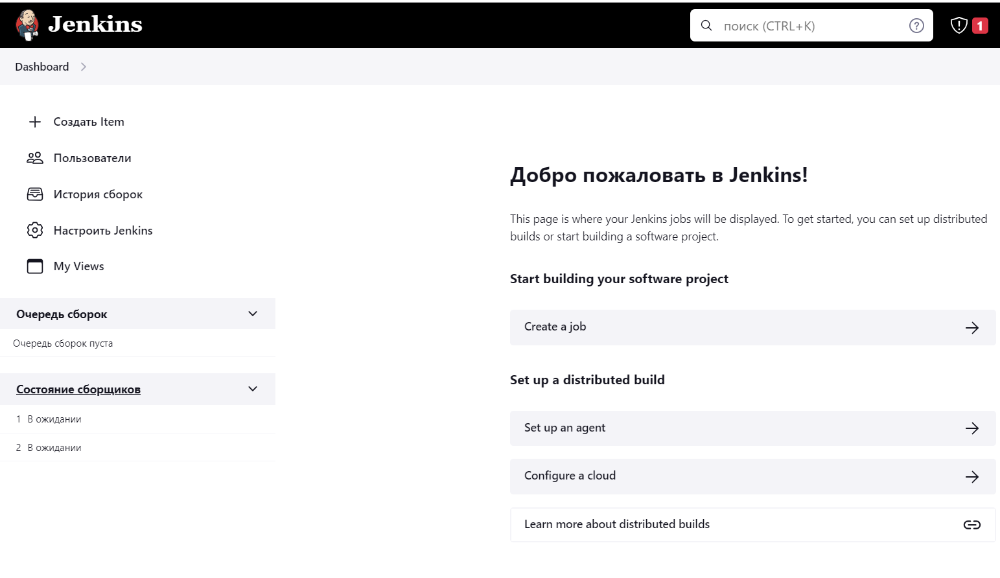
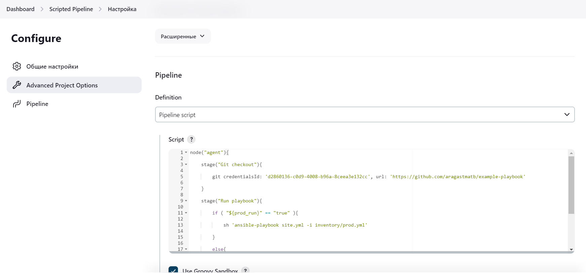

# Домашнее задание к занятию "10.Jenkins"

## Подготовка к выполнению

1. Создать 2 VM: для jenkins-master и jenkins-agent.
2. Установить jenkins при помощи playbook'a.

<details>
<summary>Expand</summary>

На мастере, перед запуском playbook

```
sudo rpm --import https://pkg.jenkins.io/redhat-stable/jenkins.io-2023.key
```

```commandline
ansible-playbook ./site.yml -i ./inventory/cicd/hosts.yml

PLAY [Preapre all hosts] *********************************************************************************************************************

TASK [Gathering Facts] ***********************************************************************************************************************
ok: [jenkins-master-01]
ok: [jenkins-agent-01]

TASK [Create group] **************************************************************************************************************************
changed: [jenkins-master-01]
changed: [jenkins-agent-01]

TASK [Create user] ***************************************************************************************************************************
changed: [jenkins-agent-01]
changed: [jenkins-master-01]

TASK [Upload SSH key] ************************************************************************************************************************
changed: [jenkins-master-01]
changed: [jenkins-agent-01]

TASK [Upload SSH Pub key] ********************************************************************************************************************
changed: [jenkins-agent-01]
changed: [jenkins-master-01]

TASK [Install JDK] ***************************************************************************************************************************
changed: [jenkins-master-01]
changed: [jenkins-agent-01]

PLAY [Get Jenkins master installed] **********************************************************************************************************

TASK [Gathering Facts] ***********************************************************************************************************************
ok: [jenkins-master-01]

TASK [Get repo Jenkins] **********************************************************************************************************************
changed: [jenkins-master-01]

TASK [Add Jenkins key] ***********************************************************************************************************************
changed: [jenkins-master-01]

TASK [Install epel-release] ******************************************************************************************************************
changed: [jenkins-master-01]

TASK [Install Jenkins and requirements] ******************************************************************************************************
changed: [jenkins-master-01]

TASK [Ensure jenkins agents are present in known_hosts file] *********************************************************************************
# 158.160.29.142:22 SSH-2.0-OpenSSH_7.4
# 158.160.29.142:22 SSH-2.0-OpenSSH_7.4
# 158.160.29.142:22 SSH-2.0-OpenSSH_7.4
# 158.160.29.142:22 SSH-2.0-OpenSSH_7.4
# 158.160.29.142:22 SSH-2.0-OpenSSH_7.4
changed: [jenkins-master-01] => (item=jenkins-agent-01)
[WARNING]: Module remote_tmp /home/jenkins/.ansible/tmp did not exist and was created with a mode of 0700, this may cause issues when running
as another user. To avoid this, create the remote_tmp dir with the correct permissions manually

TASK [Start Jenkins] *************************************************************************************************************************
changed: [jenkins-master-01]

PLAY [Prepare jenkins agent] *****************************************************************************************************************

TASK [Gathering Facts] ***********************************************************************************************************************
ok: [jenkins-agent-01]

TASK [Add master publickey into authorized_key] **********************************************************************************************
changed: [jenkins-agent-01]

TASK [Create agent_dir] **********************************************************************************************************************
changed: [jenkins-agent-01]

TASK [Add docker repo] ***********************************************************************************************************************
changed: [jenkins-agent-01]

TASK [Install some required] *****************************************************************************************************************
changed: [jenkins-agent-01]

TASK [Update pip] ****************************************************************************************************************************
changed: [jenkins-agent-01]

TASK [Install Ansible] ***********************************************************************************************************************
changed: [jenkins-agent-01]

TASK [Reinstall Selinux] *********************************************************************************************************************
changed: [jenkins-agent-01]

TASK [Add local to PATH] *********************************************************************************************************************
changed: [jenkins-agent-01]

TASK [Create docker group] *******************************************************************************************************************
ok: [jenkins-agent-01]

TASK [Add jenkinsuser to dockergroup] ********************************************************************************************************
changed: [jenkins-agent-01]

TASK [Restart docker] ************************************************************************************************************************
changed: [jenkins-agent-01]

TASK [Install agent.jar] *********************************************************************************************************************
changed: [jenkins-agent-01]

TASK [Fix Elasticsearch bootstrap checks] ****************************************************************************************************
changed: [jenkins-agent-01]

PLAY RECAP ***********************************************************************************************************************************
jenkins-agent-01           : ok=20   changed=17   unreachable=0    failed=0    skipped=0    rescued=0    ignored=0   
jenkins-master-01          : ok=13   changed=11   unreachable=0    failed=0    skipped=0    rescued=0    ignored=0
```

</details>

3. Запустить и проверить работоспособность.




4. Сделать первоначальную настройку.


## Основная часть

1. Сделать Freestyle Job, который будет запускать `molecule test` из любого вашего репозитория с ролью.


2. Сделать Declarative Pipeline Job, который будет запускать `molecule test` из любого вашего репозитория с ролью.


<details>
<summary>Pipeline script</summary>

```commandline
pipeline {
    agent {
        label 'agent'
    }
    stages {
        stage('Checkout') {
            steps{
                git branch: 'master', credentialsId: 'd2860136-c0d9-4008-b96a-8ceea3e132cc', url: 'https://github.com/taikobara3/vector-role'
            }
        }
        stage('Install molecule') {
            steps{
                sh 'pip3 install -r test-requirements.txt'
                sh "echo =============="
            }
        }
        stage('Run Molecule'){
            steps{
                sh '/home/oleg/.local/bin/molecule test'
                // Clean workspace after testing
                cleanWs()
            }
        }
    }
}
```

</details>


3. Перенести Declarative Pipeline в репозиторий в файл `Jenkinsfile`.
4. Создать Multibranch Pipeline на запуск `Jenkinsfile` из репозитория.


<details>
<summary>Console output</summary>

```
Branch indexing
17:11:12 Connecting to https://api.github.com using oleg/****** (user)
Obtained Jenkinsfile from 675d526a47b1d8675c427c3835c6c6ee1dfad37b
[Pipeline] Start of Pipeline
[Pipeline] node
Running on agent in /home/oleg/workspace/vector-role_multibranch_master
[Pipeline] {
[Pipeline] stage
[Pipeline] { (Declarative: Checkout SCM)
[Pipeline] checkout
The recommended git tool is: NONE
using credential 34742206-43a7-4319-a1ab-3133a334791b
Cloning the remote Git repository
Cloning with configured refspecs honoured and without tags
Avoid second fetch
Checking out Revision 675d526a47b1d8675c427c3835c6c6ee1dfad37b (master)
Commit message: "Jenkins06"
First time build. Skipping changelog.
Cloning repository https://github.com/taikobara3/vector-role.git
 > git init /home/oleg/workspace/vector-role_multibranch_master # timeout=10
Fetching upstream changes from https://github.com/taikobara3/vector-role.git
 > git --version # timeout=10
 > git --version # 'git version 1.8.3.1'
using GIT_ASKPASS to set credentials user
 > git fetch --no-tags --progress https://github.com/taikobara3/vector-role.git +refs/heads/master:refs/remotes/origin/master # timeout=10
 > git config remote.origin.url https://github.com/taikobara3/vector-role.git # timeout=10
 > git config --add remote.origin.fetch +refs/heads/master:refs/remotes/origin/master # timeout=10
 > git config core.sparsecheckout # timeout=10
 > git checkout -f 675d526a47b1d8675c427c3835c6c6ee1dfad37b # timeout=10
[Pipeline] }
[Pipeline] // stage
[Pipeline] withEnv
[Pipeline] {
[Pipeline] stage
[Pipeline] { (Checkout)
[Pipeline] git
The recommended git tool is: NONE
using credential d2860136-c0d9-4008-b96a-8ceea3e132cc
Fetching changes from the remote Git repository
Checking out Revision 675d526a47b1d8675c427c3835c6c6ee1dfad37b (refs/remotes/origin/master)
Commit message: "Jenkins06"
[Pipeline] }
[Pipeline] // stage
[Pipeline] stage
[Pipeline] { (Install molecule)
[Pipeline] sh
 > git rev-parse --resolve-git-dir /home/oleg/workspace/vector-role_multibranch_master/.git # timeout=10
 > git config remote.origin.url https://github.com/taikobara3/vector-role # timeout=10
Fetching upstream changes from https://github.com/taikobara3/vector-role
 > git --version # timeout=10
 > git --version # 'git version 1.8.3.1'
using GIT_SSH to set credentials 
[INFO] Currently running in a labeled security context
[INFO] Currently SELinux is 'enforcing' on the host
 > /usr/bin/chcon --type=ssh_home_t /home/oleg/workspace/vector-role_multibranch_master@tmp/jenkins-gitclient-ssh3613178876558024471.key
Verifying host key using known hosts file
You're using 'Known hosts file' strategy to verify ssh host keys, but your known_hosts file does not exist, please go to 'Manage Jenkins' -> 'Configure Global Security' -> 'Git Host Key Verification Configuration' and configure host key verification.
 > git fetch --tags --progress https://github.com/taikobara3/vector-role +refs/heads/*:refs/remotes/origin/* # timeout=10
 > git rev-parse refs/remotes/origin/master^{commit} # timeout=10
 > git config core.sparsecheckout # timeout=10
 > git checkout -f 675d526a47b1d8675c427c3835c6c6ee1dfad37b # timeout=10
 > git branch -a -v --no-abbrev # timeout=10
 > git checkout -b master 675d526a47b1d8675c427c3835c6c6ee1dfad37b # timeout=10
+ pip3 install -r test-requirements.txt
Defaulting to user installation because normal site-packages is not writeable
Requirement already satisfied: molecule==3.4.0 in /home/oleg/.local/lib/python3.6/site-packages (from -r test-requirements.txt (line 1)) (3.4.0)
Requirement already satisfied: molecule_docker in /home/oleg/.local/lib/python3.6/site-packages (from -r test-requirements.txt (line 2)) (1.1.0)
Requirement already satisfied: docker in /home/oleg/.local/lib/python3.6/site-packages (from -r test-requirements.txt (line 3)) (5.0.3)
Requirement already satisfied: ansible-lint in /home/oleg/.local/lib/python3.6/site-packages (from -r test-requirements.txt (line 4)) (5.4.0)
Requirement already satisfied: yamllint in /home/oleg/.local/lib/python3.6/site-packages (from -r test-requirements.txt (line 5)) (1.28.0)
Requirement already satisfied: rich>=9.5.1 in /home/oleg/.local/lib/python3.6/site-packages (from molecule==3.4.0->-r test-requirements.txt (line 1)) (12.6.0)
Requirement already satisfied: cerberus!=1.3.3,!=1.3.4,>=1.3.1 in /home/oleg/.local/lib/python3.6/site-packages (from molecule==3.4.0->-r test-requirements.txt (line 1)) (1.3.2)
Requirement already satisfied: dataclasses in /home/oleg/.local/lib/python3.6/site-packages (from molecule==3.4.0->-r test-requirements.txt (line 1)) (0.8)
Requirement already satisfied: subprocess-tee>=0.3.2 in /home/oleg/.local/lib/python3.6/site-packages (from molecule==3.4.0->-r test-requirements.txt (line 1)) (0.3.5)
Requirement already satisfied: pluggy<1.0,>=0.7.1 in /home/oleg/.local/lib/python3.6/site-packages (from molecule==3.4.0->-r test-requirements.txt (line 1)) (0.13.1)
Requirement already satisfied: Jinja2>=2.11.3 in /usr/local/lib/python3.6/site-packages (from molecule==3.4.0->-r test-requirements.txt (line 1)) (3.0.3)
Requirement already satisfied: packaging in /usr/local/lib/python3.6/site-packages (from molecule==3.4.0->-r test-requirements.txt (line 1)) (21.3)
Requirement already satisfied: cookiecutter>=1.7.3 in /home/oleg/.local/lib/python3.6/site-packages (from molecule==3.4.0->-r test-requirements.txt (line 1)) (1.7.3)
Requirement already satisfied: paramiko<3,>=2.5.0 in /home/oleg/.local/lib/python3.6/site-packages (from molecule==3.4.0->-r test-requirements.txt (line 1)) (2.12.0)
Requirement already satisfied: PyYAML<6,>=5.1 in /home/oleg/.local/lib/python3.6/site-packages (from molecule==3.4.0->-r test-requirements.txt (line 1)) (5.4.1)
Requirement already satisfied: setuptools>=42 in /usr/local/lib/python3.6/site-packages (from molecule==3.4.0->-r test-requirements.txt (line 1)) (59.6.0)
Requirement already satisfied: enrich>=1.2.5 in /home/oleg/.local/lib/python3.6/site-packages (from molecule==3.4.0->-r test-requirements.txt (line 1)) (1.2.7)
Requirement already satisfied: selinux in /usr/local/lib/python3.6/site-packages (from molecule==3.4.0->-r test-requirements.txt (line 1)) (0.2.1)
Requirement already satisfied: click-help-colors>=0.9 in /home/oleg/.local/lib/python3.6/site-packages (from molecule==3.4.0->-r test-requirements.txt (line 1)) (0.9.1)
Requirement already satisfied: click<9,>=8.0 in /home/oleg/.local/lib/python3.6/site-packages (from molecule==3.4.0->-r test-requirements.txt (line 1)) (8.0.4)
Requirement already satisfied: requests in /home/oleg/.local/lib/python3.6/site-packages (from molecule_docker->-r test-requirements.txt (line 2)) (2.27.1)
Requirement already satisfied: ansible-compat>=0.5.0 in /home/oleg/.local/lib/python3.6/site-packages (from molecule_docker->-r test-requirements.txt (line 2)) (1.0.0)
Requirement already satisfied: websocket-client>=0.32.0 in /home/oleg/.local/lib/python3.6/site-packages (from docker->-r test-requirements.txt (line 3)) (1.3.1)
Requirement already satisfied: ruamel.yaml<1,>=0.15.34 in /home/oleg/.local/lib/python3.6/site-packages (from ansible-lint->-r test-requirements.txt (line 4)) (0.17.21)
Requirement already satisfied: tenacity in /home/oleg/.local/lib/python3.6/site-packages (from ansible-lint->-r test-requirements.txt (line 4)) (8.2.2)
Requirement already satisfied: wcmatch>=7.0 in /home/oleg/.local/lib/python3.6/site-packages (from ansible-lint->-r test-requirements.txt (line 4)) (8.3)
Requirement already satisfied: typing-extensions in /home/oleg/.local/lib/python3.6/site-packages (from ansible-lint->-r test-requirements.txt (line 4)) (4.1.1)
Requirement already satisfied: pathspec>=0.5.3 in /home/oleg/.local/lib/python3.6/site-packages (from yamllint->-r test-requirements.txt (line 5)) (0.9.0)
Requirement already satisfied: cached-property~=1.5 in /home/oleg/.local/lib/python3.6/site-packages (from ansible-compat>=0.5.0->molecule_docker->-r test-requirements.txt (line 2)) (1.5.2)
Requirement already satisfied: importlib-metadata in /home/oleg/.local/lib/python3.6/site-packages (from click<9,>=8.0->molecule==3.4.0->-r test-requirements.txt (line 1)) (4.8.3)
Requirement already satisfied: jinja2-time>=0.2.0 in /home/oleg/.local/lib/python3.6/site-packages (from cookiecutter>=1.7.3->molecule==3.4.0->-r test-requirements.txt (line 1)) (0.2.0)
Requirement already satisfied: python-slugify>=4.0.0 in /home/oleg/.local/lib/python3.6/site-packages (from cookiecutter>=1.7.3->molecule==3.4.0->-r test-requirements.txt (line 1)) (6.1.2)
Requirement already satisfied: binaryornot>=0.4.4 in /home/oleg/.local/lib/python3.6/site-packages (from cookiecutter>=1.7.3->molecule==3.4.0->-r test-requirements.txt (line 1)) (0.4.4)
Requirement already satisfied: six>=1.10 in /home/oleg/.local/lib/python3.6/site-packages (from cookiecutter>=1.7.3->molecule==3.4.0->-r test-requirements.txt (line 1)) (1.16.0)
Requirement already satisfied: poyo>=0.5.0 in /home/oleg/.local/lib/python3.6/site-packages (from cookiecutter>=1.7.3->molecule==3.4.0->-r test-requirements.txt (line 1)) (0.5.0)
Requirement already satisfied: MarkupSafe>=2.0 in /usr/local/lib64/python3.6/site-packages (from Jinja2>=2.11.3->molecule==3.4.0->-r test-requirements.txt (line 1)) (2.0.1)
Requirement already satisfied: cryptography>=2.5 in /usr/local/lib64/python3.6/site-packages (from paramiko<3,>=2.5.0->molecule==3.4.0->-r test-requirements.txt (line 1)) (40.0.2)
Requirement already satisfied: pynacl>=1.0.1 in /home/oleg/.local/lib/python3.6/site-packages (from paramiko<3,>=2.5.0->molecule==3.4.0->-r test-requirements.txt (line 1)) (1.5.0)
Requirement already satisfied: bcrypt>=3.1.3 in /home/oleg/.local/lib/python3.6/site-packages (from paramiko<3,>=2.5.0->molecule==3.4.0->-r test-requirements.txt (line 1)) (4.0.1)
Requirement already satisfied: charset-normalizer~=2.0.0 in /home/oleg/.local/lib/python3.6/site-packages (from requests->molecule_docker->-r test-requirements.txt (line 2)) (2.0.12)
Requirement already satisfied: urllib3<1.27,>=1.21.1 in /home/oleg/.local/lib/python3.6/site-packages (from requests->molecule_docker->-r test-requirements.txt (line 2)) (1.26.15)
Requirement already satisfied: idna<4,>=2.5 in /home/oleg/.local/lib/python3.6/site-packages (from requests->molecule_docker->-r test-requirements.txt (line 2)) (3.4)
Requirement already satisfied: certifi>=2017.4.17 in /home/oleg/.local/lib/python3.6/site-packages (from requests->molecule_docker->-r test-requirements.txt (line 2)) (2022.12.7)
Requirement already satisfied: pygments<3.0.0,>=2.6.0 in /home/oleg/.local/lib/python3.6/site-packages (from rich>=9.5.1->molecule==3.4.0->-r test-requirements.txt (line 1)) (2.14.0)
Requirement already satisfied: commonmark<0.10.0,>=0.9.0 in /home/oleg/.local/lib/python3.6/site-packages (from rich>=9.5.1->molecule==3.4.0->-r test-requirements.txt (line 1)) (0.9.1)
Requirement already satisfied: ruamel.yaml.clib>=0.2.6 in /home/oleg/.local/lib/python3.6/site-packages (from ruamel.yaml<1,>=0.15.34->ansible-lint->-r test-requirements.txt (line 4)) (0.2.7)
Requirement already satisfied: bracex>=2.1.1 in /home/oleg/.local/lib/python3.6/site-packages (from wcmatch>=7.0->ansible-lint->-r test-requirements.txt (line 4)) (2.2.1)
Requirement already satisfied: pyparsing!=3.0.5,>=2.0.2 in /usr/local/lib/python3.6/site-packages (from packaging->molecule==3.4.0->-r test-requirements.txt (line 1)) (3.0.9)
Requirement already satisfied: distro>=1.3.0 in /usr/local/lib/python3.6/site-packages (from selinux->molecule==3.4.0->-r test-requirements.txt (line 1)) (1.8.0)
Requirement already satisfied: chardet>=3.0.2 in /home/oleg/.local/lib/python3.6/site-packages (from binaryornot>=0.4.4->cookiecutter>=1.7.3->molecule==3.4.0->-r test-requirements.txt (line 1)) (5.0.0)
Requirement already satisfied: cffi>=1.12 in /usr/local/lib64/python3.6/site-packages (from cryptography>=2.5->paramiko<3,>=2.5.0->molecule==3.4.0->-r test-requirements.txt (line 1)) (1.15.1)
Requirement already satisfied: zipp>=0.5 in /home/oleg/.local/lib/python3.6/site-packages (from importlib-metadata->click<9,>=8.0->molecule==3.4.0->-r test-requirements.txt (line 1)) (3.6.0)
Requirement already satisfied: arrow in /home/oleg/.local/lib/python3.6/site-packages (from jinja2-time>=0.2.0->cookiecutter>=1.7.3->molecule==3.4.0->-r test-requirements.txt (line 1)) (1.2.3)
Requirement already satisfied: text-unidecode>=1.3 in /home/oleg/.local/lib/python3.6/site-packages (from python-slugify>=4.0.0->cookiecutter>=1.7.3->molecule==3.4.0->-r test-requirements.txt (line 1)) (1.3)
Requirement already satisfied: pycparser in /usr/local/lib/python3.6/site-packages (from cffi>=1.12->cryptography>=2.5->paramiko<3,>=2.5.0->molecule==3.4.0->-r test-requirements.txt (line 1)) (2.21)
Requirement already satisfied: python-dateutil>=2.7.0 in /home/oleg/.local/lib/python3.6/site-packages (from arrow->jinja2-time>=0.2.0->cookiecutter>=1.7.3->molecule==3.4.0->-r test-requirements.txt (line 1)) (2.8.2)
[Pipeline] sh
+ echo ==============
==============
[Pipeline] }
[Pipeline] // stage
[Pipeline] stage
[Pipeline] { (Run Molecule)
[Pipeline] sh
+ /home/oleg/.local/bin/molecule test
/home/oleg/.local/lib/python3.6/site-packages/requests/__init__.py:104: RequestsDependencyWarning: urllib3 (1.26.15) or chardet (5.0.0)/charset_normalizer (2.0.12) doesn't match a supported version!
  RequestsDependencyWarning)
INFO     default scenario test matrix: lint, destroy, syntax, create, converge, idempotence, verify, destroy
INFO     Performing prerun...
INFO     Guessed /home/oleg/workspace/vector-role_multibranch_master as project root directory
INFO     Using /home/oleg/.cache/ansible-lint/904d19/roles/taikobara3.vector_role symlink to current repository in order to enable Ansible to find the role using its expected full name.
INFO     Added ANSIBLE_ROLES_PATH=~/.ansible/roles:/usr/share/ansible/roles:/etc/ansible/roles:/home/oleg/.cache/ansible-lint/904d19/roles
INFO     Running default > lint
INFO     Lint is disabled.
INFO     Running default > destroy
INFO     Sanity checks: 'docker'
/home/oleg/.local/lib/python3.6/site-packages/paramiko/transport.py:33: CryptographyDeprecationWarning: Python 3.6 is no longer supported by the Python core team. Therefore, support for it is deprecated in cryptography. The next release of cryptography will remove support for Python 3.6.
  from cryptography.hazmat.backends import default_backend
[DEPRECATION WARNING]: Ansible will require Python 3.8 or newer on the
controller starting with Ansible 2.12. Current version: 3.6.8 (default, Nov 16
2020, 16:55:22) [GCC 4.8.5 20150623 (Red Hat 4.8.5-44)]. This feature will be
removed from ansible-core in version 2.12. Deprecation warnings can be disabled
 by setting deprecation_warnings=False in ansible.cfg.

PLAY [Destroy] *****************************************************************

TASK [Destroy molecule instance(s)] ********************************************
/usr/local/lib/python3.6/site-packages/ansible/parsing/vault/__init__.py:44: CryptographyDeprecationWarning: Python 3.6 is no longer supported by the Python core team. Therefore, support for it is deprecated in cryptography. The next release of cryptography will remove support for Python 3.6.
  from cryptography.exceptions import InvalidSignature
changed: [localhost] => (item=instance-1)
changed: [localhost] => (item=instance-2)

TASK [Wait for instance(s) deletion to complete] *******************************
ok: [localhost] => (item=instance-1)
ok: [localhost] => (item=instance-2)

TASK [Delete docker networks(s)] ***********************************************

PLAY RECAP *********************************************************************
localhost                  : ok=2    changed=1    unreachable=0    failed=0    skipped=1    rescued=0    ignored=0

INFO     Running default > syntax
[DEPRECATION WARNING]: Ansible will require Python 3.8 or newer on the
controller starting with Ansible 2.12. Current version: 3.6.8 (default, Nov 16
2020, 16:55:22) [GCC 4.8.5 20150623 (Red Hat 4.8.5-44)]. This feature will be
removed from ansible-core in version 2.12. Deprecation warnings can be disabled
 by setting deprecation_warnings=False in ansible.cfg.

playbook: /home/oleg/workspace/vector-role_multibranch_master/molecule/default/converge.yml
/usr/local/lib/python3.6/site-packages/ansible/parsing/vault/__init__.py:44: CryptographyDeprecationWarning: Python 3.6 is no longer supported by the Python core team. Therefore, support for it is deprecated in cryptography. The next release of cryptography will remove support for Python 3.6.
  from cryptography.exceptions import InvalidSignature
INFO     Running default > create
[DEPRECATION WARNING]: Ansible will require Python 3.8 or newer on the
controller starting with Ansible 2.12. Current version: 3.6.8 (default, Nov 16
2020, 16:55:22) [GCC 4.8.5 20150623 (Red Hat 4.8.5-44)]. This feature will be
removed from ansible-core in version 2.12. Deprecation warnings can be disabled
 by setting deprecation_warnings=False in ansible.cfg.

PLAY [Create] ******************************************************************

TASK [Log into a Docker registry] **********************************************
/usr/local/lib/python3.6/site-packages/ansible/parsing/vault/__init__.py:44: CryptographyDeprecationWarning: Python 3.6 is no longer supported by the Python core team. Therefore, support for it is deprecated in cryptography. The next release of cryptography will remove support for Python 3.6.
  from cryptography.exceptions import InvalidSignature
skipping: [localhost] => (item=None)
skipping: [localhost] => (item=None)
skipping: [localhost]

TASK [Check presence of custom Dockerfiles] ************************************
ok: [localhost] => (item={'image': 'docker.io/tgagor/centos:7', 'name': 'instance-1', 'pre_build_image': True})
ok: [localhost] => (item={'image': 'docker.io/tgagor/centos:8', 'name': 'instance-2', 'pre_build_image': True})

TASK [Create Dockerfiles from image names] *************************************
skipping: [localhost] => (item={'image': 'docker.io/tgagor/centos:7', 'name': 'instance-1', 'pre_build_image': True})
skipping: [localhost] => (item={'image': 'docker.io/tgagor/centos:8', 'name': 'instance-2', 'pre_build_image': True})

TASK [Discover local Docker images] ********************************************
ok: [localhost] => (item={'changed': False, 'skipped': True, 'skip_reason': 'Conditional result was False', 'item': {'image': 'docker.io/tgagor/centos:7', 'name': 'instance-1', 'pre_build_image': True}, 'ansible_loop_var': 'item', 'i': 0, 'ansible_index_var': 'i'})
ok: [localhost] => (item={'changed': False, 'skipped': True, 'skip_reason': 'Conditional result was False', 'item': {'image': 'docker.io/tgagor/centos:8', 'name': 'instance-2', 'pre_build_image': True}, 'ansible_loop_var': 'item', 'i': 1, 'ansible_index_var': 'i'})

TASK [Build an Ansible compatible image (new)] *********************************
skipping: [localhost] => (item=molecule_local/docker.io/tgagor/centos:7)
skipping: [localhost] => (item=molecule_local/docker.io/tgagor/centos:8)

TASK [Create docker network(s)] ************************************************

TASK [Determine the CMD directives] ********************************************
ok: [localhost] => (item={'image': 'docker.io/tgagor/centos:7', 'name': 'instance-1', 'pre_build_image': True})
ok: [localhost] => (item={'image': 'docker.io/tgagor/centos:8', 'name': 'instance-2', 'pre_build_image': True})

TASK [Create molecule instance(s)] *********************************************
changed: [localhost] => (item=instance-1)
changed: [localhost] => (item=instance-2)

TASK [Wait for instance(s) creation to complete] *******************************
FAILED - RETRYING: Wait for instance(s) creation to complete (300 retries left).
changed: [localhost] => (item={'started': 1, 'finished': 0, 'ansible_job_id': '95931868184.25992', 'results_file': '/home/oleg/.ansible_async/95931868184.25992', 'changed': True, 'failed': False, 'item': {'image': 'docker.io/tgagor/centos:7', 'name': 'instance-1', 'pre_build_image': True}, 'ansible_loop_var': 'item'})
changed: [localhost] => (item={'started': 1, 'finished': 0, 'ansible_job_id': '924431137766.26018', 'results_file': '/home/oleg/.ansible_async/924431137766.26018', 'changed': True, 'failed': False, 'item': {'image': 'docker.io/tgagor/centos:8', 'name': 'instance-2', 'pre_build_image': True}, 'ansible_loop_var': 'item'})

PLAY RECAP *********************************************************************
localhost                  : ok=5    changed=2    unreachable=0    failed=0    skipped=4    rescued=0    ignored=0

INFO     Running default > converge
[DEPRECATION WARNING]: Ansible will require Python 3.8 or newer on the
controller starting with Ansible 2.12. Current version: 3.6.8 (default, Nov 16
2020, 16:55:22) [GCC 4.8.5 20150623 (Red Hat 4.8.5-44)]. This feature will be
removed from ansible-core in version 2.12. Deprecation warnings can be disabled
 by setting deprecation_warnings=False in ansible.cfg.

PLAY [Converge] ****************************************************************

TASK [Gathering Facts] *********************************************************
/usr/local/lib/python3.6/site-packages/ansible/parsing/vault/__init__.py:44: CryptographyDeprecationWarning: Python 3.6 is no longer supported by the Python core team. Therefore, support for it is deprecated in cryptography. The next release of cryptography will remove support for Python 3.6.
  from cryptography.exceptions import InvalidSignature
ok: [instance-2]
ok: [instance-1]

TASK [Include vector-role] *****************************************************

TASK [vector-role : Install sudo] **********************************************
changed: [instance-1]
changed: [instance-2]

TASK [vector-role : Get vector distrib] ****************************************
changed: [instance-2]
changed: [instance-1]

TASK [vector-role : Install vector packages] ***********************************
changed: [instance-2]
changed: [instance-1]

PLAY RECAP *********************************************************************
instance-1                 : ok=4    changed=3    unreachable=0    failed=0    skipped=0    rescued=0    ignored=0
instance-2                 : ok=4    changed=3    unreachable=0    failed=0    skipped=0    rescued=0    ignored=0

INFO     Running default > idempotence
[DEPRECATION WARNING]: Ansible will require Python 3.8 or newer on the
controller starting with Ansible 2.12. Current version: 3.6.8 (default, Nov 16
2020, 16:55:22) [GCC 4.8.5 20150623 (Red Hat 4.8.5-44)]. This feature will be
removed from ansible-core in version 2.12. Deprecation warnings can be disabled
 by setting deprecation_warnings=False in ansible.cfg.

PLAY [Converge] ****************************************************************

TASK [Gathering Facts] *********************************************************
/usr/local/lib/python3.6/site-packages/ansible/parsing/vault/__init__.py:44: CryptographyDeprecationWarning: Python 3.6 is no longer supported by the Python core team. Therefore, support for it is deprecated in cryptography. The next release of cryptography will remove support for Python 3.6.
  from cryptography.exceptions import InvalidSignature
ok: [instance-2]
ok: [instance-1]

TASK [Include vector-role] *****************************************************

TASK [vector-role : Install sudo] **********************************************
ok: [instance-1]
ok: [instance-2]

TASK [vector-role : Get vector distrib] ****************************************
ok: [instance-1]
ok: [instance-2]

TASK [vector-role : Install vector packages] ***********************************
ok: [instance-1]
ok: [instance-2]

PLAY RECAP *********************************************************************
instance-1                 : ok=4    changed=0    unreachable=0    failed=0    skipped=0    rescued=0    ignored=0
instance-2                 : ok=4    changed=0    unreachable=0    failed=0    skipped=0    rescued=0    ignored=0

INFO     Idempotence completed successfully.
INFO     Running default > verify
INFO     Running Ansible Verifier
[DEPRECATION WARNING]: Ansible will require Python 3.8 or newer on the
controller starting with Ansible 2.12. Current version: 3.6.8 (default, Nov 16
2020, 16:55:22) [GCC 4.8.5 20150623 (Red Hat 4.8.5-44)]. This feature will be
removed from ansible-core in version 2.12. Deprecation warnings can be disabled
 by setting deprecation_warnings=False in ansible.cfg.

PLAY [Verify] ******************************************************************

TASK [stat execute vector exists] **********************************************
/usr/local/lib/python3.6/site-packages/ansible/parsing/vault/__init__.py:44: CryptographyDeprecationWarning: Python 3.6 is no longer supported by the Python core team. Therefore, support for it is deprecated in cryptography. The next release of cryptography will remove support for Python 3.6.
  from cryptography.exceptions import InvalidSignature
ok: [instance-1]
ok: [instance-2]

TASK [Check execute vector exists] *********************************************
ok: [instance-2] => {
    "changed": false,
    "msg": "vector exists"
}
ok: [instance-1] => {
    "changed": false,
    "msg": "vector exists"
}

TASK [Gather Installed Packages] ***********************************************
ok: [instance-1]
ok: [instance-2]

TASK [Assert Vector Packages] **************************************************
ok: [instance-1] => (item=vector) => {
    "ansible_loop_var": "item",
    "changed": false,
    "item": "vector",
    "msg": "All assertions passed"
}
ok: [instance-2] => (item=vector) => {
    "ansible_loop_var": "item",
    "changed": false,
    "item": "vector",
    "msg": "All assertions passed"
}

PLAY RECAP *********************************************************************
instance-1                 : ok=4    changed=0    unreachable=0    failed=0    skipped=0    rescued=0    ignored=0
instance-2                 : ok=4    changed=0    unreachable=0    failed=0    skipped=0    rescued=0    ignored=0

INFO     Verifier completed successfully.
INFO     Running default > destroy
[DEPRECATION WARNING]: Ansible will require Python 3.8 or newer on the
controller starting with Ansible 2.12. Current version: 3.6.8 (default, Nov 16
2020, 16:55:22) [GCC 4.8.5 20150623 (Red Hat 4.8.5-44)]. This feature will be
removed from ansible-core in version 2.12. Deprecation warnings can be disabled
 by setting deprecation_warnings=False in ansible.cfg.

PLAY [Destroy] *****************************************************************

TASK [Destroy molecule instance(s)] ********************************************
/usr/local/lib/python3.6/site-packages/ansible/parsing/vault/__init__.py:44: CryptographyDeprecationWarning: Python 3.6 is no longer supported by the Python core team. Therefore, support for it is deprecated in cryptography. The next release of cryptography will remove support for Python 3.6.
  from cryptography.exceptions import InvalidSignature
changed: [localhost] => (item=instance-1)
changed: [localhost] => (item=instance-2)

TASK [Wait for instance(s) deletion to complete] *******************************
FAILED - RETRYING: Wait for instance(s) deletion to complete (300 retries left).
changed: [localhost] => (item=instance-1)
changed: [localhost] => (item=instance-2)

TASK [Delete docker networks(s)] ***********************************************

PLAY RECAP *********************************************************************
localhost                  : ok=2    changed=2    unreachable=0    failed=0    skipped=1    rescued=0    ignored=0

INFO     Pruning extra files from scenario ephemeral directory
[Pipeline] cleanWs
[WS-CLEANUP] Deleting project workspace...
[WS-CLEANUP] Deferred wipeout is used...
[WS-CLEANUP] done
[Pipeline] }
[Pipeline] // stage
[Pipeline] }
[Pipeline] // withEnv
[Pipeline] }
[Pipeline] // node
[Pipeline] End of Pipeline

Could not update commit status, please check if your scan credentials belong to a member of the organization or a collaborator of the repository and repo:status scope is selected


GitHub has been notified of this commit’s build result

Finished: SUCCESS
```

</details>


5. Создать Scripted Pipeline, наполнить его скриптом из [pipeline](./pipeline).


<details>
<summary>Pipeline script</summary>

```commandline
node("agent"){

    stage("Git checkout"){

        git credentialsId: 'd2860136-c0d9-4008-b96a-8ceea3e132cc', url: 'https://github.com/aragastmatb/example-playbook'

    }

    stage("Sample define secret_check"){

        secret_check=true

    }

    stage("Run playbook"){

        if (secret_check){

            sh 'ansible-playbook site.yml -i inventory/prod.yml'

        }

        else{

            echo 'need more action'

        }

        

    }

}
```

</details>

6. Внести необходимые изменения, чтобы Pipeline запускал `ansible-playbook` без флагов `--check --diff`, если не установлен параметр при запуске джобы (prod_run = True), по умолчанию параметр имеет значение False и запускает прогон с флагами `--check --diff`.

Прогон без параметра (по умолчанию)


<details>
<summary>Console output</summary>

```commandline
Started by user Троицкий Олег
[Pipeline] Start of Pipeline
[Pipeline] node
Running on agent in /home/oleg/workspace/Scripted Pipeline
[Pipeline] {
[Pipeline] stage
[Pipeline] { (Git checkout)
[Pipeline] git
The recommended git tool is: NONE
using credential d2860136-c0d9-4008-b96a-8ceea3e132cc
Fetching changes from the remote Git repository
Checking out Revision 20bd8d945340bb742acdd9e8c1a8fb5b73cc1700 (refs/remotes/origin/master)
Commit message: "Merge branch 'master' of https://github.com/aragastmatb/example-playbook"
 > git rev-parse --resolve-git-dir /home/oleg/workspace/Scripted Pipeline/.git # timeout=10
 > git config remote.origin.url https://github.com/aragastmatb/example-playbook # timeout=10
Fetching upstream changes from https://github.com/aragastmatb/example-playbook
 > git --version # timeout=10
 > git --version # 'git version 1.8.3.1'
using GIT_SSH to set credentials 
[INFO] Currently running in a labeled security context
[INFO] Currently SELinux is 'enforcing' on the host
 > /usr/bin/chcon --type=ssh_home_t /home/oleg/workspace/Scripted Pipeline@tmp/jenkins-gitclient-ssh12440119053307353970.key
Verifying host key using known hosts file
You're using 'Known hosts file' strategy to verify ssh host keys, but your known_hosts file does not exist, please go to 'Manage Jenkins' -> 'Configure Global Security' -> 'Git Host Key Verification Configuration' and configure host key verification.
 > git fetch --tags --progress https://github.com/aragastmatb/example-playbook +refs/heads/*:refs/remotes/origin/* # timeout=10
 > git rev-parse refs/remotes/origin/master^{commit} # timeout=10
 > git config core.sparsecheckout # timeout=10
 > git checkout -f 20bd8d945340bb742acdd9e8c1a8fb5b73cc1700 # timeout=10
 > git branch -a -v --no-abbrev # timeout=10
 > git branch -D master # timeout=10
 > git checkout -b master 20bd8d945340bb742acdd9e8c1a8fb5b73cc1700 # timeout=10
 > git rev-list --no-walk 20bd8d945340bb742acdd9e8c1a8fb5b73cc1700 # timeout=10
[Pipeline] }
[Pipeline] // stage
[Pipeline] stage
[Pipeline] { (Run playbook)
[Pipeline] sh
+ ansible-playbook site.yml -i inventory/prod.yml --check --diff
[DEPRECATION WARNING]: Ansible will require Python 3.8 or newer on the 
controller starting with Ansible 2.12. Current version: 3.6.8 (default, Nov 16 
2020, 16:55:22) [GCC 4.8.5 20150623 (Red Hat 4.8.5-44)]. This feature will be 
removed from ansible-core in version 2.12. Deprecation warnings can be disabled
 by setting deprecation_warnings=False in ansible.cfg.

PLAY [Install Java] ************************************************************

TASK [Gathering Facts] *********************************************************
/usr/local/lib/python3.6/site-packages/ansible/parsing/vault/__init__.py:44: CryptographyDeprecationWarning: Python 3.6 is no longer supported by the Python core team. Therefore, support for it is deprecated in cryptography. The next release of cryptography will remove support for Python 3.6.
  from cryptography.exceptions import InvalidSignature
ok: [localhost]

TASK [java : Upload .tar.gz file containing binaries from local storage] *******
skipping: [localhost]

TASK [java : Upload .tar.gz file conaining binaries from remote storage] *******
ok: [localhost]

TASK [java : Ensure installation dir exists] ***********************************
ok: [localhost]

TASK [java : Extract java in the installation directory] ***********************
skipping: [localhost]

TASK [java : Export environment variables] *************************************
ok: [localhost]

PLAY RECAP *********************************************************************
localhost                  : ok=4    changed=0    unreachable=0    failed=0    skipped=2    rescued=0    ignored=0   

[Pipeline] }
[Pipeline] // stage
[Pipeline] }
[Pipeline] // node
[Pipeline] End of Pipeline
Finished: SUCCESS
```
</details>

Прогон с параметром


<details>
<summary>Console output</summary>

```commandline
Started by user Троицкий Олег
[Pipeline] Start of Pipeline
[Pipeline] node
Running on agent in /home/oleg/workspace/Scripted Pipeline
[Pipeline] {
[Pipeline] stage
[Pipeline] { (Git checkout)
[Pipeline] git
The recommended git tool is: NONE
using credential d2860136-c0d9-4008-b96a-8ceea3e132cc
Fetching changes from the remote Git repository
Checking out Revision 20bd8d945340bb742acdd9e8c1a8fb5b73cc1700 (refs/remotes/origin/master)
Commit message: "Merge branch 'master' of https://github.com/aragastmatb/example-playbook"
 > git rev-parse --resolve-git-dir /home/oleg/workspace/Scripted Pipeline/.git # timeout=10
 > git config remote.origin.url https://github.com/aragastmatb/example-playbook # timeout=10
Fetching upstream changes from https://github.com/aragastmatb/example-playbook
 > git --version # timeout=10
 > git --version # 'git version 1.8.3.1'
using GIT_SSH to set credentials 
[INFO] Currently running in a labeled security context
[INFO] Currently SELinux is 'enforcing' on the host
 > /usr/bin/chcon --type=ssh_home_t /home/oleg/workspace/Scripted Pipeline@tmp/jenkins-gitclient-ssh4058095477371966579.key
Verifying host key using known hosts file
You're using 'Known hosts file' strategy to verify ssh host keys, but your known_hosts file does not exist, please go to 'Manage Jenkins' -> 'Configure Global Security' -> 'Git Host Key Verification Configuration' and configure host key verification.
 > git fetch --tags --progress https://github.com/aragastmatb/example-playbook +refs/heads/*:refs/remotes/origin/* # timeout=10
 > git rev-parse refs/remotes/origin/master^{commit} # timeout=10
 > git config core.sparsecheckout # timeout=10
 > git checkout -f 20bd8d945340bb742acdd9e8c1a8fb5b73cc1700 # timeout=10
 > git branch -a -v --no-abbrev # timeout=10
 > git branch -D master # timeout=10
 > git checkout -b master 20bd8d945340bb742acdd9e8c1a8fb5b73cc1700 # timeout=10
 > git rev-list --no-walk 20bd8d945340bb742acdd9e8c1a8fb5b73cc1700 # timeout=10
[Pipeline] }
[Pipeline] // stage
[Pipeline] stage
[Pipeline] { (Run playbook)
[Pipeline] sh
+ ansible-playbook site.yml -i inventory/prod.yml
[DEPRECATION WARNING]: Ansible will require Python 3.8 or newer on the 
controller starting with Ansible 2.12. Current version: 3.6.8 (default, Nov 16 
2020, 16:55:22) [GCC 4.8.5 20150623 (Red Hat 4.8.5-44)]. This feature will be 
removed from ansible-core in version 2.12. Deprecation warnings can be disabled
 by setting deprecation_warnings=False in ansible.cfg.

PLAY [Install Java] ************************************************************

TASK [Gathering Facts] *********************************************************
/usr/local/lib/python3.6/site-packages/ansible/parsing/vault/__init__.py:44: CryptographyDeprecationWarning: Python 3.6 is no longer supported by the Python core team. Therefore, support for it is deprecated in cryptography. The next release of cryptography will remove support for Python 3.6.
  from cryptography.exceptions import InvalidSignature
ok: [localhost]

TASK [java : Upload .tar.gz file containing binaries from local storage] *******
skipping: [localhost]

TASK [java : Upload .tar.gz file conaining binaries from remote storage] *******
ok: [localhost]

TASK [java : Ensure installation dir exists] ***********************************
ok: [localhost]

TASK [java : Extract java in the installation directory] ***********************
skipping: [localhost]

TASK [java : Export environment variables] *************************************
ok: [localhost]

PLAY RECAP *********************************************************************
localhost                  : ok=4    changed=0    unreachable=0    failed=0    skipped=2    rescued=0    ignored=0   

[Pipeline] }
[Pipeline] // stage
[Pipeline] }
[Pipeline] // node
[Pipeline] End of Pipeline
Finished: SUCCESS
```
</details>

Настройки pipeline




<details>
<summary>Script</summary>

```commandline
node("agent"){

    stage("Git checkout"){

        git credentialsId: 'd2860136-c0d9-4008-b96a-8ceea3e132cc', url: 'https://github.com/aragastmatb/example-playbook'

    }

    stage("Run playbook"){

        if ( "${prod_run}" == "true" ){

            sh 'ansible-playbook site.yml -i inventory/prod.yml'

        }

        else{

            sh 'ansible-playbook site.yml -i inventory/prod.yml --check --diff'

        }

        

    }

}
```

</details>

7. Проверить работоспособность, исправить ошибки, исправленный Pipeline вложить в репозиторий в файл `ScriptedJenkinsfile`.
8. Отправить ссылку на репозиторий с ролью и Declarative Pipeline и Scripted Pipeline.

 a) Declarative Pipeline:

https://github.com/taikobara3/vector-role/blob/master/Jenkinsfile

 b) Scripted Pipeline:

https://github.com/taikobara3/devops-netology/blob/main/09-ci-04-jenkins/pipeline/ScriptedJenkinsfile


## Необязательная часть

1. Создать скрипт на groovy, который будет собирать все Job, которые завершились хотя бы раз неуспешно. Добавить скрипт в репозиторий с решением с названием `AllJobFailure.groovy`.
2. Создать Scripted Pipeline таким образом, чтобы он мог сначала запустить через Ya.Cloud CLI необходимое количество инстансов, прописать их в инвентори плейбука и после этого запускать плейбук. Тем самым, мы должны по нажатию кнопки получить готовую к использованию систему.

---

### Как оформить ДЗ?

Выполненное домашнее задание пришлите ссылкой на .md-файл в вашем репозитории.

---
