# Домашнее задание к занятию "11.Teamcity"

## Подготовка к выполнению

1. В Ya.Cloud создайте новый инстанс (4CPU4RAM) на основе образа `jetbrains/teamcity-server`
2. Дождитесь запуска teamcity, выполните первоначальную настройку
3. Создайте ещё один инстанс(2CPU4RAM) на основе образа `jetbrains/teamcity-agent`. Пропишите к нему переменную окружения `SERVER_URL: "http://<teamcity_url>:8111"`
4. Авторизуйте агент

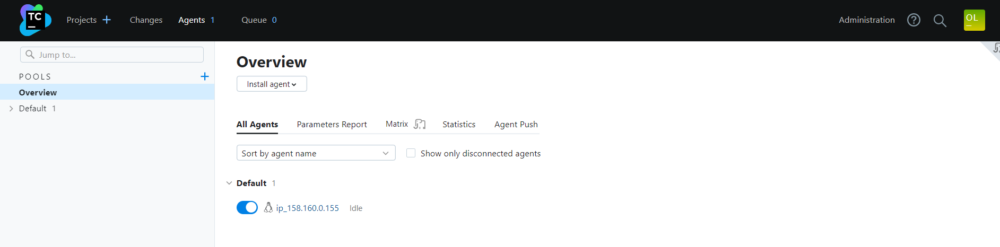

5. Сделайте fork [репозитория](https://github.com/aragastmatb/example-teamcity)

```
$git clone https://github.com/taikobara3/example-teamcity
Cloning into 'example-teamcity'...
remote: Enumerating objects: 343, done.
remote: Counting objects: 100% (1/1), done.
remote: Total 343 (delta 0), reused 1 (delta 0), pack-reused 342
Receiving objects: 100% (343/343), 45.95 KiB | 1.35 MiB/s, done.
Resolving deltas: 100% (114/114), done.
```
6. Создать VM (2CPU4RAM) и запустить [playbook](./infrastructure)

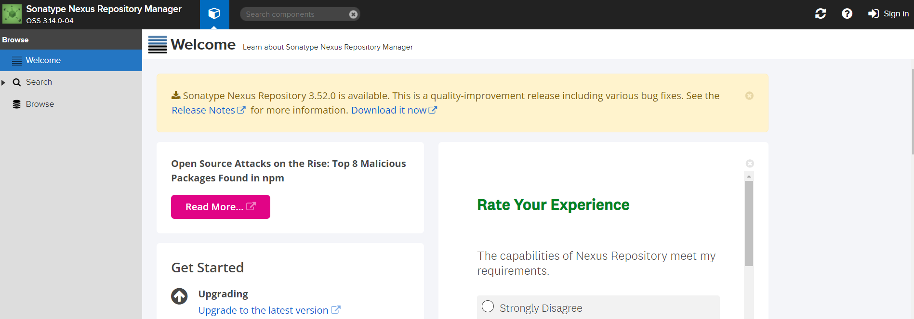

## Основная часть

1. Создайте новый проект в teamcity на основе fork

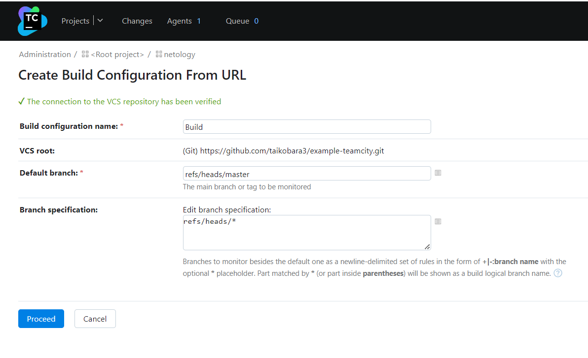

2. Сделайте autodetect конфигурации

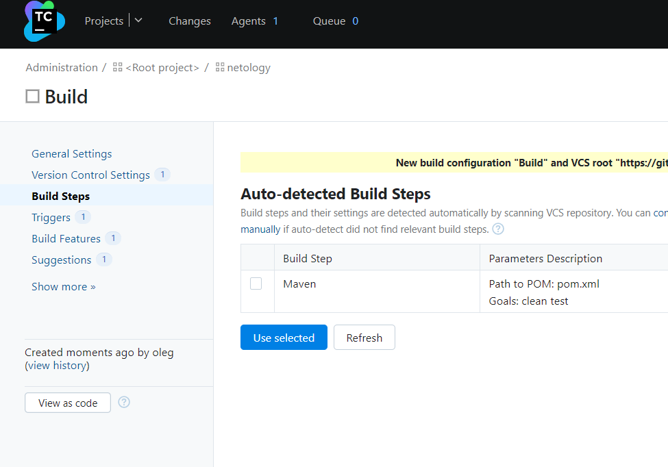

3. Сохраните необходимые шаги, запустите первую сборку master'a

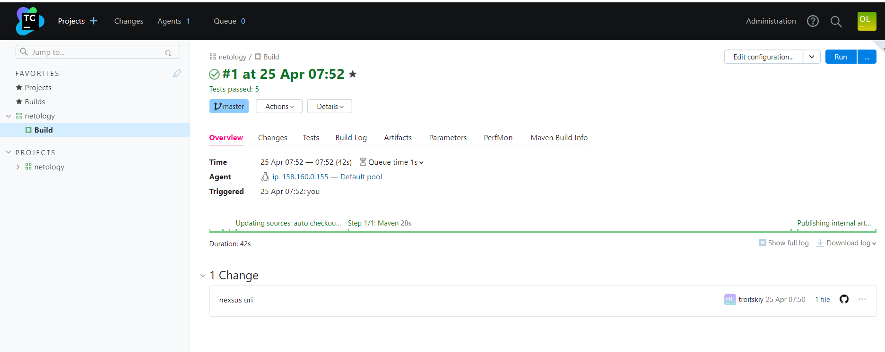

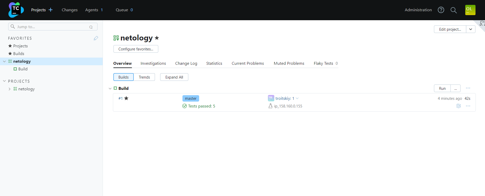

4. Поменяйте условия сборки: если сборка по ветке `master`, то должен происходит `mvn clean deploy`, иначе `mvn clean test`

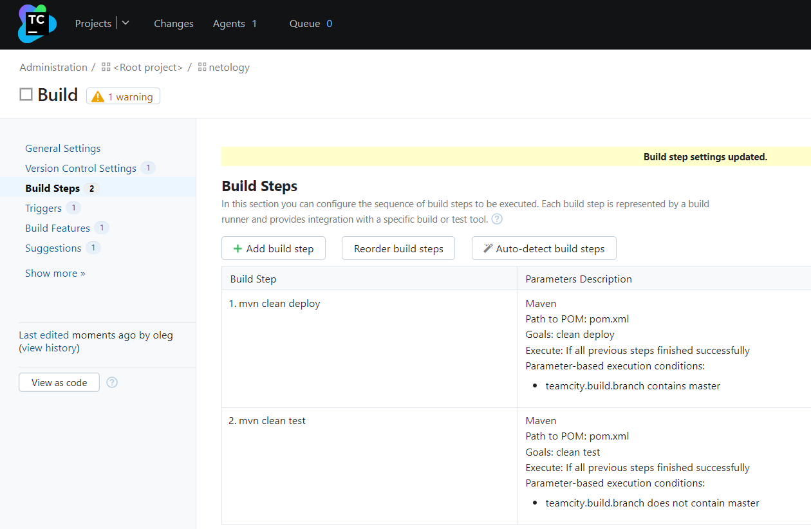

5. Для deploy будет необходимо загрузить [settings.xml](./teamcity/settings.xml) в набор конфигураций maven у teamcity, предварительно записав туда креды для подключения к nexus

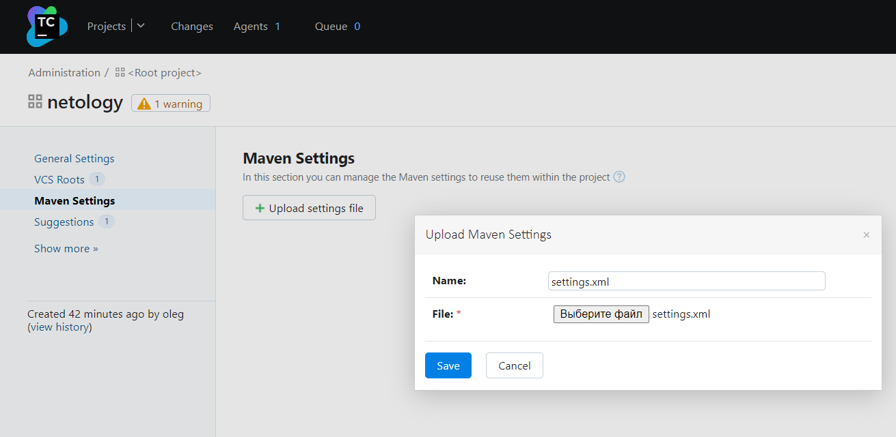

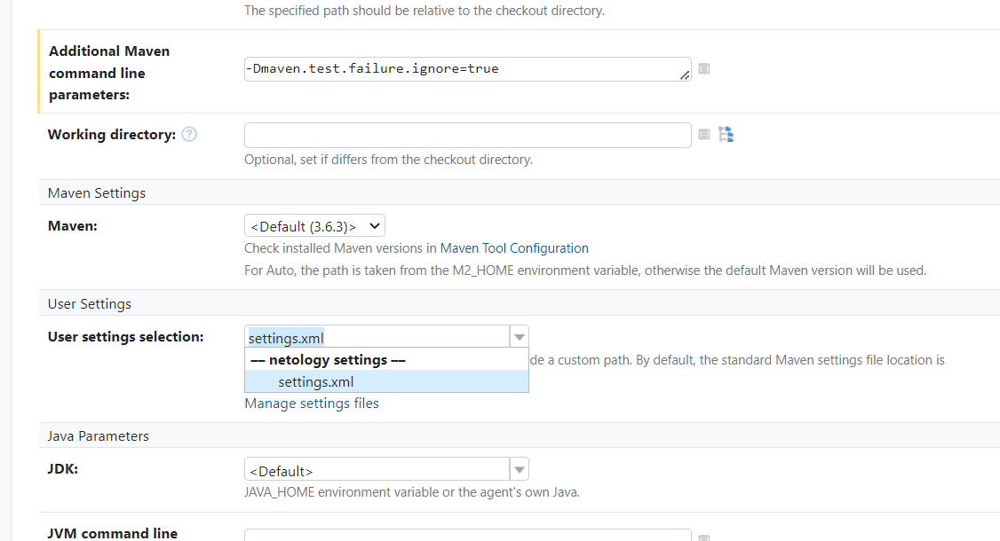

6. В pom.xml необходимо поменять ссылки на репозиторий и nexus
7. Запустите сборку по master, убедитесь что всё прошло успешно, артефакт появился в nexus

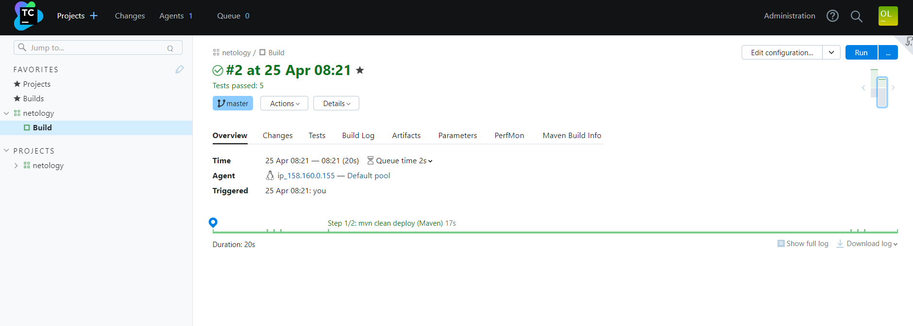

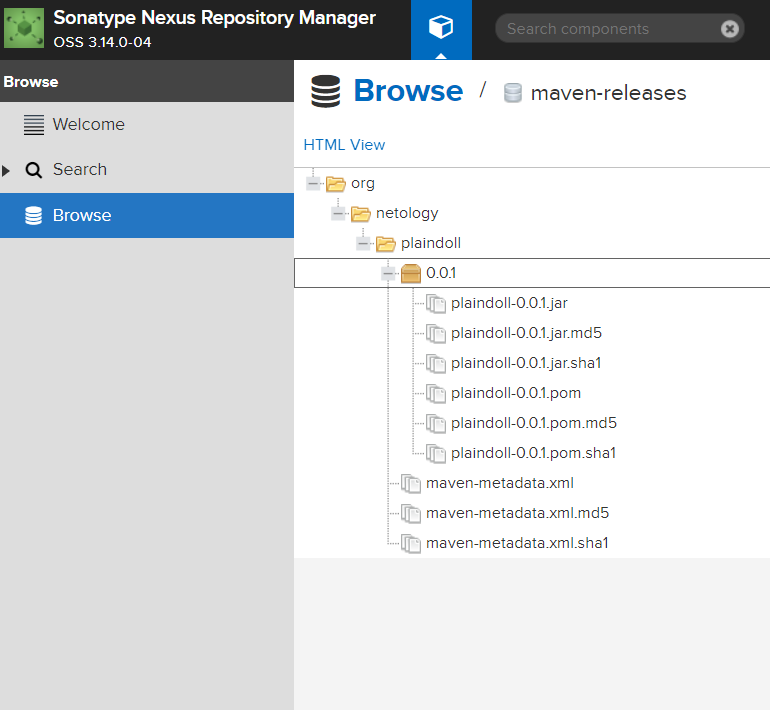

8. Мигрируйте `build configuration` в репозиторий

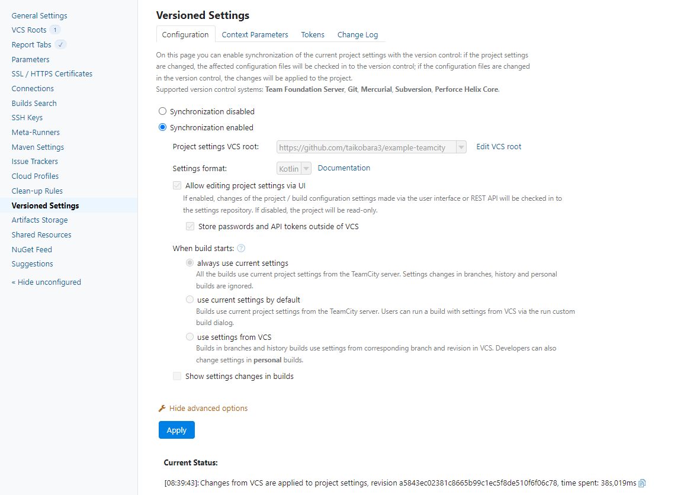

9. Создайте отдельную ветку `feature/add_reply` в репозитории

```commandline
$ git checkout -b feature/add_reply
Switched to a new branch 'feature/add_reply'
```

10. Напишите новый метод для класса Welcomer: метод должен возвращать произвольную реплику, содержащую слово `hunter`

ackage plaindoll;

<details>
<summary>New method</summary>

```
package plaindoll;

public class Welcomer{
        public String sayWelcome() {
                return "Welcome home, good hunter. What is it your desire?";
        }
        public String sayFarewell() {
                return "Farewell, good hunter. May you find your worth in waking world.";
        }
        public String sayNeedGold() {
                return "Not enough gold";
        }
        public String saySome() {
                return "something in the way";
        }
        public String sayHunterduck() {
                return "Hunter is not hunterduck.";
        }
}
```

</details>

11. Дополните тест для нового метода на поиск слова `hunter` в новой реплике

<details>
<summary>New test</summary>

```commandline
ackage plaindoll;

import static org.hamcrest.CoreMatchers.containsString;
import static org.junit.Assert.*;

import org.junit.Test;

public class WelcomerTest {

        private Welcomer welcomer = new Welcomer();

        @Test
        public void welcomerSaysWelcome() {
                assertThat(welcomer.sayWelcome(), containsString("Welcome"));
        }
        @Test
        public void welcomerSaysFarewell() {
                assertThat(welcomer.sayFarewell(), containsString("Farewell"));
        }
        @Test
        public void welcomerSaysHunter() {
                assertThat(welcomer.sayWelcome(), containsString("hunter"));
                assertThat(welcomer.sayFarewell(), containsString("hunter"));
        }
        @Test
        public void welcomerSaysSilver(){
                assertThat(welcomer.sayNeedGold(), containsString("gold"));
        }
        @Test
        public void welcomerSaysSomething(){
                assertThat(welcomer.saySome(), containsString("something"));
        }
        @Test
        public void welcomerSaysHunterduck() {
                assertThat(welcomer.sayHunterduck(), containsString("hunter"));
        }
}
```

</details>

12. Сделайте push всех изменений в новую ветку в репозиторий

```
git push origin feature/add_reply
Username for 'https://github.com': taikobara3 
Password for 'https://taikobara3@github.com': 
Enumerating objects: 357, done.
Counting objects: 100% (357/357), done.
Delta compression using up to 4 threads
Compressing objects: 100% (146/146), done.
Writing objects: 100% (357/357), 47.14 KiB | 5.24 MiB/s, done.
Total 357 (delta 118), reused 341 (delta 114), pack-reused 0
remote: Resolving deltas: 100% (118/118), done.
remote: 
remote: Create a pull request for 'feature/add_reply' on GitHub by visiting:
remote:      https://github.com/taikobara3/example-teamcity/pull/new/feature/add_reply
remote: 
To https://github.com/taikobara3/example-teamcity
 * [new branch]      feature/add_reply -> feature/add_reply
 ```

13. Убедитесь что сборка самостоятельно запустилась, тесты прошли успешно

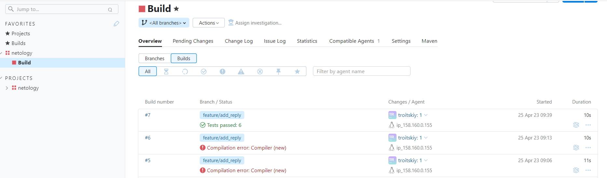

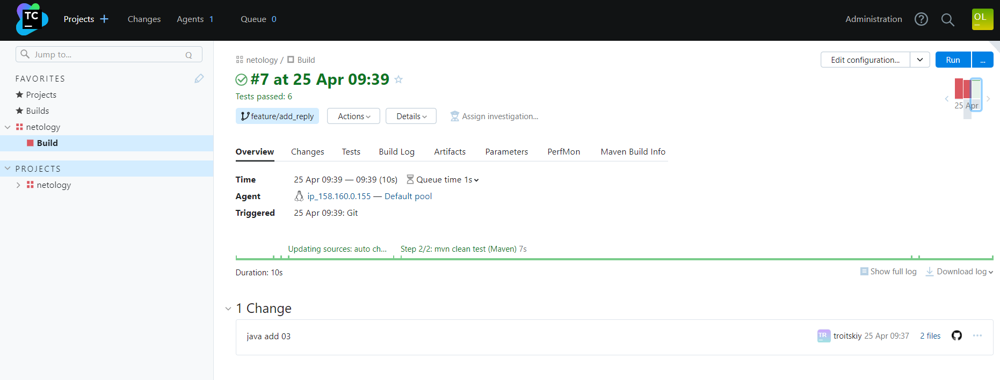

14. Внесите изменения из произвольной ветки `feature/add_reply` в `master` через `Merge`

```commandline
$ git pull
Merge made by the 'ort' strategy.
 .teamcity/pluginData/Netology/mavenSettings/settings.xml | 261 +++++++++++++++++++++++++++++++++++++++++++++++++++++++++++++++++++++++++++++++++++++
 .teamcity/pom.xml                                        | 104 ++++++++++++++++++++++++++++++++++
 .teamcity/settings.kts                                   | 110 ++++++++++++++++++++++++++++++++++++
 3 files changed, 475 insertions(+)
 create mode 100644 .teamcity/pluginData/Netology/mavenSettings/settings.xml
 create mode 100644 .teamcity/pom.xml
 create mode 100644 .teamcity/settings.kts
$ git checkout master
Switched to branch 'master'
Your branch is up to date with 'origin/master'.
$ git merge feature/add_reply
Updating 84b4152..5d1ab6c
Fast-forward
 src/main/java/plaindoll/Welcomer.java     | 7 +++++--
 src/test/java/plaindoll/WelcomerTest.java | 6 +++++-
 2 files changed, 10 insertions(+), 3 deletions(-)
$ git push origin master
Username for 'https://github.com': taikobara3
Password for 'https://taikobara3@github.com': 
Enumerating objects: 4, done.
Counting objects: 100% (4/4), done.
Delta compression using up to 4 threads
Compressing objects: 100% (2/2), done.
Writing objects: 100% (2/2), 327 bytes | 327.00 KiB/s, done.
Total 2 (delta 1), reused 0 (delta 0), pack-reused 0
remote: Resolving deltas: 100% (1/1), completed with 1 local object.
To https://github.com/taikobara3/example-teamcity
   a5843ec..7c7103a  master -> master
```

15. Убедитесь, что нет собранного артефакта в сборке по ветке `master`

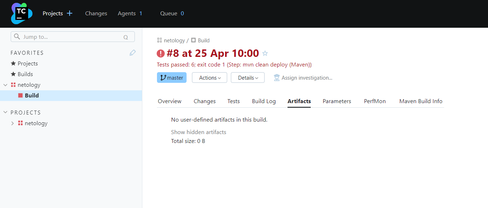

16. Настройте конфигурацию так, чтобы она собирала `.jar` в артефакты сборки

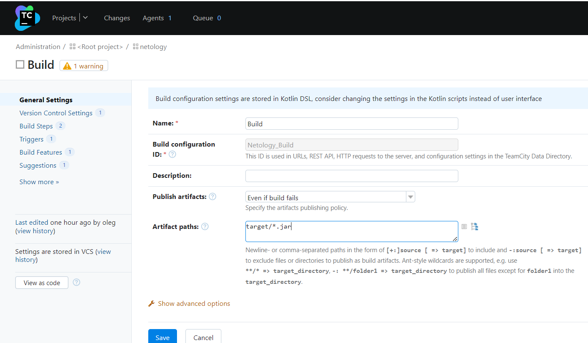

17. Проведите повторную сборку мастера, убедитесь, что сбора прошла успешно и артефакты собраны

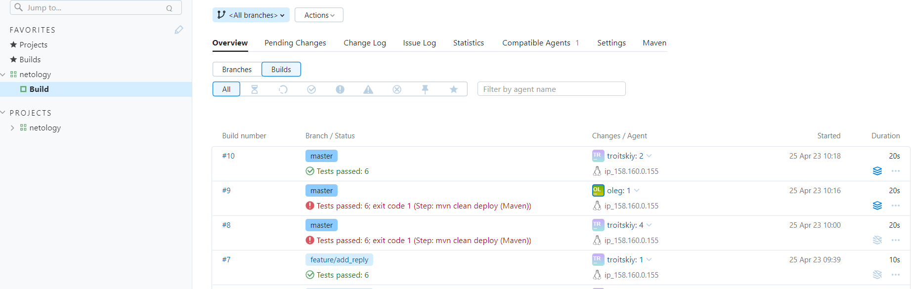

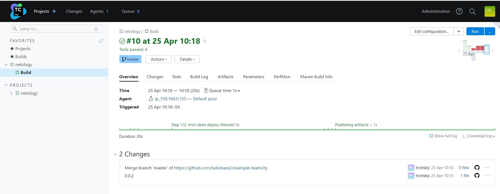

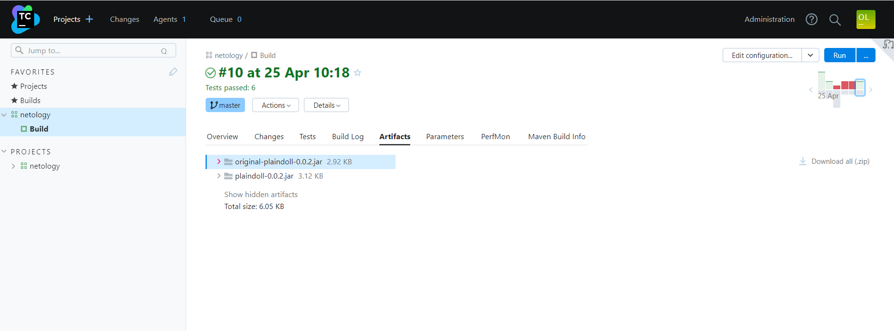

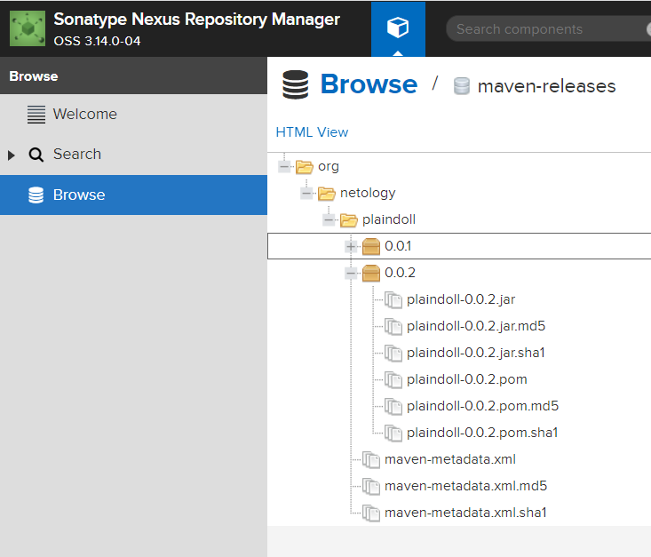

18. Проверьте, что конфигурация в репозитории содержит все настройки конфигурации из teamcity

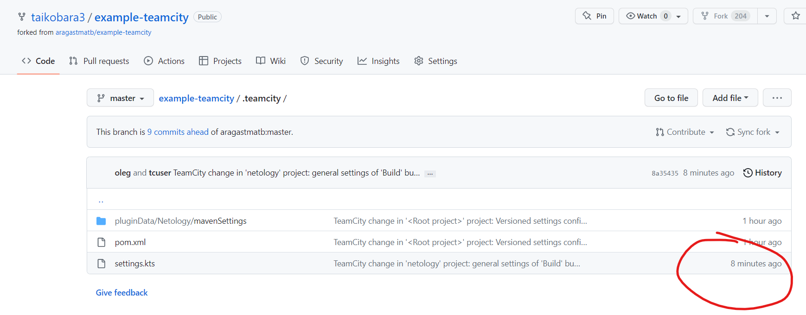

19. В ответ предоставьте ссылку на репозиторий

https://github.com/taikobara3/example-teamcity

---

### Как оформить ДЗ?

Выполненное домашнее задание пришлите ссылкой на .md-файл в вашем репозитории.

---
