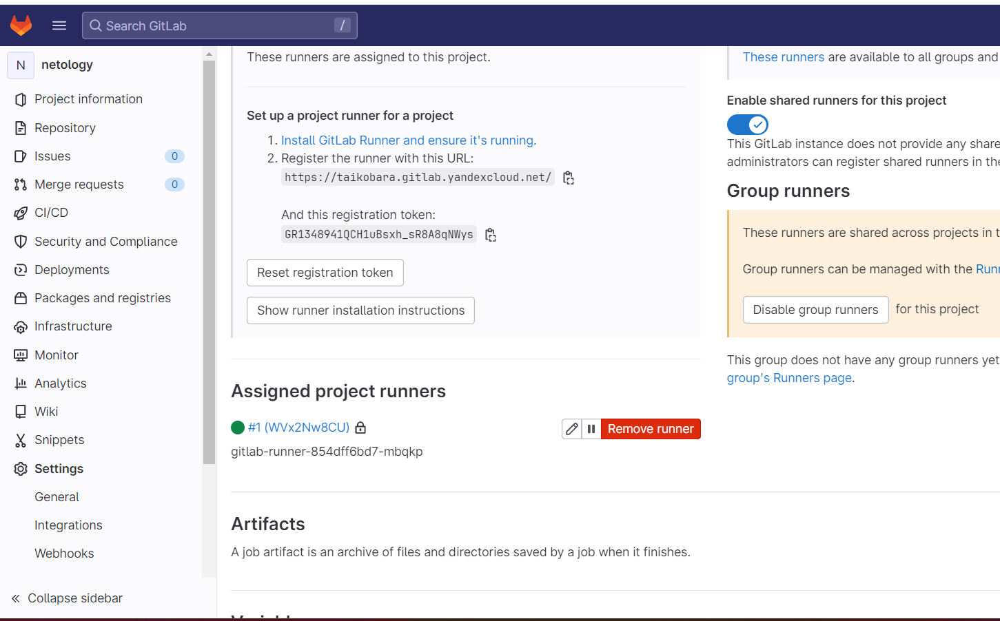
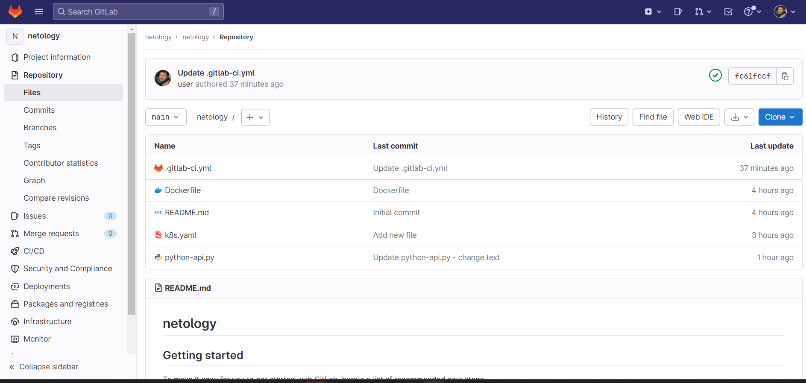
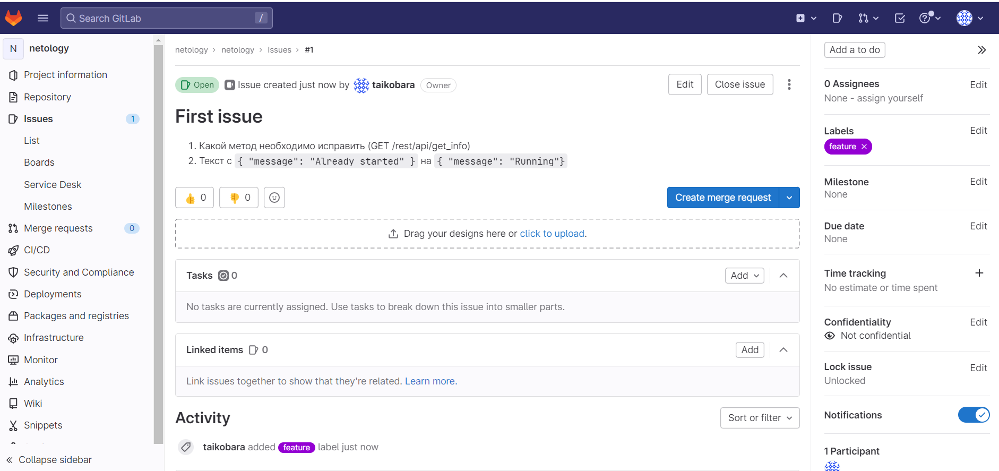
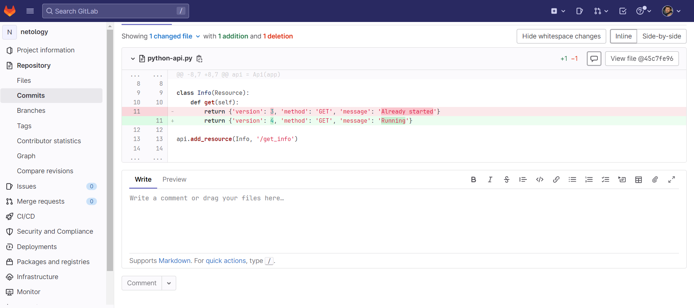
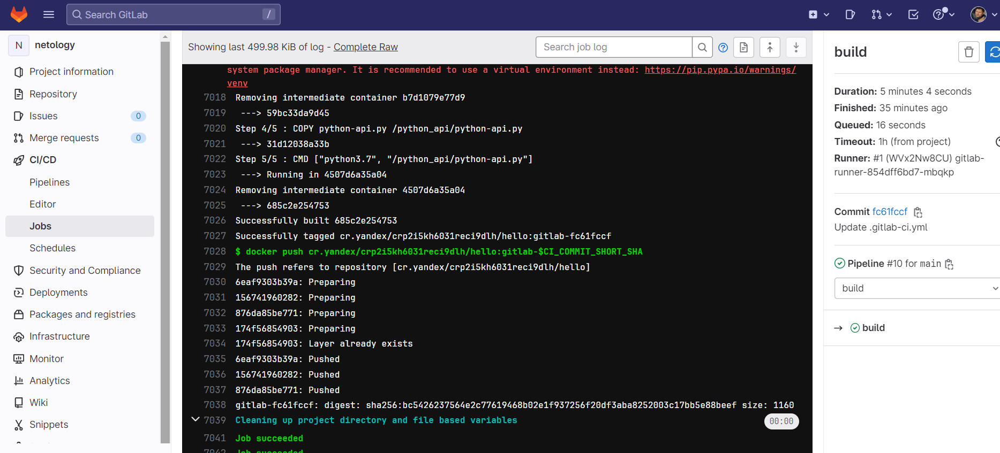
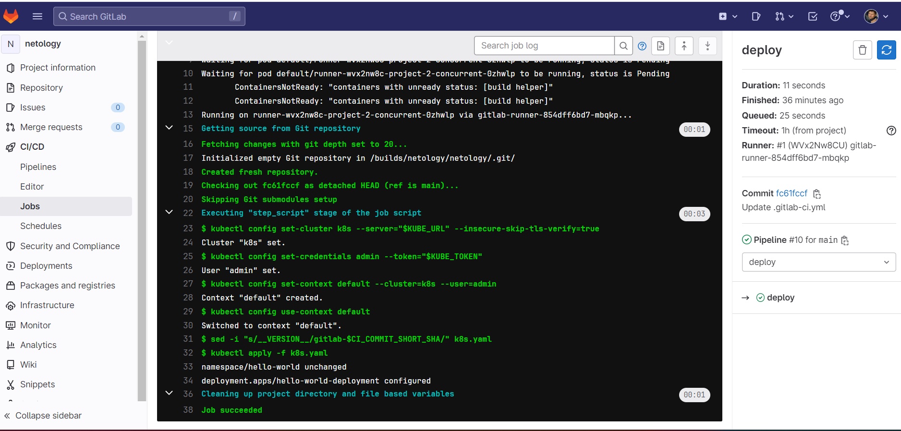
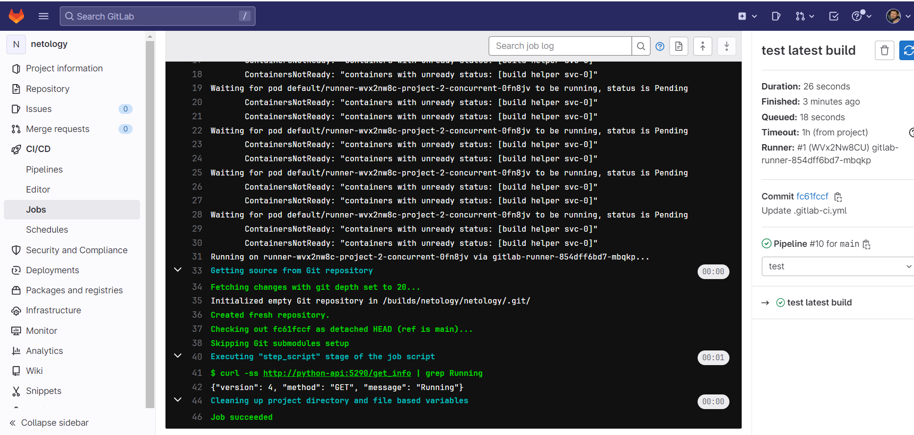
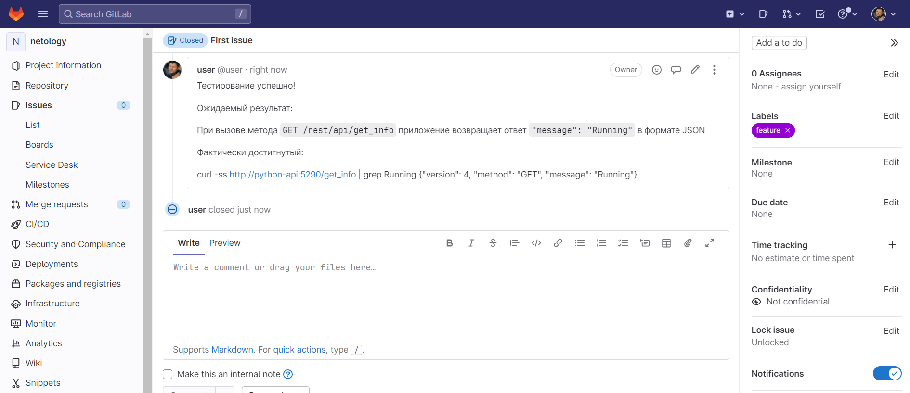

# Домашнее задание к занятию "12.Gitlab"

## Подготовка к выполнению

1. Необходимо [подготовить gitlab к работе по инструкции](https://cloud.yandex.ru/docs/tutorials/infrastructure-management/gitlab-containers)
2. Создайте свой новый проект
3. Создайте новый репозиторий в gitlab, наполните его [файлами](./repository)
4. Проект должен быть публичным, остальные настройки по желанию

## Основная часть

### DevOps

В репозитории содержится код проекта на python. Проект - RESTful API сервис. Ваша задача автоматизировать сборку образа с выполнением python-скрипта:
1. Образ собирается на основе [centos:7](https://hub.docker.com/_/centos?tab=tags&page=1&ordering=last_updated)
2. Python версии не ниже 3.7
3. Установлены зависимости: `flask` `flask-jsonpify` `flask-restful`
4. Создана директория `/python_api`
5. Скрипт из репозитория размещён в /python_api
6. Точка вызова: запуск скрипта
7. Если сборка происходит на ветке `master`: должен подняться pod kubernetes на основе образа `python-api`, иначе этот шаг нужно пропустить






### Product Owner

Вашему проекту нужна бизнесовая доработка: необходимо поменять JSON ответа на вызов метода GET `/rest/api/get_info`, необходимо создать Issue в котором указать:
1. Какой метод необходимо исправить
2. Текст с `{ "message": "Already started" }` на `{ "message": "Running"}`
3. Issue поставить label: feature



### Developer

Вам пришел новый Issue на доработку, вам необходимо:
1. Создать отдельную ветку, связанную с этим issue
2. Внести изменения по тексту из задания
3. Подготовить Merge Requst, влить необходимые изменения в `master`, проверить, что сборка прошла успешно







### Tester

Разработчики выполнили новый Issue, необходимо проверить валидность изменений:
1. Поднять докер-контейнер с образом `python-api:latest` и проверить возврат метода на корректность
2. Закрыть Issue с комментарием об успешности прохождения, указав желаемый результат и фактически достигнутый

## Итог

В качестве ответа предоставьте подробные скриншоты по каждому пункту задания:
- файл gitlab-ci.yml

```commandline
stages:
  - build
  - deploy
  - test
build:
  stage: build
  variables:
    DOCKER_DRIVER: overlay2
    DOCKER_TLS_CERTDIR: ""
    DOCKER_HOST: tcp://localhost:2375/
  image: cr.yandex/yc/metadata-token-docker-helper:0.2
  services:
    - docker:19.03.1-dind
  script:
    - docker build . -t cr.yandex/crp2i5kh6031reci9dlh/hello:gitlab-$CI_COMMIT_SHORT_SHA
    - docker push cr.yandex/crp2i5kh6031reci9dlh/hello:gitlab-$CI_COMMIT_SHORT_SHA

deploy:
  image: gcr.io/cloud-builders/kubectl:latest
  stage: deploy
  script:
    - kubectl config set-cluster k8s --server="$KUBE_URL" --insecure-skip-tls-verify=true
    - kubectl config set-credentials admin --token="$KUBE_TOKEN"
    - kubectl config set-context default --cluster=k8s --user=admin
    - kubectl config use-context default
    - sed -i "s/__VERSION__/gitlab-$CI_COMMIT_SHORT_SHA/" k8s.yaml
    - kubectl apply -f k8s.yaml
  only:
    - main
    - master
test latest build:
  image: curlimages/curl
  services:
    - name: cr.yandex/crp2i5kh6031reci9dlh/hello:gitlab-$CI_COMMIT_SHORT_SHA
      alias: python-api
  stage: test
  script:
    - curl -ss http://python-api:5290/get_info | grep Running
  only:
    - main
    - master

```

- Dockerfile

```
FROM centos:7

RUN yum -y install wget make gcc openssl-devel bzip2-devel libffi-devel && \
    cd /tmp/ && \
    wget https://www.python.org/ftp/python/3.7.9/Python-3.7.9.tgz && \
    tar xzf Python-3.7.9.tgz && \
    cd Python-3.7.9 && \
    ./configure --enable-optimizations && \
    make altinstall && \
    ln -sfn /usr/local/bin/python3.7 /usr/bin/python3.7 && \
    ln -sfn /usr/local/bin/pip3.7 /usr/bin/pip3.7 && \
    python3.7 -m pip install --upgrade pip
RUN pip3.7 install flask flask-restful flask-jsonpify

COPY python-api.py /python_api/python-api.py
CMD ["python3.7", "/python_api/python-api.py"]
```

- лог успешного выполнения пайплайна



- решенный Issue.



### :bangbang: После выполнения задания выключите и удалите все задействованные ресурсы в Yandex.Cloud.

## Необязательная часть

Автомазируйте работу тестировщика, пусть у вас будет отдельный конвейер, который автоматически поднимает контейнер и выполняет проверку, например, при помощи curl. На основе вывода - будет приниматься решение об успешности прохождения тестирования


###############

oleg@oleg-VirtualBox:~/.ssh$ helm install --namespace default gitlab-runner -f values.yaml gitlab/gitlab-runner
NAME: gitlab-runner
LAST DEPLOYED: Mon May 15 14:32:06 2023
NAMESPACE: default
STATUS: deployed
REVISION: 1
TEST SUITE: None
NOTES:
Your GitLab Runner should now be registered against the GitLab instance reachable at: "https://taikobara.gitlab.yandexcloud.net/"

Runner namespace "default" was found in runners.config template.
oleg@oleg-VirtualBox:~/.ssh$ kubectl get pods -n default | grep gitlab-runner
gitlab-runner-854dff6bd7-mbqkp   0/1     ContainerCreating   0          32s

