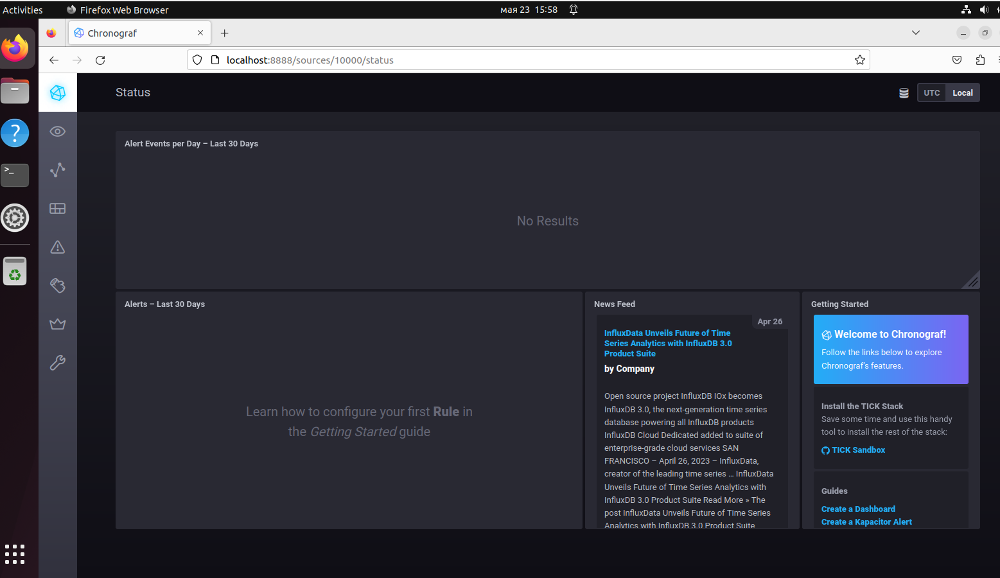
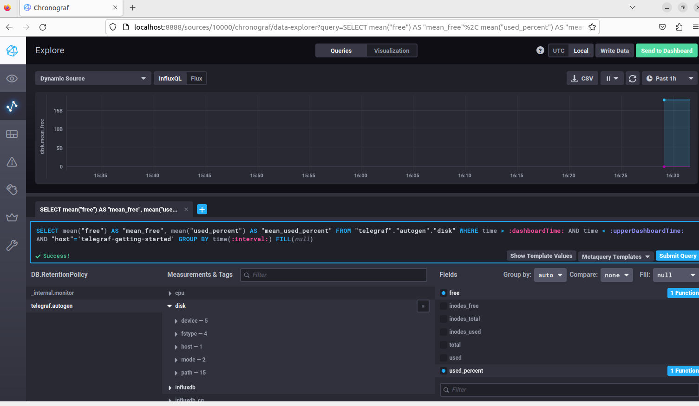
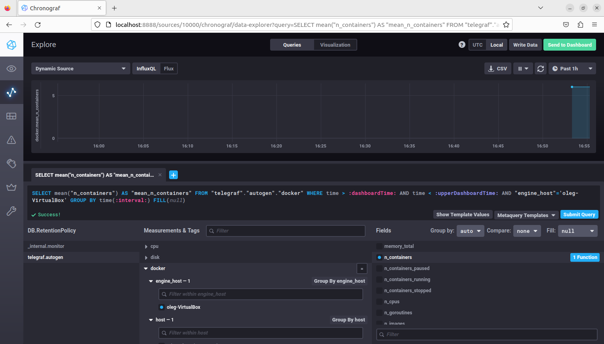

# Домашнее задание к занятию "13.Введение в мониторинг"

## Обязательные задания

**1.** _Вас пригласили настроить мониторинг на проект. На онбординге вам рассказали, что проект представляет из себя 
платформу для вычислений с выдачей текстовых отчетов, которые сохраняются на диск. Взаимодействие с платформой 
осуществляется по протоколу http. Также вам отметили, что вычисления загружают ЦПУ. Какой минимальный набор метрик вы
выведите в мониторинг и почему?_

I - Мониторинг дисковой подсистемы - для предотвращения переполнения дисковой подсистемы, исключения снижения эффективности работы ПО из-за недостатка или деградации производительности дисковой подсистемы, потери данных из-за сбоев дисков)
1.    наличие свободного пространства и динамика прироста 
2.    свободные inod
3.    длина очереди дисковых операций, латентность, IOpS
4.    по возможности - состояние smart дисков и/или информацию по RAID массиву

II - Общая производительность сервера - для оценки производительности, выявления узких мест, для оценки необходимости перерапределения ресурсов
1.    загрузка CPU (текущая, и в динамике)
2.    интегральная загруженность системы (load averages в top)
3.    утилизация оперативной памяти (свободная память, динамика утилизация - для диагностики возможных утечек)
4.    процент нагрузки на систему, создаваемой отдельными группами процессов (системное ПО, вычисление, генерация отчетов)

III - Оценка работы ПО - для оценки производительности, нагрузки, SLI
1.    количество запросов
2.    соотношение корректных и некорректных ответов сервера  
3.    доступность серверного ПО (по тесту API, или тестовым запросам)
4.    количество выполненных вычислений и отчетов за интервалы времени

IV - Мониторинг безопасности
1.    валидность SSL сертификатов
2.    неудачные авторизации в ПО и на сервере
3.    география запросов по GeoIP - для оптимизации производительности, разбора инцидентов, предотвращения ddos атак

**2.** _Менеджер продукта посмотрев на ваши метрики сказал, что ему непонятно что такое RAM/inodes/CPUla. Также он сказал, 
что хочет понимать, насколько мы выполняем свои обязанности перед клиентами и какое качество обслуживания. Что вы 
можете ему предложить?_

Можно предложить следующие метрики:
1.    наличие ошибочных ответов сервера (4хх и 5хх) на страницах рабочего проекта вообще
2.    отношение количества корректных ответов сервера к ошибочным за интервалы времени: 5, 15, 60 минут, сутки, неделю
3.    время выполнения вычислений и создания отчетов - максимальные и средние за те же промежутки времени
4.    количество запросов на создание отчетов, и количество выполненных отчетов за те же промежутки времени
5.    загрузка ЦПУ процессами коммерческого приложения за интервалы времени

Для понимания менеджерами занчений этих метрик мониторинга, они должны быть заведены в систему с уровными warning и critical, установленными исходя из значений SLO для этих показателей.
Также им могут быть даны более понятные наименования ("Уровень ошибок" "Время выполнения")
Последняя метрика, возможно, наименее "понятная", но может быть важна для бизнес-аналитики, для оценки степени эффективности использования ресурсов.

**3.** _Вашей DevOps команде в этом году не выделили финансирование на построение системы сбора логов. Разработчики в свою 
очередь хотят видеть все ошибки, которые выдают их приложения. Какое решение вы можете предпринять в этой ситуации, 
чтобы разработчики получали ошибки приложения?_

Для решения подобной задачи, не обязательно наличие какой-то системы сбора логов, требующей финансирования. 
Задачу можно реализовать:
1.    самописным скриптом, анализирующим логи приложений, и высылающим найденные ошибки по почте
2.    использованием приложения Logsentry, которое по сути делает именно это же
3.    логи, особенно если они выводятся в syslog - можно выводить на один сервер, это штатная функция syslog - там ошибки можно смотреть теми же способами, или просто grep
 

**4.** _Вы, как опытный SRE, сделали мониторинг, куда вывели отображения выполнения SLA=99% по http кодам ответов. 
Вычисляете этот параметр по следующей формуле: summ_2xx_requests/summ_all_requests. Данный параметр не поднимается выше 
70%, но при этом в вашей системе нет кодов ответа 5xx и 4xx. Где у вас ошибка?_

Вероятно, ошибка в том, что как корректные ответы не учитываются коды ответов 1xx и 2xx

**5.** _Опишите основные плюсы и минусы pull и push систем мониторинга._

Плюсы push:

* Проще настройка рассылки данных в несколько систем мониторинга (для репликации, например)
* Возможность использования более производительного UDP протокола (например, протокол sFlow)
* Более простое горизонтальное масштабирование (можно просто добавлять узлы с агентами, на сервере ничего настраивать не нужно)
* Агенты защищены от атак, так как не слушают порты
* Агенты не имеют состояния, передают информацию сразу 
* Увеличение количества агентов создает меньшую нагрузку на коллектор
* Проще реализовать Real-time мониторинг

Плюсы pull:

* Легче контролировать подлинность получаемых данных (но требует более трудоемкой настройки безопасности - доступ к удаленным агентам)
* Более простая централизованная конфигурация клиентов на сервере мониторинга (более низкий порог вхождения). Возможность получения практически любой метрики с агента в любое время (по запросу) - обеспечивается более гибкая настройка мониторинга
* Возможность настройки единого proxy для всех агентов
* Упрощенная отладка данных, получаемых от клиентов
* Относительно более сложно организована настройка (подключение к мониторингу) новых агентов

Минусы моделей, в основном противоположны указанным плюсам. 

У pull модели это, большие накладные расходы при увеличении количества агентов (в целом менее производительные протоколы, большая требовательность к ресурсам центрального сервера), относительная сложность добавления новых клиентов, большая уязвимость агентов к атакам, большие задержки при получении данных, сложность установки сервера за NAT

У push модели это меньшая гибкость оперативного выбора получаемых метрик (нельзя запросить с сервера любую метрику), невозможность использования модели на безагентных или чужих узлах, агенты могут заддосить коллектор 

**6.** _Какие из ниже перечисленных систем относятся к push модели, а какие к pull? А может есть гибридные?_

* Prometheus - pull (возможна push при помощи Pushgateway)
* TICK - push (InfluxDB использует читсый push, telegraf может использовать оба метода)
* Zabbix - push и pull c Zabbix Proxy
* VictoriaMetrics - push и pull ( https://docs.victoriametrics.com/keyConcepts.html ). Возможна работа только в одном методе, для смены необходим рестарт
* Nagios - push и pull (Push реализуется активным режимом агента)

**7.** _Склонируйте себе репозиторий и запустите TICK-стэк, используя технологии docker и docker-compose.
В виде решения на это упражнение приведите скриншот веб-интерфейса ПО chronograf (http://localhost:8888)._
_P.S.: если при запуске некоторые контейнеры будут падать с ошибкой - проставьте им режим Z, например ./data:/var/lib:Z_

**8.** _Перейдите в веб-интерфейс Chronograf (http://localhost:8888) и откройте вкладку Data explorer._

* _Нажмите на кнопку Add a query_
* _Изучите вывод интерфейса и выберите БД telegraf.autogen_
* _В measurments выберите mem->host->telegraf_container_id , а в fields выберите used_percent. Внизу появится график утилизации оперативной памяти в контейнере telegraf._
* _Вверху вы можете увидеть запрос, аналогичный SQL-синтаксису. Поэкспериментируйте с запросом, попробуйте изменить группировку и интервал наблюдений._
_Для выполнения задания приведите скриншот с отображением метрик утилизации места на диске (disk->host->telegraf_container_id) из веб-интерфейса._

**9.** Изучите список telegraf inputs. Добавьте в конфигурацию telegraf следующий плагин - docker:
[[inputs.docker]]
  endpoint = "unix:///var/run/docker.sock"
Дополнительно вам может потребоваться донастройка контейнера telegraf в docker-compose.yml дополнительного volume и режима privileged:

  telegraf:
    image: telegraf:1.4.0
    privileged: true
    volumes:
      - ./etc/telegraf.conf:/etc/telegraf/telegraf.conf:Z
      - /var/run/docker.sock:/var/run/docker.sock:Z
    links:
      - influxdb
    ports:
      - "8092:8092/udp"
      - "8094:8094"
      - "8125:8125/udp"
После настройке перезапустите telegraf, обновите веб интерфейс и приведите скриншотом список measurments в веб-интерфейсе базы telegraf.autogen . Там должны появиться метрики, связанные с docker.

Факультативно можете изучить какие метрики собирает telegraf после выполнения данного задания.

## Дополнительное задание (со звездочкой*) - необязательно к выполнению

Вы устроились на работу в стартап. На данный момент у вас нет возможности развернуть полноценную систему 
мониторинга, и вы решили самостоятельно написать простой python3-скрипт для сбора основных метрик сервера. Вы, как 
опытный системный-администратор, знаете, что системная информация сервера лежит в директории `/proc`. 
Также, вы знаете, что в системе Linux есть  планировщик задач cron, который может запускать задачи по расписанию.

Суммировав все, вы спроектировали приложение, которое:
- является python3 скриптом
- собирает метрики из папки `/proc`
- складывает метрики в файл 'YY-MM-DD-awesome-monitoring.log' в директорию /var/log 
(YY - год, MM - месяц, DD - день)
- каждый сбор метрик складывается в виде json-строки, в виде:
  + timestamp (временная метка, int, unixtimestamp)
  + metric_1 (метрика 1)
  + metric_2 (метрика 2)
  
     ...
     
  + metric_N (метрика N)
  
- сбор метрик происходит каждую 1 минуту по cron-расписанию

Для успешного выполнения задания нужно привести:

а) работающий код python3-скрипта,

б) конфигурацию cron-расписания,

в) пример верно сформированного 'YY-MM-DD-awesome-monitoring.log', имеющий не менее 5 записей,

P.S.: количество собираемых метрик должно быть не менее 4-х.
P.P.S.: по желанию можно себя не ограничивать только сбором метрик из `/proc`.

---

### Как оформить ДЗ?

Выполненное домашнее задание пришлите ссылкой на .md-файл в вашем репозитории.

---
