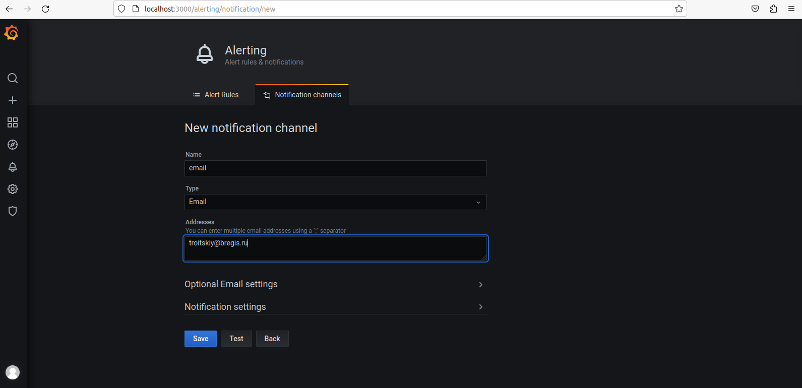

# Домашнее задание к занятию "14.Средство визуализации Grafana"

## Задание повышенной сложности

**В части задания 1** не используйте директорию [help](./help) для сборки проекта, самостоятельно разверните grafana, где в 
роли источника данных будет выступать prometheus, а сборщиком данных node-exporter:
- grafana
- prometheus-server
- prometheus node-exporter

За дополнительными материалами, вы можете обратиться в официальную документацию grafana и prometheus.

В решении к домашнему заданию приведите также все конфигурации/скрипты/манифесты, которые вы 
использовали в процессе решения задания.

**В части задания 3** вы должны самостоятельно завести удобный для вас канал нотификации, например Telegram или Email
и отправить туда тестовые события.

В решении приведите скриншоты тестовых событий из каналов нотификаций.

## Обязательные задания

### Задание 1
Используя директорию [help](./help) внутри данного домашнего задания - запустите связку prometheus-grafana.

Зайдите в веб-интерфейс графана, используя авторизационные данные, указанные в манифесте docker-compose.

Подключите поднятый вами prometheus как источник данных.

Решение домашнего задания - скриншот веб-интерфейса grafana со списком подключенных Datasource.


## Задание 2
Изучите самостоятельно ресурсы:
- [promql-for-humans](https://timber.io/blog/promql-for-humans/#cpu-usage-by-instance)
- [understanding prometheus cpu metrics](https://www.robustperception.io/understanding-machine-cpu-usage)

Создайте Dashboard и в ней создайте следующие Panels:
- Утилизация CPU для nodeexporter (в процентах, 100-idle)

```
100 * (1 - avg by(instance)(irate(node_cpu_seconds_total{job="nodeexporter",mode="idle"}[5m])))
```

- CPULA 1/5/15

```
avg by (instance)(rate(node_load1{}[$__rate_interval]))
avg by (instance)(rate(node_load5{}[$__rate_interval]))
avg by (instance)(rate(node_load15{}[$__rate_interval]))
```

- Количество свободной оперативной памяти

```
node_memory_MemFree_bytes{job="nodeexporter"}
```

- Количество места на файловой системе

```commandline
node_filesystem_free_bytes{job="nodeexporter",mountpoint="/"}
```

Для решения данного ДЗ приведите promql запросы для выдачи этих метрик, а также скриншот получившейся Dashboard.


## Задание 3
Создайте для каждой Dashboard подходящее правило alert (можно обратиться к первой лекции в блоке "Мониторинг").

Для решения ДЗ - приведите скриншот вашей итоговой Dashboard.




## Задание 4
Сохраните ваш Dashboard.

Для этого перейдите в настройки Dashboard, выберите в боковом меню "JSON MODEL".

Далее скопируйте отображаемое json-содержимое в отдельный файл и сохраните его.

В решении задания - приведите листинг этого файла.

<details>
<summary>Листинг JSON</summary>

```commandline
{
  "annotations": {
    "list": [
      {
        "builtIn": 1,
        "datasource": "-- Grafana --",
        "enable": true,
        "hide": true,
        "iconColor": "rgba(0, 211, 255, 1)",
        "name": "Annotations & Alerts",
        "type": "dashboard"
      }
    ]
  },
  "editable": true,
  "gnetId": null,
  "graphTooltip": 0,
  "id": 1,
  "links": [],
  "panels": [
    {
      "alert": {
        "alertRuleTags": {},
        "conditions": [
          {
            "evaluator": {
              "params": [
                0.8
              ],
              "type": "gt"
            },
            "operator": {
              "type": "and"
            },
            "query": {
              "params": [
                "A",
                "5m",
                "now"
              ]
            },
            "reducer": {
              "params": [],
              "type": "last"
            },
            "type": "query"
          },
          {
            "evaluator": {
              "params": [
                0.6
              ],
              "type": "gt"
            },
            "operator": {
              "type": "or"
            },
            "query": {
              "params": [
                "B",
                "5m",
                "now"
              ]
            },
            "reducer": {
              "params": [],
              "type": "last"
            },
            "type": "query"
          },
          {
            "evaluator": {
              "params": [
                0.4
              ],
              "type": "gt"
            },
            "operator": {
              "type": "or"
            },
            "query": {
              "params": [
                "C",
                "5m",
                "now"
              ]
            },
            "reducer": {
              "params": [],
              "type": "last"
            },
            "type": "query"
          }
        ],
        "executionErrorState": "alerting",
        "for": "5m",
        "frequency": "1m",
        "handler": 1,
        "name": "CPULA 1/5/15 alert",
        "noDataState": "no_data",
        "notifications": []
      },
      "aliasColors": {},
      "bars": false,
      "dashLength": 10,
      "dashes": false,
      "datasource": null,
      "fieldConfig": {
        "defaults": {
          "custom": {}
        },
        "overrides": []
      },
      "fill": 1,
      "fillGradient": 0,
      "gridPos": {
        "h": 8,
        "w": 12,
        "x": 0,
        "y": 0
      },
      "hiddenSeries": false,
      "id": 4,
      "legend": {
        "avg": false,
        "current": false,
        "max": false,
        "min": false,
        "show": true,
        "total": false,
        "values": false
      },
      "lines": true,
      "linewidth": 1,
      "nullPointMode": "null",
      "options": {
        "alertThreshold": true
      },
      "percentage": false,
      "pluginVersion": "7.4.0",
      "pointradius": 2,
      "points": false,
      "renderer": "flot",
      "seriesOverrides": [],
      "spaceLength": 10,
      "stack": false,
      "steppedLine": false,
      "targets": [
        {
          "expr": "avg by (instance)(rate(node_load1{}[$__rate_interval]))",
          "interval": "",
          "legendFormat": "1",
          "refId": "A"
        },
        {
          "expr": "avg by (instance)(rate(node_load5{}[$__rate_interval]))",
          "hide": false,
          "interval": "",
          "legendFormat": "5",
          "refId": "B"
        },
        {
          "expr": "avg by (instance)(rate(node_load15{}[$__rate_interval]))",
          "hide": false,
          "interval": "",
          "legendFormat": "15",
          "refId": "C"
        }
      ],
      "thresholds": [
        {
          "colorMode": "critical",
          "fill": true,
          "line": true,
          "op": "gt",
          "value": 0.8,
          "visible": true
        }
      ],
      "timeFrom": null,
      "timeRegions": [],
      "timeShift": null,
      "title": "CPULA 1/5/15",
      "tooltip": {
        "shared": true,
        "sort": 0,
        "value_type": "individual"
      },
      "type": "graph",
      "xaxis": {
        "buckets": null,
        "mode": "time",
        "name": null,
        "show": true,
        "values": []
      },
      "yaxes": [
        {
          "format": "short",
          "label": null,
          "logBase": 1,
          "max": null,
          "min": null,
          "show": true
        },
        {
          "format": "short",
          "label": null,
          "logBase": 1,
          "max": null,
          "min": null,
          "show": true
        }
      ],
      "yaxis": {
        "align": false,
        "alignLevel": null
      }
    },
    {
      "alert": {
        "alertRuleTags": {},
        "conditions": [
          {
            "evaluator": {
              "params": [
                500000000
              ],
              "type": "lt"
            },
            "operator": {
              "type": "and"
            },
            "query": {
              "params": [
                "A",
                "5m",
                "now"
              ]
            },
            "reducer": {
              "params": [],
              "type": "last"
            },
            "type": "query"
          }
        ],
        "executionErrorState": "alerting",
        "for": "5m",
        "frequency": "1m",
        "handler": 1,
        "name": "Free memory alert",
        "noDataState": "no_data",
        "notifications": []
      },
      "aliasColors": {},
      "bars": false,
      "dashLength": 10,
      "dashes": false,
      "datasource": null,
      "fieldConfig": {
        "defaults": {
          "color": {},
          "custom": {},
          "thresholds": {
            "mode": "absolute",
            "steps": []
          },
          "unit": "decbytes"
        },
        "overrides": []
      },
      "fill": 1,
      "fillGradient": 0,
      "gridPos": {
        "h": 8,
        "w": 12,
        "x": 12,
        "y": 0
      },
      "hiddenSeries": false,
      "id": 6,
      "legend": {
        "avg": false,
        "current": false,
        "max": false,
        "min": false,
        "show": true,
        "total": false,
        "values": false
      },
      "lines": true,
      "linewidth": 1,
      "nullPointMode": "null",
      "options": {
        "alertThreshold": true
      },
      "percentage": false,
      "pluginVersion": "7.4.0",
      "pointradius": 2,
      "points": false,
      "renderer": "flot",
      "seriesOverrides": [],
      "spaceLength": 10,
      "stack": false,
      "steppedLine": false,
      "targets": [
        {
          "expr": "node_memory_MemFree_bytes{job=\"nodeexporter\"}",
          "interval": "",
          "legendFormat": "",
          "refId": "A"
        }
      ],
      "thresholds": [
        {
          "colorMode": "critical",
          "fill": true,
          "line": true,
          "op": "lt",
          "value": 500000000,
          "visible": true
        }
      ],
      "timeFrom": null,
      "timeRegions": [],
      "timeShift": null,
      "title": "Free memory",
      "tooltip": {
        "shared": true,
        "sort": 0,
        "value_type": "individual"
      },
      "type": "graph",
      "xaxis": {
        "buckets": null,
        "mode": "time",
        "name": null,
        "show": true,
        "values": []
      },
      "yaxes": [
        {
          "format": "decbytes",
          "label": null,
          "logBase": 1,
          "max": null,
          "min": null,
          "show": true
        },
        {
          "format": "short",
          "label": null,
          "logBase": 1,
          "max": null,
          "min": null,
          "show": true
        }
      ],
      "yaxis": {
        "align": false,
        "alignLevel": null
      }
    },
    {
      "alert": {
        "alertRuleTags": {},
        "conditions": [
          {
            "evaluator": {
              "params": [
                80
              ],
              "type": "gt"
            },
            "operator": {
              "type": "and"
            },
            "query": {
              "params": [
                "A",
                "5m",
                "now"
              ]
            },
            "reducer": {
              "params": [],
              "type": "last"
            },
            "type": "query"
          }
        ],
        "executionErrorState": "alerting",
        "for": "5m",
        "frequency": "1m",
        "handler": 1,
        "name": "CPU for nodeexporter alert",
        "noDataState": "no_data",
        "notifications": [
          {
            "uid": "0fsTMcQVk"
          }
        ]
      },
      "aliasColors": {},
      "bars": false,
      "dashLength": 10,
      "dashes": false,
      "datasource": null,
      "fieldConfig": {
        "defaults": {
          "color": {},
          "custom": {},
          "thresholds": {
            "mode": "absolute",
            "steps": []
          }
        },
        "overrides": []
      },
      "fill": 1,
      "fillGradient": 0,
      "gridPos": {
        "h": 9,
        "w": 12,
        "x": 0,
        "y": 8
      },
      "hiddenSeries": false,
      "id": 2,
      "legend": {
        "avg": false,
        "current": false,
        "max": false,
        "min": false,
        "show": true,
        "total": false,
        "values": false
      },
      "lines": true,
      "linewidth": 1,
      "nullPointMode": "null",
      "options": {
        "alertThreshold": true
      },
      "percentage": false,
      "pluginVersion": "7.4.0",
      "pointradius": 2,
      "points": false,
      "renderer": "flot",
      "seriesOverrides": [],
      "spaceLength": 10,
      "stack": false,
      "steppedLine": false,
      "targets": [
        {
          "expr": "100 * (1 - avg by(instance)(irate(node_cpu_seconds_total{job=\"nodeexporter\",mode=\"idle\"}[5m])))",
          "interval": "",
          "legendFormat": "",
          "refId": "A"
        }
      ],
      "thresholds": [
        {
          "colorMode": "critical",
          "fill": true,
          "line": true,
          "op": "gt",
          "value": 80,
          "visible": true
        }
      ],
      "timeFrom": null,
      "timeRegions": [],
      "timeShift": null,
      "title": "CPU for nodeexporter",
      "tooltip": {
        "shared": true,
        "sort": 0,
        "value_type": "individual"
      },
      "type": "graph",
      "xaxis": {
        "buckets": null,
        "mode": "time",
        "name": null,
        "show": true,
        "values": []
      },
      "yaxes": [
        {
          "format": "short",
          "label": null,
          "logBase": 1,
          "max": null,
          "min": null,
          "show": true
        },
        {
          "format": "short",
          "label": null,
          "logBase": 1,
          "max": null,
          "min": null,
          "show": true
        }
      ],
      "yaxis": {
        "align": false,
        "alignLevel": null
      }
    },
    {
      "alert": {
        "alertRuleTags": {},
        "conditions": [
          {
            "evaluator": {
              "params": [
                20000000000
              ],
              "type": "lt"
            },
            "operator": {
              "type": "and"
            },
            "query": {
              "params": [
                "A",
                "5m",
                "now"
              ]
            },
            "reducer": {
              "params": [],
              "type": "last"
            },
            "type": "query"
          }
        ],
        "executionErrorState": "alerting",
        "for": "5m",
        "frequency": "1m",
        "handler": 1,
        "name": "Free disk alert",
        "noDataState": "no_data",
        "notifications": []
      },
      "aliasColors": {},
      "bars": false,
      "dashLength": 10,
      "dashes": false,
      "datasource": null,
      "fieldConfig": {
        "defaults": {
          "custom": {},
          "unit": "decbytes"
        },
        "overrides": []
      },
      "fill": 1,
      "fillGradient": 0,
      "gridPos": {
        "h": 8,
        "w": 12,
        "x": 12,
        "y": 8
      },
      "hiddenSeries": false,
      "id": 8,
      "legend": {
        "avg": false,
        "current": false,
        "max": false,
        "min": false,
        "show": true,
        "total": false,
        "values": false
      },
      "lines": true,
      "linewidth": 1,
      "nullPointMode": "null",
      "options": {
        "alertThreshold": true
      },
      "percentage": false,
      "pluginVersion": "7.4.0",
      "pointradius": 2,
      "points": false,
      "renderer": "flot",
      "seriesOverrides": [],
      "spaceLength": 10,
      "stack": false,
      "steppedLine": false,
      "targets": [
        {
          "expr": "node_filesystem_free_bytes{job=\"nodeexporter\",mountpoint=\"/\"}",
          "interval": "",
          "legendFormat": "",
          "refId": "A"
        }
      ],
      "thresholds": [
        {
          "colorMode": "critical",
          "fill": true,
          "line": true,
          "op": "lt",
          "value": 20000000000,
          "visible": true
        }
      ],
      "timeFrom": null,
      "timeRegions": [],
      "timeShift": null,
      "title": "Free disk",
      "tooltip": {
        "shared": true,
        "sort": 0,
        "value_type": "individual"
      },
      "type": "graph",
      "xaxis": {
        "buckets": null,
        "mode": "time",
        "name": null,
        "show": true,
        "values": []
      },
      "yaxes": [
        {
          "format": "decbytes",
          "label": null,
          "logBase": 1,
          "max": null,
          "min": null,
          "show": true
        },
        {
          "format": "short",
          "label": null,
          "logBase": 1,
          "max": null,
          "min": null,
          "show": true
        }
      ],
      "yaxis": {
        "align": false,
        "alignLevel": null
      }
    }
  ],
  "refresh": "5m",
  "schemaVersion": 27,
  "style": "dark",
  "tags": [],
  "templating": {
    "list": []
  },
  "time": {
    "from": "now-6h",
    "to": "now"
  },
  "timepicker": {},
  "timezone": "",
  "title": "Dashboard 1",
  "uid": "wKRhM5Q4k",
  "version": 8
}
```
</details>

---

### Как оформить ДЗ?

Выполненное домашнее задание пришлите ссылкой на .md-файл в вашем репозитории.

---
