# Домашнее задание к занятию «Хранение в K8s. Часть 2»

### Цель задания

В тестовой среде Kubernetes нужно создать PV и продемострировать запись и хранение файлов.

------

### Чеклист готовности к домашнему заданию

1. Установленное K8s-решение (например, MicroK8S).
2. Установленный локальный kubectl.
3. Редактор YAML-файлов с подключенным GitHub-репозиторием.

------

### Дополнительные материалы для выполнения задания

1. [Инструкция по установке NFS в MicroK8S](https://microk8s.io/docs/nfs). 
2. [Описание Persistent Volumes](https://kubernetes.io/docs/concepts/storage/persistent-volumes/). 
3. [Описание динамического провижининга](https://kubernetes.io/docs/concepts/storage/dynamic-provisioning/). 
4. [Описание Multitool](https://github.com/wbitt/Network-MultiTool).

------

### Задание 1

**Что нужно сделать**

Создать Deployment приложения, использующего локальный PV, созданный вручную.

1. Создать Deployment приложения, состоящего из контейнеров busybox и multitool.

[yaml-конфигурация](./pod.yaml)

2. Создать PV и PVC для подключения папки на локальной ноде, которая будет использована в поде.

[yaml-конфигурация PV](./pv.yaml)

[yaml-конфигурация PVC](./pvc.yaml)

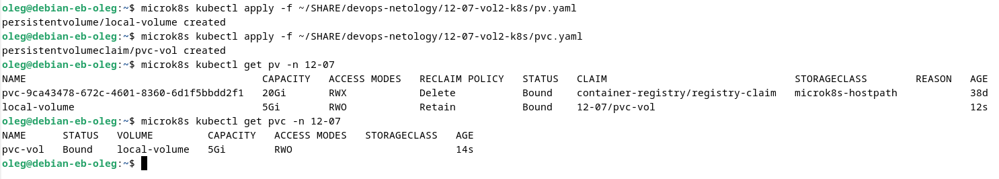

3. Продемонстрировать, что multitool может читать файл, в который busybox пишет каждые пять секунд в общей директории. 

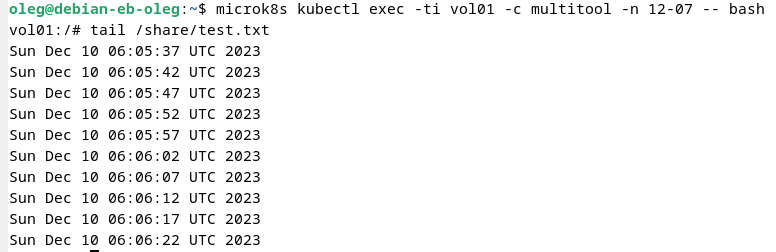

В локальной директории на ноде:

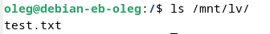

4. Удалить Deployment и PVC. Продемонстрировать, что после этого произошло с PV. Пояснить, почему.

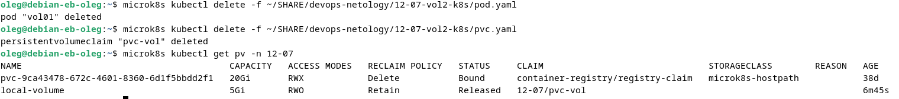

После удаления Deployment и PVC - PV перешло в состояние Released.
Произошло это потому что параметр PV persistentVolumeReclaimPolicy был установлен в Retain.

5. Продемонстрировать, что файл сохранился на локальном диске ноды. Удалить PV.  Продемонстрировать что произошло с файлом после удаления PV. Пояснить, почему.

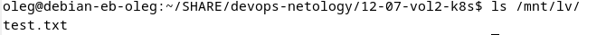

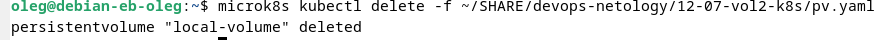

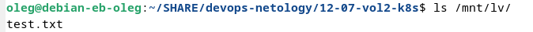

После удаления PV файл в локальной директории остался, потому что не было директивы очищать хранилище

5. Предоставить манифесты, а также скриншоты или вывод необходимых команд.

------

### Задание 2

**Что нужно сделать**

Создать Deployment приложения, которое может хранить файлы на NFS с динамическим созданием PV.

1. Включить и настроить NFS-сервер на MicroK8S.

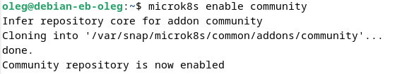

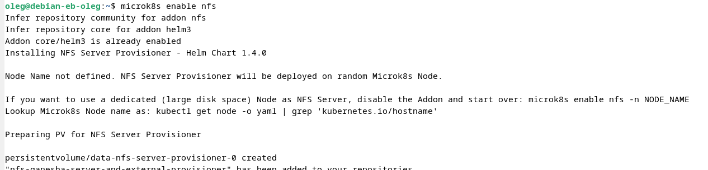

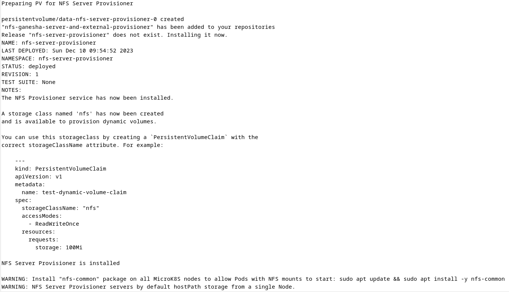

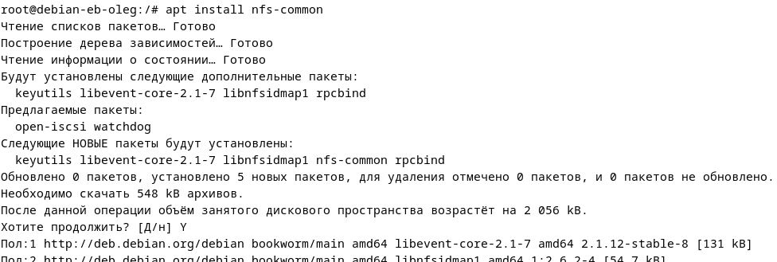

Создаем манифест запроса:

[yaml-конфигурация PVC NFS](./pvc-nfs.yaml)

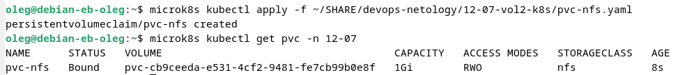

2. Создать Deployment приложения состоящего из multitool, и подключить к нему PV, созданный автоматически на сервере NFS.

[yaml-конфигурация pod для NFS](./pod-nfs.yaml)

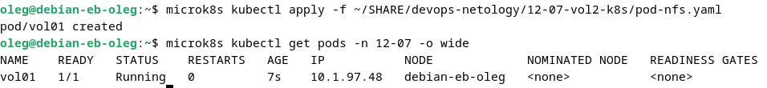

3. Продемонстрировать возможность чтения и записи файла изнутри пода. 

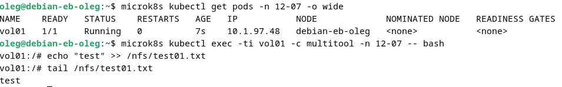

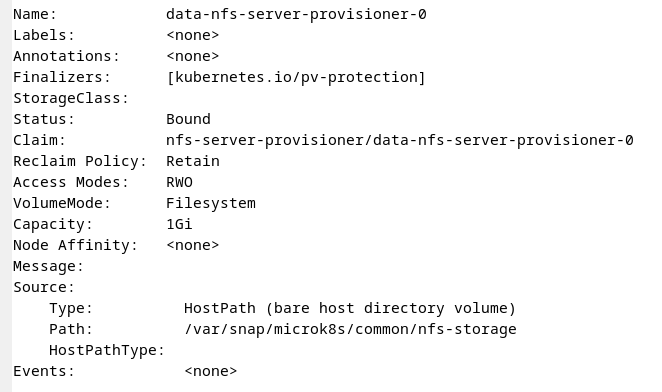

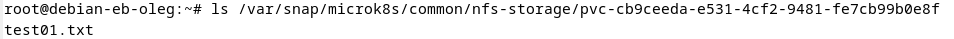

4. Предоставить манифесты, а также скриншоты или вывод необходимых команд.