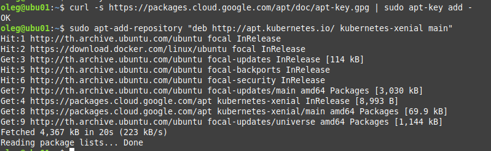
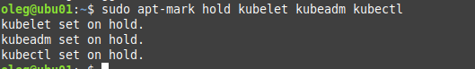

# Домашнее задание к занятию «Установка Kubernetes»

### Цель задания

Установить кластер K8s.

### Чеклист готовности к домашнему заданию

1. Развёрнутые ВМ с ОС Ubuntu 20.04-lts.

### Инструменты и дополнительные материалы, которые пригодятся для выполнения задания

1. [Инструкция по установке kubeadm](https://kubernetes.io/docs/setup/production-environment/tools/kubeadm/create-cluster-kubeadm/).
2. [Документация kubespray](https://kubespray.io/).

-----

### Задание 1. Установить кластер k8s с 1 master node

1. Подготовка работы кластера из 5 нод: 1 мастер и 4 рабочие ноды.
2. В качестве CRI — containerd.
3. Запуск etcd производить на мастере.
4. Способ установки выбрать самостоятельно.

Отключаем своп на всех узлах:

Загружаем модули ядра, конфигурируем:

Настраиваем containerd:

Устанавливаем пакеты kubelet, kubeadm и kubectl:

Инициализируем кластер:

Подключаем 4 рабочие ноды:

Устанавливаем Calico на мастер:

Все узлы кластера находятся в рабочем состоянии:

