# Домашнее задание к занятию «Обновление приложений»

### Цель задания

Выбрать и настроить стратегию обновления приложения.

### Чеклист готовности к домашнему заданию

1. Кластер K8s.

### Инструменты и дополнительные материалы, которые пригодятся для выполнения задания

1. [Документация Updating a Deployment](https://kubernetes.io/docs/concepts/workloads/controllers/deployment/#updating-a-deployment).
2. [Статья про стратегии обновлений](https://habr.com/ru/companies/flant/articles/471620/).

-----

### Задание 1. Выбрать стратегию обновления приложения и описать ваш выбор

1. Имеется приложение, состоящее из нескольких реплик, которое требуется обновить.
2. Ресурсы, выделенные для приложения, ограничены, и нет возможности их увеличить.
3. Запас по ресурсам в менее загруженный момент времени составляет 20%.
4. Обновление мажорное, новые версии приложения не умеют работать со старыми.
5. Вам нужно объяснить свой выбор стратегии обновления приложения.

Я бы предложил для обновления приложения при таких условиях, сначала, для тестирования, использовать стратегию blue-green, использовав для развертывания тестового стенда 20% запаса в наименее загруженный период времени.
После успешного завершения тестирования, для окончательного обновления я использовал бы стратегию recreate

### Задание 2. Обновить приложение

1. Создать deployment приложения с контейнерами nginx и multitool. Версию nginx взять 1.19. Количество реплик — 5.

[yaml-конфигурация deployment](./deployment.yaml)

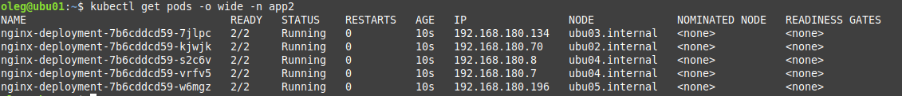

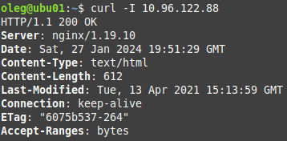

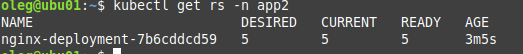

2. Обновить версию nginx в приложении до версии 1.20, сократив время обновления до минимума. Приложение должно быть доступно.

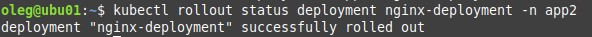

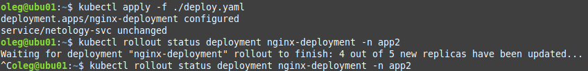

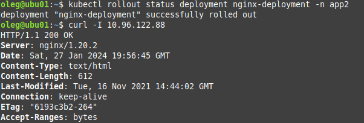

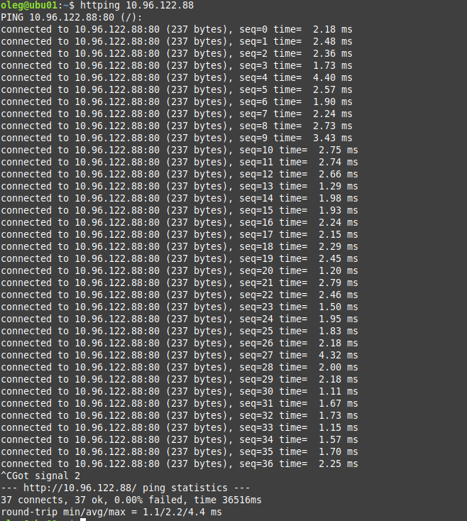

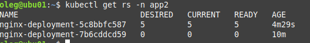

3. 3.Попытаться обновить nginx до версии 1.28, приложение должно оставаться доступным.

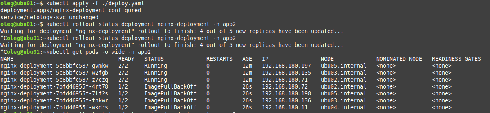

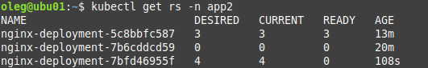

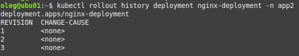

4. Откатиться после неудачного обновления.

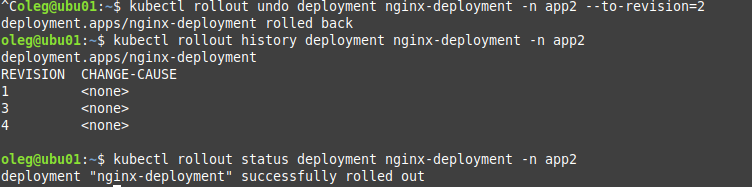

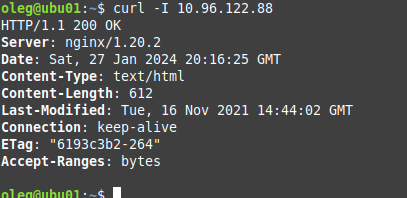