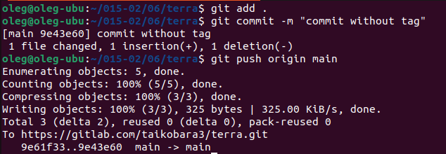

# Дипломный практикум в Yandex.Cloud
<details>
<summary>ЗАДАНИЕ</summary>
  * [Цели:](#цели)
  * [Этапы выполнения:](#этапы-выполнения)
     * [Создание облачной инфраструктуры](#создание-облачной-инфраструктуры)
     * [Создание Kubernetes кластера](#создание-kubernetes-кластера)
     * [Создание тестового приложения](#создание-тестового-приложения)
     * [Подготовка cистемы мониторинга и деплой приложения](#подготовка-cистемы-мониторинга-и-деплой-приложения)
     * [Установка и настройка CI/CD](#установка-и-настройка-cicd)
  * [Что необходимо для сдачи задания?](#что-необходимо-для-сдачи-задания)
  * [Как правильно задавать вопросы дипломному руководителю?](#как-правильно-задавать-вопросы-дипломному-руководителю)

**Перед началом работы над дипломным заданием изучите [Инструкция по экономии облачных ресурсов](https://github.com/netology-code/devops-materials/blob/master/cloudwork.MD).**

---
## Цели:

1. Подготовить облачную инфраструктуру на базе облачного провайдера Яндекс.Облако.
2. Запустить и сконфигурировать Kubernetes кластер.
3. Установить и настроить систему мониторинга.
4. Настроить и автоматизировать сборку тестового приложения с использованием Docker-контейнеров.
5. Настроить CI для автоматической сборки и тестирования.
6. Настроить CD для автоматического развёртывания приложения.

---
## Этапы выполнения:

### Создание облачной инфраструктуры

Для начала необходимо подготовить облачную инфраструктуру в ЯО при помощи [Terraform](https://www.terraform.io/).

Особенности выполнения:

- Бюджет купона ограничен, что следует иметь в виду при проектировании инфраструктуры и использовании ресурсов;
Для облачного k8s используйте региональный мастер(неотказоустойчивый). Для self-hosted k8s минимизируйте ресурсы ВМ и долю ЦПУ. В обоих вариантах используйте прерываемые ВМ для worker nodes.
- Следует использовать версию [Terraform](https://www.terraform.io/) не старше 1.5.x .

Предварительная подготовка к установке и запуску Kubernetes кластера.

1. Создайте сервисный аккаунт, который будет в дальнейшем использоваться Terraform для работы с инфраструктурой с необходимыми и достаточными правами. Не стоит использовать права суперпользователя
2. Подготовьте [backend](https://www.terraform.io/docs/language/settings/backends/index.html) для Terraform:  
   а. Рекомендуемый вариант: S3 bucket в созданном ЯО аккаунте(создание бакета через TF)
   б. Альтернативный вариант:  [Terraform Cloud](https://app.terraform.io/)  
3. Создайте VPC с подсетями в разных зонах доступности.
4. Убедитесь, что теперь вы можете выполнить команды `terraform destroy` и `terraform apply` без дополнительных ручных действий.
5. В случае использования [Terraform Cloud](https://app.terraform.io/) в качестве [backend](https://www.terraform.io/docs/language/settings/backends/index.html) убедитесь, что применение изменений успешно проходит, используя web-интерфейс Terraform cloud.

Ожидаемые результаты:

1. Terraform сконфигурирован и создание инфраструктуры посредством Terraform возможно без дополнительных ручных действий.
2. Полученная конфигурация инфраструктуры является предварительной, поэтому в ходе дальнейшего выполнения задания возможны изменения.

---
### Создание Kubernetes кластера

На этом этапе необходимо создать [Kubernetes](https://kubernetes.io/ru/docs/concepts/overview/what-is-kubernetes/) кластер на базе предварительно созданной инфраструктуры.   Требуется обеспечить доступ к ресурсам из Интернета.

Это можно сделать двумя способами:

1. Рекомендуемый вариант: самостоятельная установка Kubernetes кластера.  
   а. При помощи Terraform подготовить как минимум 3 виртуальных машины Compute Cloud для создания Kubernetes-кластера. Тип виртуальной машины следует выбрать самостоятельно с учётом требовании к производительности и стоимости. Если в дальнейшем поймете, что необходимо сменить тип инстанса, используйте Terraform для внесения изменений.  
   б. Подготовить [ansible](https://www.ansible.com/) конфигурации, можно воспользоваться, например [Kubespray](https://kubernetes.io/docs/setup/production-environment/tools/kubespray/)  
   в. Задеплоить Kubernetes на подготовленные ранее инстансы, в случае нехватки каких-либо ресурсов вы всегда можете создать их при помощи Terraform.
2. Альтернативный вариант: воспользуйтесь сервисом [Yandex Managed Service for Kubernetes](https://cloud.yandex.ru/services/managed-kubernetes)  
  а. С помощью terraform resource для [kubernetes](https://registry.terraform.io/providers/yandex-cloud/yandex/latest/docs/resources/kubernetes_cluster) создать **региональный** мастер kubernetes с размещением нод в разных 3 подсетях      
  б. С помощью terraform resource для [kubernetes node group](https://registry.terraform.io/providers/yandex-cloud/yandex/latest/docs/resources/kubernetes_node_group)
  
Ожидаемый результат:

1. Работоспособный Kubernetes кластер.
2. В файле `~/.kube/config` находятся данные для доступа к кластеру.
3. Команда `kubectl get pods --all-namespaces` отрабатывает без ошибок.

---
### Создание тестового приложения

Для перехода к следующему этапу необходимо подготовить тестовое приложение, эмулирующее основное приложение разрабатываемое вашей компанией.

Способ подготовки:

1. Рекомендуемый вариант:  
   а. Создайте отдельный git репозиторий с простым nginx конфигом, который будет отдавать статические данные.  
   б. Подготовьте Dockerfile для создания образа приложения.  
2. Альтернативный вариант:  
   а. Используйте любой другой код, главное, чтобы был самостоятельно создан Dockerfile.

Ожидаемый результат:

1. Git репозиторий с тестовым приложением и Dockerfile.
2. Регистри с собранным docker image. В качестве регистри может быть DockerHub или [Yandex Container Registry](https://cloud.yandex.ru/services/container-registry), созданный также с помощью terraform.

---
### Подготовка cистемы мониторинга и деплой приложения

Уже должны быть готовы конфигурации для автоматического создания облачной инфраструктуры и поднятия Kubernetes кластера.  
Теперь необходимо подготовить конфигурационные файлы для настройки нашего Kubernetes кластера.

Цель:
1. Задеплоить в кластер [prometheus](https://prometheus.io/), [grafana](https://grafana.com/), [alertmanager](https://github.com/prometheus/alertmanager), [экспортер](https://github.com/prometheus/node_exporter) основных метрик Kubernetes.
2. Задеплоить тестовое приложение, например, [nginx](https://www.nginx.com/) сервер отдающий статическую страницу.

Способ выполнения:
1. Воспользовать пакетом [kube-prometheus](https://github.com/prometheus-operator/kube-prometheus), который уже включает в себя [Kubernetes оператор](https://operatorhub.io/) для [grafana](https://grafana.com/), [prometheus](https://prometheus.io/), [alertmanager](https://github.com/prometheus/alertmanager) и [node_exporter](https://github.com/prometheus/node_exporter). При желании можете собрать все эти приложения отдельно.
2. Для организации конфигурации использовать [qbec](https://qbec.io/), основанный на [jsonnet](https://jsonnet.org/). Обратите внимание на имеющиеся функции для интеграции helm конфигов и [helm charts](https://helm.sh/)
3. Если на первом этапе вы не воспользовались [Terraform Cloud](https://app.terraform.io/), то задеплойте и настройте в кластере [atlantis](https://www.runatlantis.io/) для отслеживания изменений инфраструктуры. Альтернативный вариант 3 задания: вместо Terraform Cloud или atlantis настройте на автоматический запуск и применение конфигурации terraform из вашего git-репозитория в выбранной вами CI-CD системе при любом комите в main ветку. Предоставьте скриншоты работы пайплайна из CI/CD системы.

Ожидаемый результат:
1. Git репозиторий с конфигурационными файлами для настройки Kubernetes.
2. Http доступ к web интерфейсу grafana.
3. Дашборды в grafana отображающие состояние Kubernetes кластера.
4. Http доступ к тестовому приложению.

---
### Установка и настройка CI/CD

Осталось настроить ci/cd систему для автоматической сборки docker image и деплоя приложения при изменении кода.

Цель:

1. Автоматическая сборка docker образа при коммите в репозиторий с тестовым приложением.
2. Автоматический деплой нового docker образа.

Можно использовать [teamcity](https://www.jetbrains.com/ru-ru/teamcity/), [jenkins](https://www.jenkins.io/), [GitLab CI](https://about.gitlab.com/stages-devops-lifecycle/continuous-integration/) или GitHub Actions.

Ожидаемый результат:

1. Интерфейс ci/cd сервиса доступен по http.
2. При любом коммите в репозиторие с тестовым приложением происходит сборка и отправка в регистр Docker образа.
3. При создании тега (например, v1.0.0) происходит сборка и отправка с соответствующим label в регистри, а также деплой соответствующего Docker образа в кластер Kubernetes.

</details>

---

## Что необходимо для сдачи задания?

1. Репозиторий с конфигурационными файлами Terraform и готовность продемонстрировать создание всех ресурсов с нуля.

<details>
<summary>РЕЗУЛЬТАТ:</summary>

Репозиторий с файлами terraform, включая автоматическое создание сервисного аккаунта и бакета S3:

https://github.com/taikobara3/devops-netology/tree/main/15-01/terraform

Репозиторий с пайплайном для автоматического развертывания инфраструктуры при коммите (без предварительного создания сервисного аккаунта и бакета):

https://gitlab.com/taikobara3/terra/-/tree/main

Он же в репозитории GitHub (без настроенного пайплайна):

https://github.com/taikobara3/devops-netology/tree/main/15-01/terraform-gitlab

</details>

2. Пример pull request с комментариями созданными atlantis'ом или снимки экрана из Terraform Cloud или вашего CI-CD-terraform pipeline.

<details>
<summary>РЕЗУЛЬТАТ:</summary>


Подробное описание - в описании Дипломного практикума

</details>

3. Репозиторий с конфигурацией ansible, если был выбран способ создания Kubernetes кластера при помощи ansible.

<details>
<summary>РЕЗУЛЬТАТ:</summary>

Ссылка на репозиторий на GitHub:

https://github.com/taikobara3/devops-netology/tree/main/15-01/ansible

</details>

4. Репозиторий с Dockerfile тестового приложения и ссылка на собранный docker image.

<details>
<summary>РЕЗУЛЬТАТ:</summary>

Репозиторий с тестовым приложением на GitLab, с настроенным CI/CD, подробное описание ниже:

https://gitlab.com/nethology1/taiko3/-/tree/main

Тот же репозиторий на GitHub, без настроенного CI/CD:

https://github.com/taikobara3/devops-netology/tree/main/15-01/demo-app-qbec

</details>

5. Репозиторий с конфигурацией Kubernetes кластера.

<details>
<summary>РЕЗУЛЬТАТ:</summary>

Кластер k8s создавался при помощи ansible и скриптов и конфигурационных файлов, ссылка на которые приведена в 3 пункте. Подробное описание ниже 

</details>

6. Ссылка на тестовое приложение и веб интерфейс Grafana с данными доступа.

<details>
<summary>РЕЗУЛЬТАТ:</summary>

Ввиду отсутствия достаточного количества средств на счету Yandex облака (срок гранта от предыдущего курса истек, новый не выдавали), проект разобран.

Ход выполнения и скриншоты приведены ниже.

При необходимости - соберу проект заново для проверки

</details>

7. Все репозитории рекомендуется хранить на одном ресурсе (github, gitlab)

========================================================================================================================

## ДИПЛОМНЫЙ ПРАКТИКУМ

### Создание облачной инфраструктуры

Предварительная подготовка к установке и запуску Kubernetes кластера.

Работа проводилась на виртуальной машине с ОС Ubunti 22.04 LTS

Устанавливаем зависимости и необходимое для работы ПО:

```bash
sudo apt install curl
curl https://storage.yandexcloud.net/yandexcloud-yc/install.sh | bash

wget -q https://github.com/devops-works/binenv/releases/download/v0.19.0/binenv_linux_amd64
wget -q https://github.com/devops-works/binenv/releases/download/v0.19.0/checksums.txt
sha256sum  --check --ignore-missing checksums.txt
mv binenv_linux_amd64 binenv
chmod +x binenv
./binenv update
./binenv install binenv
rm binenv
if [[ -n $BASH ]]; then ZESHELL=bash; fi
if [[ -n $ZSH_NAME ]]; then ZESHELL=zsh; fi
echo $ZESHELL
echo -e '\nexport PATH=~/.binenv:$PATH' >> ~/.${ZESHELL}rc
echo "source <(binenv completion ${ZESHELL})" >> ~/.${ZESHELL}rc
exec $SHELL
```

```bash
wget https://hashicorp-releases.yandexcloud.net/terraform/1.5.7/terraform_1.5.7_linux_amd64.zip

Настраиваем зеркала для terraform в соответствии с:

https://cloud.yandex.ru/ru/docs/tutorials/infrastructure-management/terraform-quickstart#configure-provider

binenv install kubectl
binenv install helm

sudo apt install jq

sudo apt install python3-pip git

wget https://github.com/kubernetes-sigs/kubespray/archive/refs/tags/v2.24.1.tar.gz
tar -xvzf v2.24.1.tar.gz
mv kubespray-2.24.1 kubespray
sudo pip3 install -r kubespray/requirements.txt

sudo apt  install docker.io docker
sudo usermod -aG docker oleg
docker run hello-world
```

```bash
wget https://github.com/splunk/qbec/releases/download/v0.15.2/qbec-linux-amd64.tar.gz
tar -xzvf ./qbec-linux-amd64.tar.gz
sudo cp ./qbec /usr/bin/
sudo cp ./jsonnet-qbec /usr/bin/
qbec version
```

```bash
curl -sSL https://storage.yandexcloud.net/yandexcloud-yc/install.sh | bash
```

Настраиваем окружение:

```bash
yc init
yc config list
yc iam create-token
```

```bash
export YC_TOKEN=$(yc iam create-token)
export YC_CLOUD_ID=$(yc config get cloud-id)
export YC_FOLDER_ID=$(yc config get folder-id)
export YC_ZONE=$(yc config get compute-default-zone)
```

Получаем значения идентификаторов облака и каталога:

```bash
yc config get cloud-id
yc config get folder-id
```

Заполняем файл с переменными variables.tf

Создаем файлы tf для создания сервисного аккаунта с ролями editor и container-registry.images.puller, а также S3 bucket в Яндекс-облаке для хранения terraform state

Получаем ключ сервисного аккаунта:

```bash
yc iam key create --folder-name netology --service-account-name sa-diplom --output key.json
```


```bash
terraform init -backend-config="access_key=***" -backend-config="secret_key=***" -backend-config=backend.key
```


```bash
terrafrom applay
```


```bash
terrafrom destroy
```


Создаем предварительную структуру VPC с подсетями в разных зонах доступности
Задаём данные от сервисной учетной записи в переменных окружения:

```bash
yc iam access-key create --service-account-name sa-diplom
```

```bash
terraform init -backend-config="access_key=***" -backend-config="secret_key=***" --backend-config=backend.key
```

Файлы terraform здесь: [terraform](https://github.com/taikobara3/devops-netology/tree/main/15-01/terraform)

```bash
terrafrom apply
```


### Создание Kubernetes кластера

Получение нового токена:

```bash
yc iam create-token
```


Добавляем на хостовую машину локаль UTF8

```bash
export LC_ALL=C.UTF-8
```

Запускаем скрипт развертывания k8s при помощи kubespay. Запускаем ansible playbook скриптом, сгенерированном на предыдущем этапе:

```bash
./deploy-k8s.sh
```


### Создание тестового приложения

Создаем новый репозиторий на Github
Устанавливаем приложение для аутентификации Github

```bash
wget https://github.com/git-ecosystem/git-credential-manager/releases/download/v2.4.1/gcm-linux_amd64.2.4.1.deb
sudo dpkg -i gcm-linux_amd64.2.4.1.deb
```

Создаем токен для доступа


Создаем локальный репозиторий

```bash
mkdir ./02
cd ./02
git init
nano ./README.md
git config --global user.email "troitskiy@bregis.ru"
git config --global user.name "taikobara3"
git add .
git commit -m "first commit"
git branch -M main
```

Добавляем публичный ключ в профиль на GitHub


```bash
git remote add origin https://github.com/taikobara3/diplom.git
```

Создаем в локальном репозитории файлы для статической веб-станицы, а также Dockerfile со следующим содержимым

```bash
FROM nginx:latest
RUN rm -rf /usr/share/nginx/html/*
RUN mkdir -p /usr/share/nginx/html/
COPY --chown=nginx index.html /usr/share/nginx/html/
COPY --chown=nginx ./images/fox.png /usr/share/nginx/html/images/
COPY --chown=nginx favicon.ico /usr/share/nginx/html/

```

Создаем образ nginx-stage

```bash
docker build . -t taikobara3/nginx-stage
```


Проверяем собранный образ:

```bash
docker run -d --name nginx taikobara3/nginx-stage
```


```bash
docker stop nginx
```

Загружаем собранный образ на Docker Hub

```bash
docker login -u "taikobara3" docker.io
docker push taikobara3/nginx-stage
```


Ссылка на загруженный образ:

https://hub.docker.com/repository/docker/taikobara3/nginx-stage/general

Ссылка на репозиторий:

https://github.com/taikobara3/diplom

### Подготовка cистемы мониторинга и деплой приложения

Скачиваем репозиторий kube-prometeus

```bash
git clone https://github.com/prometheus-operator/kube-prometheus.git -b release-0.13
```

Меняем значения в /manifests/grafana-service.yaml - указываем тип NodePort и его конкретное значение


Меняем значения в /manifests/grafana-networkPolicy.yaml (комментируем ключи Ingress)


```bash
kubectl apply --server-side -f manifests/setup
kubectl wait --for condition=Established --all CustomResourceDefinition --namespace=monitoring
kubectl apply -f manifests/
```


После развертывания интерфейс Grafana доступен по адресу:
http://EXTERNAL_IP:30111/
Пароль по умолчанию: admin\admin


Разворачиваем приложение при помощи qbec:

Создаём пространство имен для приложения:

```bash
kubectl apply -f ./namespaces.yml
```

Запускаем развертывание при помощи qbec

```bash
qbec apply taiko3
```


```bash
kubectl get pods -n taiko3
```


### Установка и настройка CI/CD

Подключение репозитория в GitLab

```bash
git init
git config --global user.email "oleg.troitskiy@gmai.com"
git config --global user.name "taikobara3"
git add .
git commit -m "first commit"
git branch -M main
git remote add origin https://gitlab.com/nethology1/taiko3.git
git push -uf origin main
```


Создаем namespace

```bash
kubectl apply -f ./namespaces.yml
```


Разворачиваем в кластере gitlab runner при помощи чарта helm:

```bash
kubectl config set-context --current --namespace=gitlab-runner
kubectl create secret generic gitlab-runner --from-literal=runner-registration-token="" --from-literal=runner-token="glrt-XcSExd1cdty83fHXsdys"
```

```bash
helm repo add gitlab https://charts.gitlab.io
```


```bash
helm install gitlab-runner gitlab/gitlab-runner -n gitlab-runner -f values.yaml
```


Проверяем в веб-интерфейсе GitLab - раннер в системе зарегистрирован и активен:


Задаем значения переменных, необходимых для CI/CD
Основная сложность была с переменной MY_DOCKER_REGISTRY - я установил ее значение в https://index.docker.io/v1/
По умолчанию эта аналогичная переменная в Gitlab имеет значение https://index.docker.io/v2/ - с этим значением аутентификация на Docker Hub не проходит


Проверяем в веб-интерфейсе тестового приложения его версию:


Создаем в cli git новый коммит с версией 1.1.3, пушим его в GitLab:


Статусы джобов обоих этапов прошли успешно:


В интерфейсе Docker Hub видим последний образ с тегами 1.1.3 и latest


Проверяем версию тестового приложения, она обновилась: 1.1.3


###  Автоматический запуск и применение конфигурации terraform

Для реализации задания по автоматическому запуску и применению конфигурации terraform я также, как и для тестового приложения, использовал CI/CD систему GitLab

Создаем новый репозиторий:

```bash
git config --global user.name "Олег Troitskiy"
git config --global user.email "oleg.troitskiy@gmail.com"
git clone https://gitlab.com/taikobara3/terra.git
cd terra
git switch --create main
git add .
git commit -m "initial commit"
git push --set-upstream origin main
```


Переносим в этот репозиторий код terraform


Пишем код пайплайна для выполнения сборки инфраструктуры: [.gitlab-ci.yml](https://gitlab.com/taikobara3/terra/-/blob/main/.gitlab-ci.yml)

Пайплайн состоит из трех этапов:

1. Валидация, происходит при любом коммите
2. Сборка (применение) кода на инфрастркутуре Yandex облака, происходит при наличии тега
3. Разрушение, применяется вручную

Из исходного кода terraform удалены критичные переменные, перенесены в переменные GitLab:


Раннер для пайплайна был установлен на обычной виртуальной машине, на которой выполнялись все задания для дипломного практикума, пайплайн выполнялся в среде обычного shell


Впрочем, этот пайплайн без изменений должен выполняться и в среде любого докера, с установленным terraform

В пайплайне не реализованo хранение блокировки состояний, но, на мой взгляд, в контексте выполнения данного задания это не обязательно, и легко может быть реализовано, например при помощи Yandex Managed Service for YBD

Файл состояний .tfstate, как и в предыдущем исполнении, хранится в бакете S3 Yandex

Проверка выполнения:

Исходно ресурсов в облаке нет:


Делаем коммит без тега:



Валидация успешно пройдена, применения конфигурации к облаку не было:


Запускаем коммит с тегом:


Пайплайн для этого коммита завершен успешно:


Файлы, необходимы для дальнейшего развертывания kubernetis сохранены в артефактах:


Ресурсы в Yandex облаке созданы:


Вручную запускаем этап разрушения:


Ресурсы на облаке удалены:


