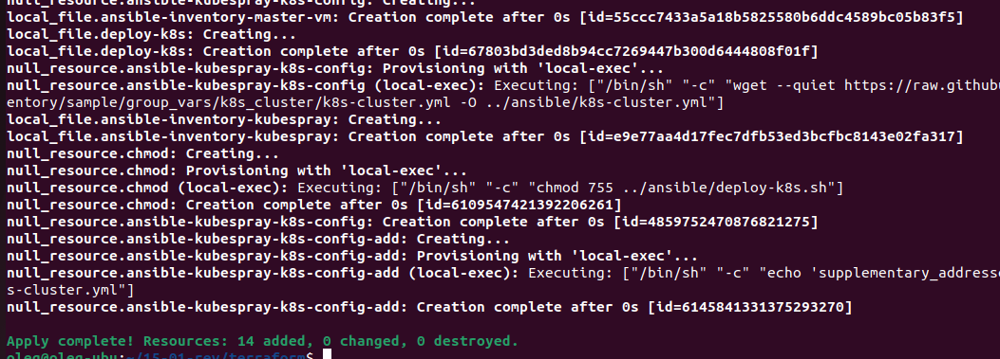

# Дипломный практикум в Yandex.Cloud - доработка

Ссылка на дипломный проект:

https://github.com/taikobara3/devops-netology/blob/main/15-01/README.md

1. Уберите весь лишний код из #комментариев если это не полезная информация. Читать очень неудобно 

Все лишние комментарии из своих файлов постарался убрать 

2. Хранить ключи в гите небезопасно (файлы key.json, backend.key). Если они неактуальны, тогда зачем их хранить в гите? И если не хранить в гите, то где их лучше хранить?

Неактуальные ключи и значения убрал.
Из оставшихся, действительно, было одно небезопасное значение переменной yc_token_id. Убрал его в переменную окружения, воспользовавшись самым простым способом:

```bash
export TF_VAR_yc_token_id=$(yc iam create-token)
```

Значение данной переменной из файла убрал.
Применение конфигурации терраформа происходит корректно:


3. Ресурс терраформа, который делает инвенторку для ансибла у вас в main.tf, при этом зависимости depends_on в других файлах. Тоже, очень неудобно читать. Либо вынесите в отдельные файлы все, либо все в один файл слепите. Я бы за отдельные файлы

Тут, тоже, возможно, я неправильно понял замечание, но в main.tf у меня только описание ресурсов для ansible, а всё остальное как раз вынесено в отдельные файлы 
Вынес все шаги по формированию файлов для ansible в отдельные файлы с префиксом ans-*

4. В задании указан конечно конкретный размер кластера и кол-во нод, но давайте придерживаться принципа DRY и не копипастить ресурсы. Пожалуйста, замените копипаст. Надо сделать так, чтобы в зависимости от параметров в variables у вас деплоилось кол-во ВМ

Постарался убрать копипаст, воспользовавшись самым простым (и, возможно, не самым оптимальным и правильным способом) - конструкцией for_each


5. Аналогично п4 для subnets. Выведите параметры в variables а код пусть будет универсальным(шаблонным)

Сделал аналогично п.4. Копипаст убран, количество виртуальных машин и/или сетей можно легко изменить, редактируя элементы списка locals. Это не буквально то, что требовалось сделать в доработке, но задачу, кажется, в данном случае - решает.

После внесенных изменений код работает корректно:



6. Откуда взят адрес 62.84.127.88? При новом деплое будет новый адрес? Как не хардкодить?
 
Файлы для развертывания кластера ansible в этой директории генерируются автоматически кодом терраформа. Поскольку эти файлы имеют разовое предназначение, как я и писал в ЛС, - наверное, хардкодом это можно не считать. Не переделывал.

7. репозитории приложения пусто. Так должно быть?

Нет, конечно, не должно. Исправил

https://github.com/taikobara3/devops-netology/tree/main/15-01/demo-app-qbec

8-9. Grafana доступна через NodePort. Просьба сделать через ingress. Аналогично - для приложения

Эта доработка заняла больше всего времени. Заставить работать ингресс контроллер в Yandex облаке на своем проекте мне не удавалось очень долго - около двух недель всё доступное время я разными способами пытался это сделать разными способами.
В результате, формально, мне удалось это сделать, хотя контроллер у меня удалось запустить только через NodePort:

Устанавливаем ingress контроллер через helm

```bash
helm repo add ingress-nginx https://kubernetes.github.io/ingress-nginx
helm install ingress-nginx ingress-nginx/ingress-nginx --namespace ingress-nginx --create-namespace -f ./values.yaml
```
```bash
cat ./values.yaml
controller:
  service:
    type: NodePort
    loadBalancerIP: "158.160.118.178"
    nodePorts:
      http: 30080
  config:
    pid: "/tmp/nginx/ingress_nginx.pid"
```


Корректируем описания служб в манифестах kube-prometeus и qbec приложения

Добавляем описания ingress для служб приложения и grafana:

```bash
cat ./ingress.yaml 
apiVersion: networking.k8s.io/v1
kind: Ingress
metadata:
  name: grefana-ingress
  namespace: monitoring
  annotations:
    nginx.ingress.kubernetes.io/rewrite-target: /
spec:
  ingressClassName: nginx
  rules:
    - host: app.com
      http:
        paths:
        - path: /
          pathType: Prefix
          backend:
            service:
              name: grafana
              port:
                number: 3000

---
apiVersion: networking.k8s.io/v1
kind: Ingress
metadata:
  name: taiko3-ingress
  namespace: taiko3
  annotations:
    nginx.ingress.kubernetes.io/rewrite-target: /
spec:
  ingressClassName: nginx
  rules:
    - host: app.com
      http:
        paths:
        - path: /app
          pathType: Prefix
          backend:
            service:
              name: demoapp
              port:
                number: 8282
```

Проверяем работу ингресс в кластере:


Запускаем развертывание системы мониторинга и приложение, проверяем их доступность через порт ibgress:


10. Сборка приложения у вас произойдет при любом теге. Как сделать так, чтобы она запускалась только при теге с версиями типа semver и не запускалась при любых других случайных тегах (защита от дурака)?

Проверяем работу системы сборки - создаем коммит с версией 1.1.4, обновляем значение переменной KUBECONFIG_FILE в gitlab, пушим коммит, проверяем развертывание приложения:


Система сборки работает

Заменяем параметр only tags значением c regex паттерном в конфигурацию, соответствующим валидному тегу версии (в нашем примере - vN.N.N)

```bash
  only:
    - /^v\d\.\d+(\.\d+)$/
```

Проводим три тестовых коммита, два с валидными тегами v1.1.6 и v1.1.7, между ними - коммит с невалидным тегом test_text_01


Проверяем на вкладке пайплайнов - сборка произошла только по коммитам с валидными тегами:


На всякий случай проверяем корректность развертывания приложения:


Ссылка на проект в gitlab:

https://gitlab.com/nethology1/taiko3/-/tree/main