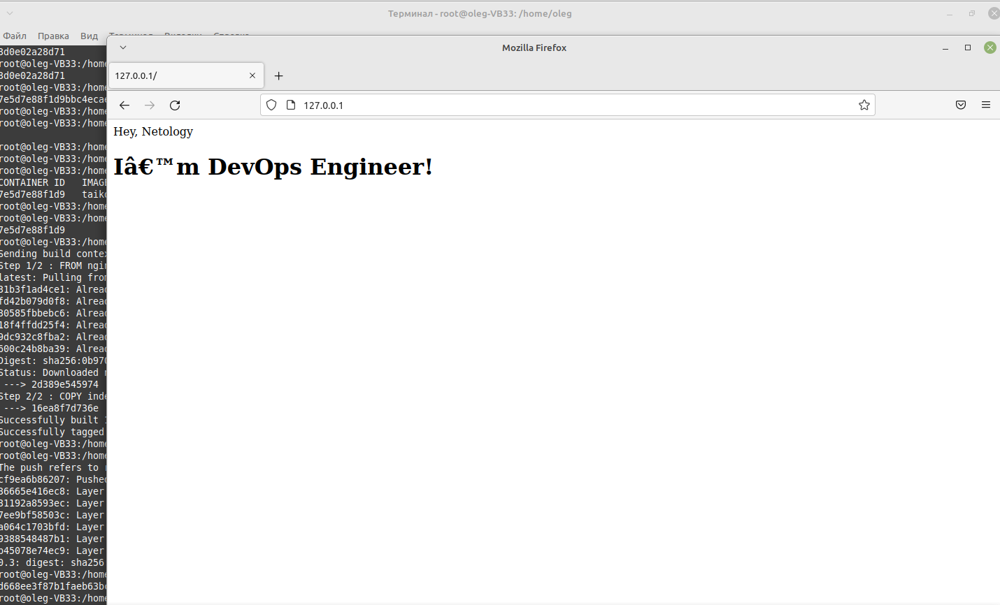

# Домашнее задание к занятию "5.3. Введение. Экосистема. Архитектура. Жизненный цикл Docker контейнера"

## Задача 1

```
root@oleg-VB33:/home/oleg/netology# docker build -t taikobara3/netology-nginx:0.3 .
Sending build context to Docker daemon  3.072kB
Step 1/2 : FROM nginx
latest: Pulling from library/nginx
31b3f1ad4ce1: Already exists 
fd42b079d0f8: Already exists 
30585fbbebc6: Already exists 
18f4ffdd25f4: Already exists 
9dc932c8fba2: Already exists 
600c24b8ba39: Already exists 
Digest: sha256:0b970013351304af46f322da1263516b188318682b2ab1091862497591189ff1
Status: Downloaded newer image for nginx:latest
 ---> 2d389e545974
Step 2/2 : COPY index.html /usr/share/nginx/html/
 ---> 16ea8f7d736e
Successfully built 16ea8f7d736e
Successfully tagged taikobara3/netology-nginx:0.3
root@oleg-VB33:/home/oleg# docker push taikobara3/netology-nginx:0.3
The push refers to repository [docker.io/taikobara3/netology-nginx]
cf9ea6b86207: Pushed 
36665e416ec8: Layer already exists 
31192a8593ec: Layer already exists 
7ee9bf58503c: Layer already exists 
a064c1703bfd: Layer already exists 
9388548487b1: Layer already exists 
b45078e74ec9: Layer already exists 
0.3: digest: sha256:7405c032a946360ab0035352d63e15aef27790121998a045ef4482090ed4efe7 size: 1777
root@oleg-VB33:/home/oleg# docker run -p 80:80 -d taikobara3/netology-nginx:0.3
d668ee3f87b1faeb63bc535dcb5fb1a61b0d72ff5a60278fb34e6d7904eb5b5f
```



https://hub.docker.com/r/taikobara3/netology-nginx

## Задача 2

### Высоконагруженное монолитное java веб-приложение;

Полагаю, что из-за высокой нагруженности, монолитности, и сравнительной простоты конфигурации (джава - это уже виртуальная машина) кроме библиотек самой джавы и соблюдения версионности больше ничего не потребуется - необходимости в использовании докера я не вижу. Виртуальный или физический сервер


### Nodejs веб-приложение;

Вполне может быть использован докер

### Мобильное приложение c версиями для Android и iOS;

Использование докера вряд ли оправдано, из-за сложности реализации. Хотя вполне можно собрать контейнер для андроида и айос, и реализовать GUI, вряд ли это будет хорошим решением

### Шина данных на базе Apache Kafka;

Насколько я знаю, Кафка используется в основном для обработки Big Data, и используется, как правило, в кластере, поэтому, в зависимости от объемов и особенностей реализации - можно использовать виртуализацию, или докер

### Elasticsearch кластер для реализации логирования продуктивного веб-приложения - три ноды elasticsearch, два logstash и две ноды kibana;

Возможна реализация как на виртуальных машинах, так и в докере. Вынесение эластиксёрч на виртуальные машины, наверное, предпочтительно.

### Мониторинг-стек на базе Prometheus и Grafana;

Вполне подходит для реализации в докере - удобно разворачивать,тестировать, обновлять

### MongoDB, как основное хранилище данных для java-приложения;

Моё мнение - категорически нет для докера. В нашем приложении мы изначально разместили монгу в докере, вместе с микросервисами - все случаи зависания и отказов случались только и исключительно из-за внезапных остановов и поломок монги. После вынесения монги на хост проблем не было
Теоретически, наверное, можно модружить монгу и любую СУБД с докером, но... Не вижу особой пользы и необходимости использования докера для СУБД, кроме целей разработки и тестирования 

### Gitlab сервер для реализации CI/CD процессов и приватный (закрытый) Docker Registry.

Кажется,это классический вполне пример использования докеров, включая и раннеры с развертыванием "докер в докере".

## Задача 3


```

docker run -d -it --name centosdata --mount type=bind,source=/home/oleg/netology/data,target=/data centos /bin/bash

docker run -d -it --name debiandata --mount type=bind,source=/home/oleg/netology/data,target=/data debian /bin/bash

root@oleg-VB33:/home/oleg/netology# docker exec -it centosdata bash
[root@d05929a59c01 /]# touch /data/file_from_centos
[root@d05929a59c01 /]# exit

root@oleg-VB33:/home/oleg/netology# touch /home/oleg/netology/data/file_from_host

root@oleg-VB33:/home/oleg/netology# docker exec -it debiandata bash
root@4be6bcd4e54b:/# ls -al /data
total 8
drwxr-xr-x 2 root root 4096 Sep 25 13:30 .
drwxr-xr-x 1 root root 4096 Sep 25 13:26 ..
-rw-r--r-- 1 root root    0 Sep 25 13:29 file_from_centos
-rw-r--r-- 1 root root    0 Sep 25 13:30 file_from_host

```

## Задача 4

```
docker build -t taikobara3/netology-ansible:0.1 .

```

https://hub.docker.com/repository/docker/taikobara3/netology-ansible