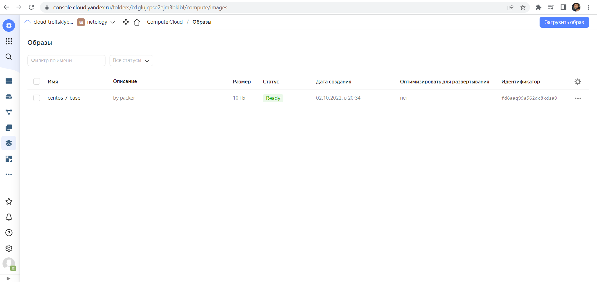
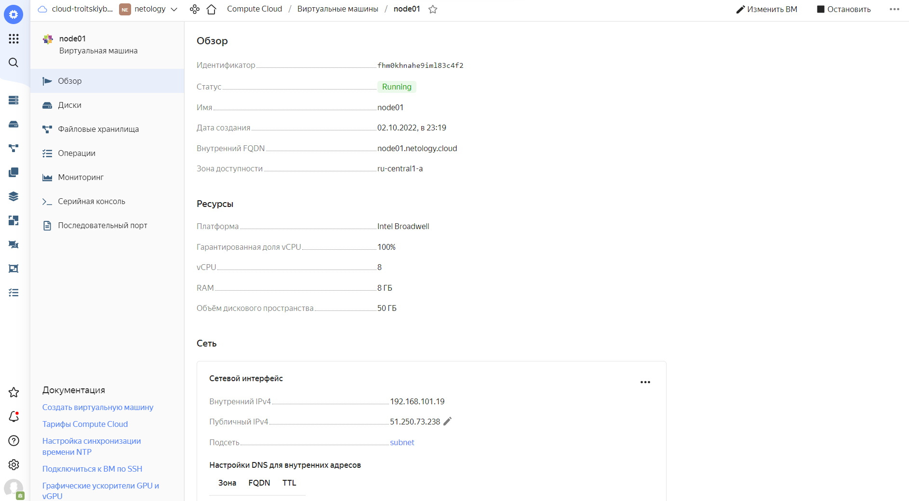
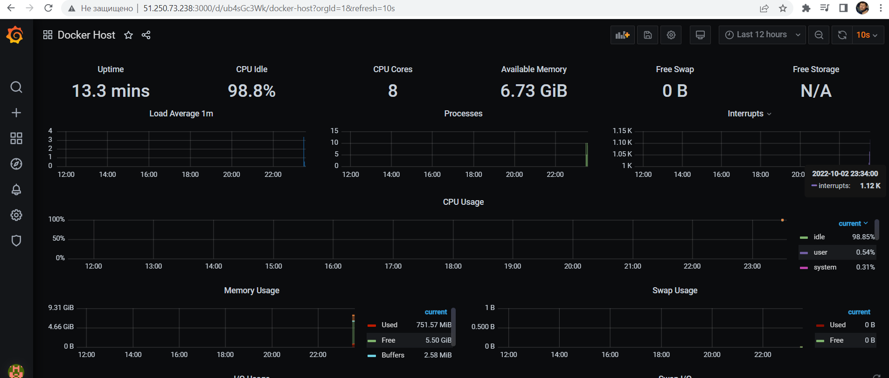
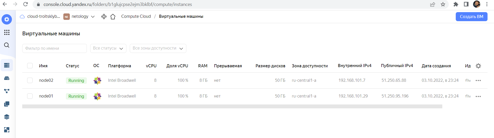
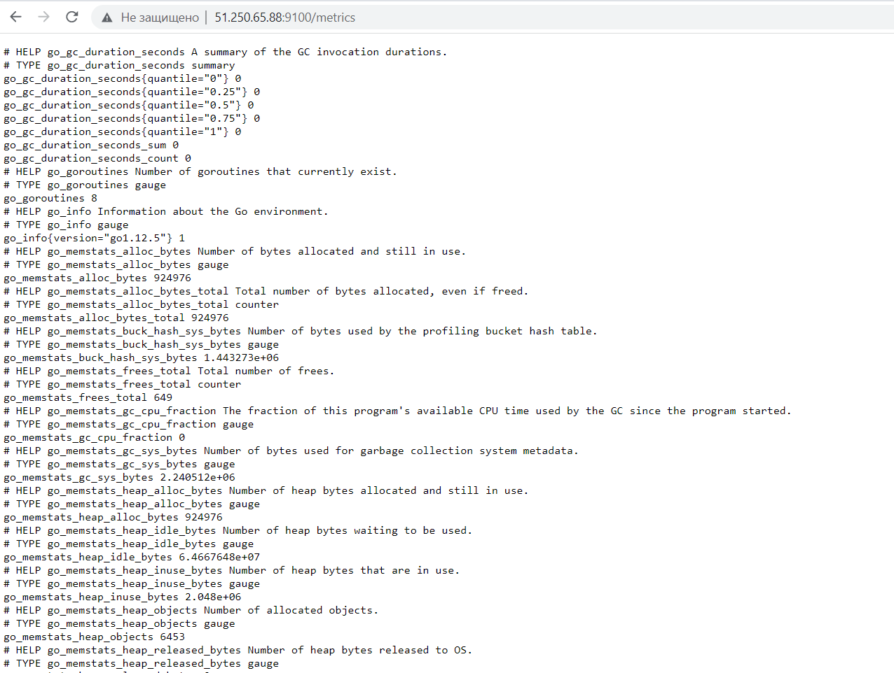
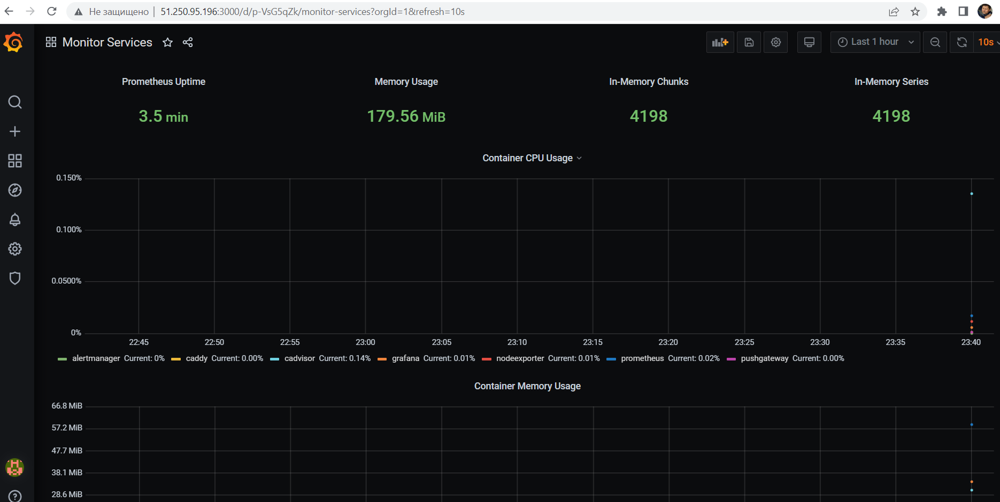
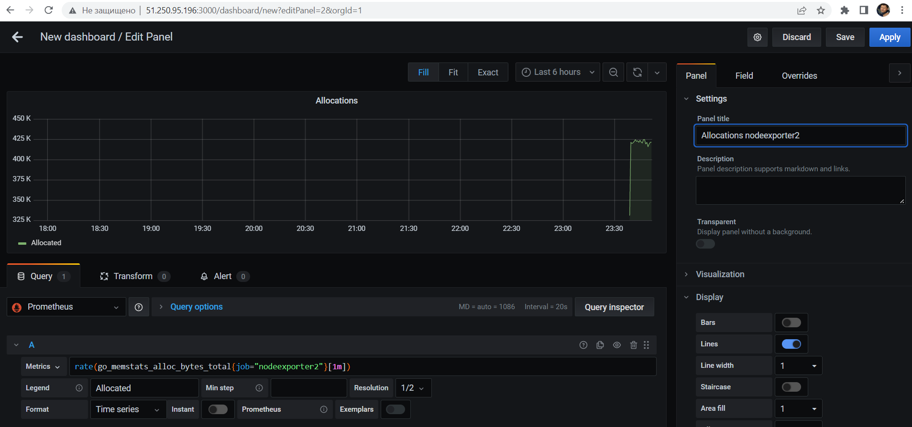
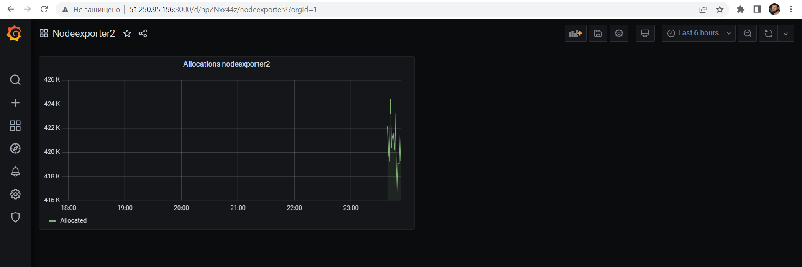
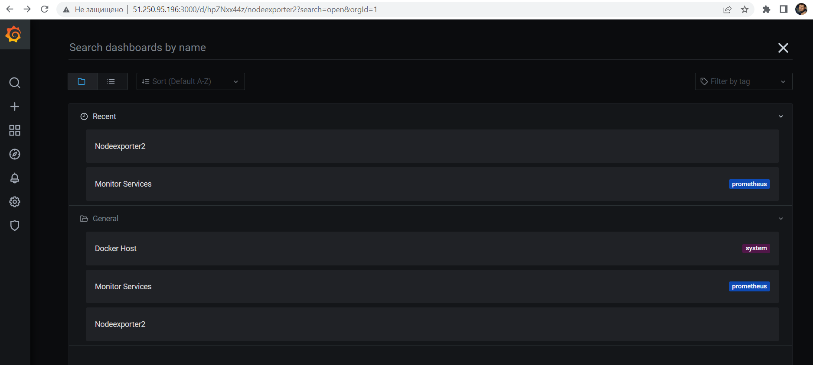

# Домашнее задание к занятию "5.4. Оркестрация группой Docker контейнеров на примере Docker Compose"

## Задача 1

## Задача 2

## Задача 3

## Задача 4

Последнее запдание делал в другую итерацию,поэтому IP другие:

Метрики со второй ноды:

Один из дашбоардов графаны до добавления метрик со второй ноды

Настройки метрики со второй ноды. Сделал только одну, с графаной раньше никогда не работал

Вид метрики со второй ноды:

Дашбоарды после добавления нового, с метриками второй ноды:

