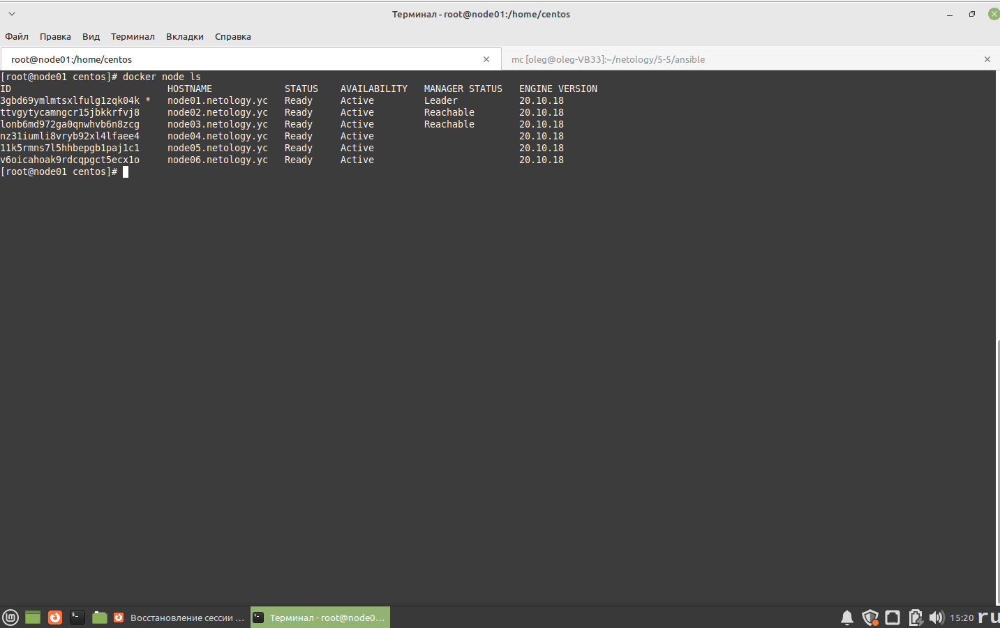
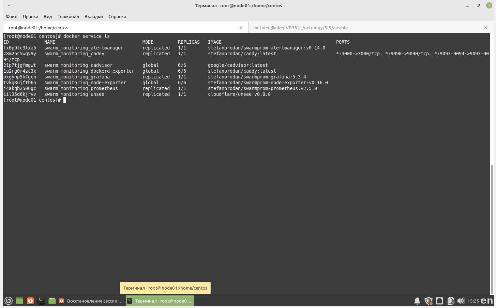
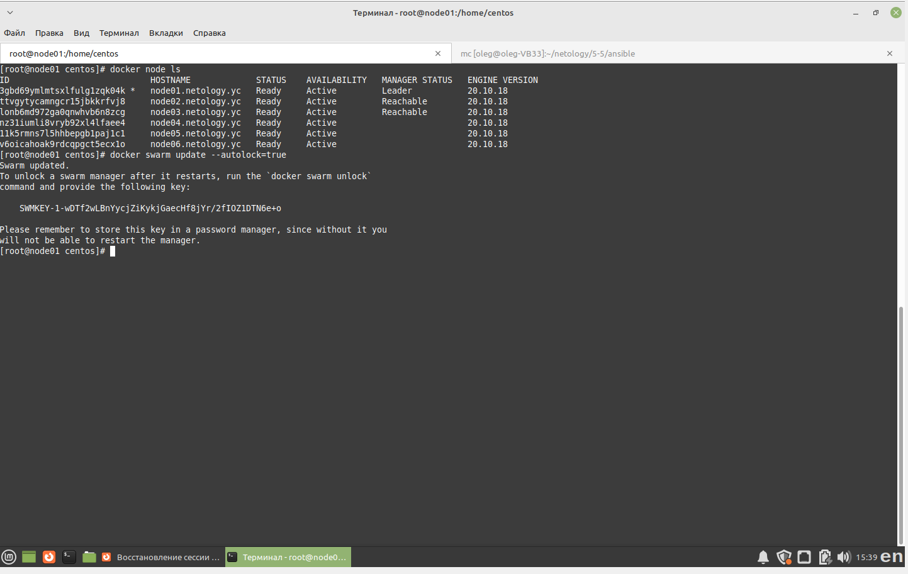

# Домашнее задание к занятию "5.5. Оркестрация кластером Docker контейнеров на примере Docker Swarm"

## Задача 1

* В чём отличие режимов работы сервисов в Docker Swarm кластере: replication и global?

replication - в кластере запустится столько экземпляров сервисов, сколько указано в параметре этого режима
global - на каждой ноде кластера будет запущено по одному экземпляру данного сервиса

* Какой алгоритм выбора лидера используется в Docker Swarm кластере?

Алгоритм поддержания распределенного консенсуса - Raft. Т.е. группа менеджеров постоянно обмениваются информацией, выбирая лидера. 

* Что такое Overlay Network?

Это разновидность виртуальной сети, используемая в Docker для того, чтобы ноды (сервисы) работающие на разных виртуальных машинах, связывались бы между собой так, как будто они работают на одном хосте.
Для использования данной сети необходимо, чтобы был какой-либо координатор. Он имеется в оркестраторе swarm, но можно использовать и другой (напр. Consul)

## Задача 2



## Задача 3



## Задача 4



```
docker swarm update --autolock=true
```

Это включение автоматической блокировки ключей, которыми защищены журналы Raft и передача данных по TLS между узлами докера.
Когда блокировка ключей включена - при перезапуске докера потребуется вручную разблокировать swarm командой
```
docker swarm unlock
```
Эта опция нужна для повышения безопасности. Отключение - для удобства перезапуска swarm без ввода ключа