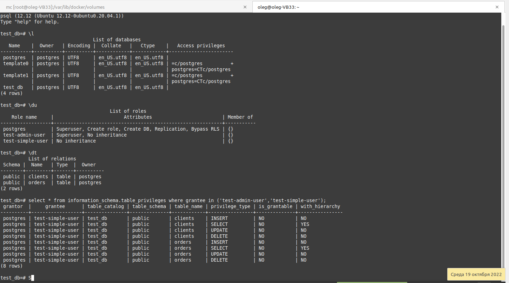
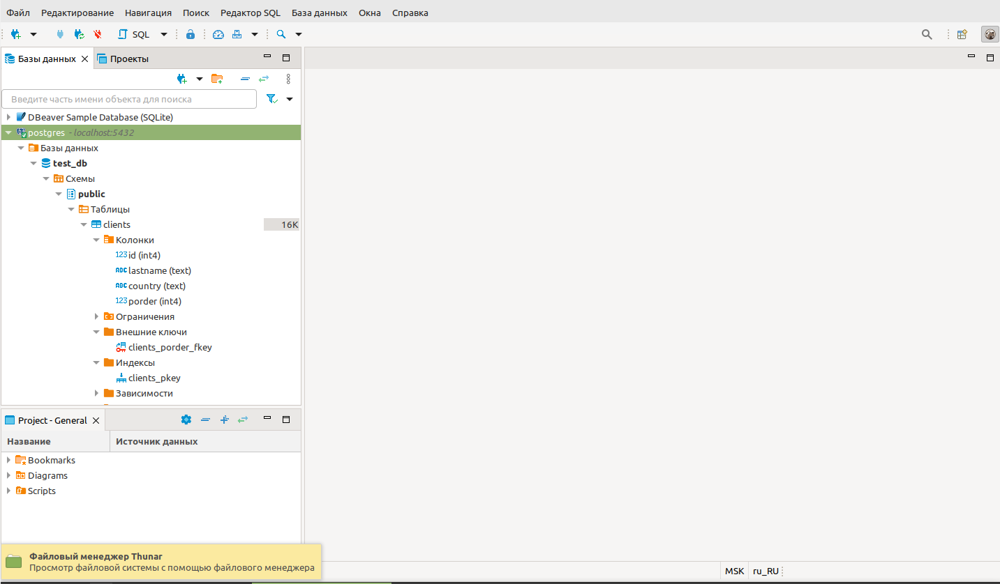
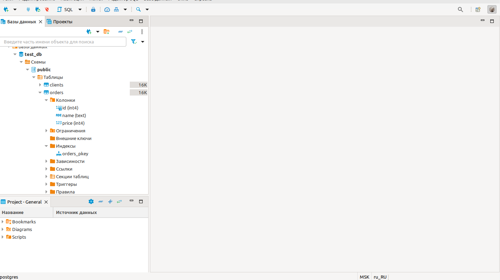
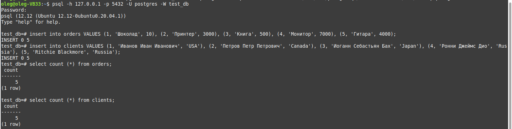
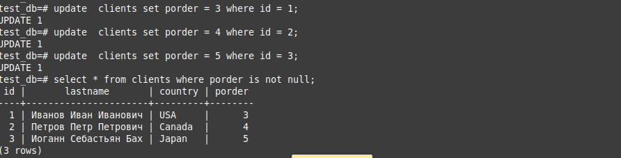
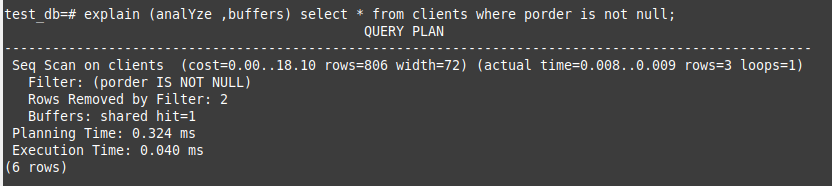
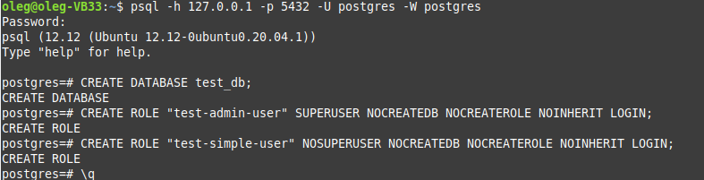
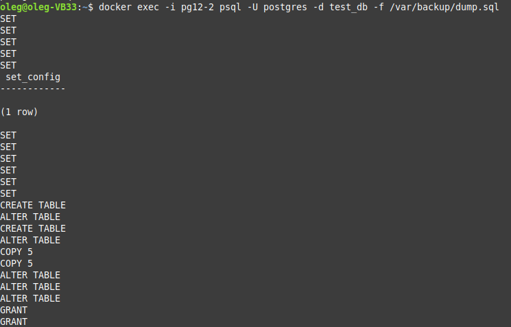

Домашнее задание к занятию "6.2. SQL"

## Задача 1

```
docker run -d --rm --name pg12 -e POSTGRES_PASSWORD=postgres -ti -p 5432:5432 -v disk01:/var/lib/postgresql/data -v disk02:/var/backup postgres:12
```
```
oleg@oleg-VB33:~$ docker ps
CONTAINER ID   IMAGE         COMMAND                  CREATED         STATUS         PORTS                                       NAMES
793936d1eb6c   postgres:12   "docker-entrypoint.s…"   3 seconds ago   Up 2 seconds   0.0.0.0:5432->5432/tcp, :::5432->5432/tcp   pg12

```

## Задача 2
```
CREATE DATABASE test_db;
CREATE ROLE "test-admin-user" SUPERUSER NOCREATEDB NOCREATEROLE NOINHERIT LOGIN;

CREATE TABLE orders 
(
id integer, 
name text, 
price integer, 
PRIMARY KEY (id) 
);

CREATE TABLE clients 
(
	id integer PRIMARY KEY,
	lastname text,
	country text,
	porder integer,
	FOREIGN KEY (porder) REFERENCES orders (id)
);

CREATE ROLE "test-simple-user" NOSUPERUSER NOCREATEDB NOCREATEROLE NOINHERIT LOGIN;
GRANT SELECT ON TABLE public.clients TO "test-simple-user";
GRANT INSERT ON TABLE public.clients TO "test-simple-user";
GRANT UPDATE ON TABLE public.clients TO "test-simple-user";
GRANT DELETE ON TABLE public.clients TO "test-simple-user";
GRANT SELECT ON TABLE public.orders TO "test-simple-user";
GRANT INSERT ON TABLE public.orders TO "test-simple-user";
GRANT UPDATE ON TABLE public.orders TO "test-simple-user";
GRANT DELETE ON TABLE public.orders TO "test-simple-user";
```





## Задача 3



## Задача 4

update  clients set porder = 3 where id = 1;
update  clients set porder = 4 where id = 2;
update  clients set porder = 5 where id = 3;

select * from clients where porder is not null;



## Задача 5



analyze - выполнить запрос на самом деле

buffers - включить информацию об использовании буфера

сost - условные попугаи Постгреса. 1 cost - время необходимое СУБД для извлечения одного блока размером в 8 Кб

В этом анализе видно, что на выполнение этого запроса времени может уйти в 18 раз больше, чем на извлечение одного такого блока

Первая цифра указывает на то, сколько времени пройдет от начала возврата первых результатов, вторая - до окончания работы запроса

rows - условное количество строк, обработанных данным запросом (в данном случае, конечно, такого количества строк не обрабатывалось)

widht - ширина в байтах всех столбцов, выводимых запросом

Rows Removed by Filter - количество строк отфильтрованных условием where

Buffers - количество попаданий в кэш. Т.е. сколько блоков необходимых для выполнения запроса уже было в памяти. Здесь только hits, соотвественно все уже было в памяти, считывать с диска ничего не надо было

Planning time - время, потраченное на построение плана запроса и его оптимизацию

Execution time - полное время выполнения запроса без учета построения плана (если срабатывают триггеры - также учитываются, за исключением триггеров AFTER)


## Задача 6
```
docker exec -t pg12 pg_dump -U postgres test_db -f /var/backup/dump.sql
docker stop pg12
docker run -d --rm --name pg12-2 -e POSTGRES_PASSWORD=postgres -ti -p 5432:5432 -v disk02:/var/backup postgres:12
```
Создаем БД и роли в новом контейнере:



И восстанавливаем дамп:

