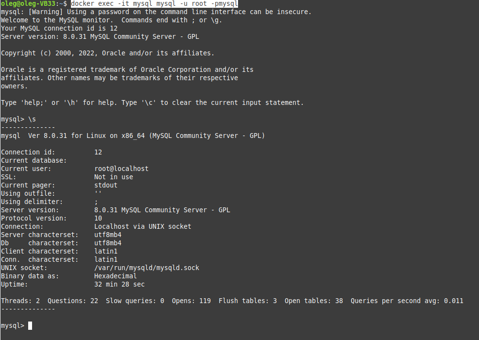
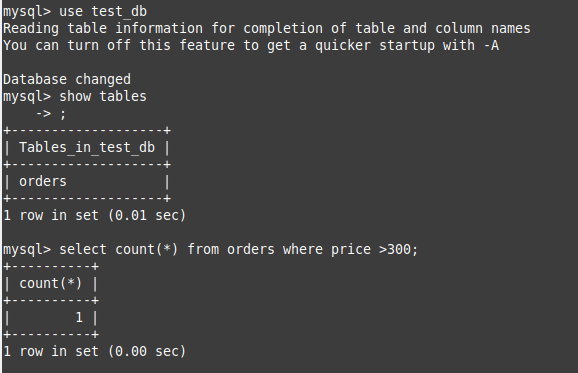
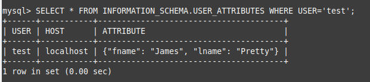
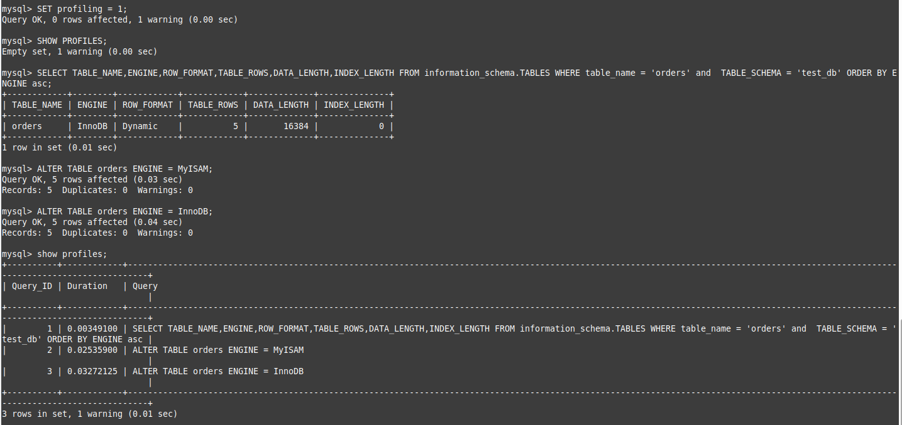

# Домашнее задание к занятию "6.3. MySQL"

## Задача 1

```
docker run -d --rm --name mysql -e MYSQL_ROOT_PASSWORD=mysql -ti -p 3306:3306 -v volume01:/etc/mysql/ mysql:8.0
mysql -h 127.0.0.1 -u root -pmysql
docker exec -it mysql mysql -u root -pmysql
```



```
mysql> create database test_db;
bash-4.4# mysql -uroot -pmysql test_db < /etc/mysql/test_dump.sql
```


## Задача 2



## Задача 3



Переключение на движок MyISAM - 0.03 секунды

Переключение на движок InnoDB - 0.04 секунды

## Задача 4

```
cat /home/oleg/test1/my.cnf
```

```
# Скорость IO важнее сохранности данных

innodb_flush_log_at_trx_commit = 0

# Нужна компрессия таблиц для экономии места на диске

innodb_file_format=Barracuda

# Размер буффера с незакомиченными транзакциями 1 Мб

innodb_log_buffer_size	= 1M

# Буффер кеширования 30% от ОЗУ
# bash-4.4# cat /proc/meminfo | grep MemTotal 
# MemTotal:        4026360 kB

key_buffer_size = 1180М

# Размер файла логов операций 100 Мб

max_binlog_size	= 100M
```

```
docker run -d --rm --name mysql -e MYSQL_ROOT_PASSWORD=mysql -ti -p 3306:3306 -v /home/oleg/test1:/etc/mysql/conf.d mysql:8.0
```

