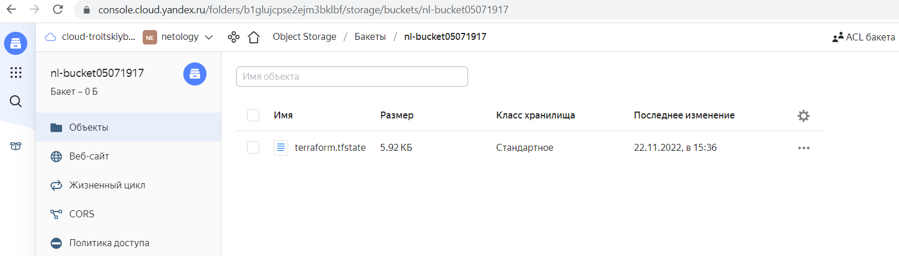

# Домашнее задание к занятию "7.3. Основы и принцип работы Терраформ"

## Задача 1

```
oleg@oleg-VB33:~/tf$ yc iam service-account list
+----------------------+----------+
|          ID          |   NAME   |
+----------------------+----------+
| ajeprbivgjek6bde5rg2 | netology |
+----------------------+----------+
```
```
yc resource-manager folder add-access-binding netology  --role editor --subject serviceAccount:ajeprbivgjek6bde5rg2
```
```
oleg@oleg-VB33:~/tf$ yc iam access-key create --service-account-name netology
access_key:
  id: xxx
  service_account_id: xxx
  created_at: "2022-11-22T10:40:39.905526524Z"
  key_id: xxx
secret: xxx
```
```
oleg@oleg-VB33:~/tf$ aws configure
AWS Access Key ID [None]: xxx
AWS Secret Access Key [None]: xxx                 
Default region name [None]: ru-central1
Default output format [None]: 
```
```
oleg@oleg-VB33:~/tf$ aws s3 --endpoint-url=https://storage.yandexcloud.net ls
2022-11-22 13:23:34 nl-bucket05071917
```

```
oleg@oleg-VB33:~/tf$ terraform init -reconfigure

Initializing the backend...

Successfully configured the backend "s3"! Terraform will automatically
use this backend unless the backend configuration changes.

Initializing provider plugins...
- Reusing previous version of yandex-cloud/yandex from the dependency lock file
- Using previously-installed yandex-cloud/yandex v0.82.0

Terraform has been successfully initialized!

You may now begin working with Terraform. Try running "terraform plan" to see
any changes that are required for your infrastructure. All Terraform commands
should now work.

If you ever set or change modules or backend configuration for Terraform,
rerun this command to reinitialize your working directory. If you forget, other
commands will detect it and remind you to do so if necessary.
```



## Задача 2

```
oleg@oleg-VB33:~/tf$ terraform workspace new stage
Created and switched to workspace "stage"!

You're now on a new, empty workspace. Workspaces isolate their state,
so if you run "terraform plan" Terraform will not see any existing state
for this configuration.
```
```
oleg@oleg-VB33:~/tf$ terraform workspace new prod
Created and switched to workspace "prod"!

You're now on a new, empty workspace. Workspaces isolate their state,
so if you run "terraform plan" Terraform will not see any existing state
for this configuration.
```
```
oleg@oleg-VB33:~/tf$ terraform workspace list
  default
* prod
  stage
```
```
oleg@oleg-VB33:~/tf$ terraform plan

Terraform used the selected providers to generate the following execution plan. Resource actions are indicated with the following symbols:
  + create

Terraform will perform the following actions:

  # yandex_compute_instance.nld["one"] will be created
  + resource "yandex_compute_instance" "nld" {
      + created_at                = (known after apply)
      + folder_id                 = (known after apply)
      + fqdn                      = (known after apply)
      + hostname                  = (known after apply)
      + id                        = (known after apply)
      + metadata                  = {
          + "ssh-keys" = <<-EOT
                ubuntu:ssh-rsa AAAAB3NzaC1yc2EAAAADAQABAAABgQDVLnPeTthuP3CEC7gPSZDIYFemJEqkgiKW5WmgKkqt+KgO9BXDTs7K2Qi4X52U6fCzxFcPYG5jZ9fJxr3e6w0Og6+uTg7d5D5bybdL84qi2bjrIAjU2p7pMec1ZSNfRBFgOAI7VtBIAND5aEkZ3/1HiUBTwv7BQz4ulpaYlKzdJZn3gYM9sshjQcq4d7PvmwAmc9yeHzvGkLjpSS3aho+++Ww10+SM8UWVOvU9APq8DKxAp4/ZEQAc+ySxwFEq/3AxcKDUiKkqfGLQHFeWu1RJ0uziWvP9TXmLjeo3ohB7fgiV1nqRypxVDR8R3a0j0TbKvoGlyFrlJszwdDFgVohrAk+bBuQsHfqRw0gwq5ptfJmhGjM8AE9o0ftGZdtG6nz3BGq3ZkbFGXWrPPAUk7+z88toQJtFENwdaLHpIt/nt4wIivxGcV9RzgdTpPdPVvSKLwGY6n5DPV/yi6TZid9Kl4DEadv/ylNr8sB70j3NyaD+fOhghIrdYkc8yU+JpBE= oleg@oleg-VB33
            EOT
        }
      + name                      = "nld-one"
      + network_acceleration_type = "standard"
      + platform_id               = "standard-v1"
      + service_account_id        = (known after apply)
      + status                    = (known after apply)
      + zone                      = (known after apply)

      + boot_disk {
          + auto_delete = true
          + device_name = (known after apply)
          + disk_id     = (known after apply)
          + mode        = (known after apply)

          + initialize_params {
              + block_size  = (known after apply)
              + description = (known after apply)
              + image_id    = "fd8ch5n0oe99ktf1tu8r"
              + name        = (known after apply)
              + size        = (known after apply)
              + snapshot_id = (known after apply)
              + type        = "network-hdd"
            }
        }

      + network_interface {
          + index              = (known after apply)
          + ip_address         = (known after apply)
          + ipv4               = true
          + ipv6               = (known after apply)
          + ipv6_address       = (known after apply)
          + mac_address        = (known after apply)
          + nat                = true
          + nat_ip_address     = (known after apply)
          + nat_ip_version     = (known after apply)
          + security_group_ids = (known after apply)
          + subnet_id          = (known after apply)
        }

      + placement_policy {
          + host_affinity_rules = (known after apply)
          + placement_group_id  = (known after apply)
        }

      + resources {
          + core_fraction = 100
          + cores         = 2
          + memory        = 4
        }

      + scheduling_policy {
          + preemptible = (known after apply)
        }
    }

  # yandex_compute_instance.nld["two"] will be created
  + resource "yandex_compute_instance" "nld" {
      + created_at                = (known after apply)
      + folder_id                 = (known after apply)
      + fqdn                      = (known after apply)
      + hostname                  = (known after apply)
      + id                        = (known after apply)
      + metadata                  = {
          + "ssh-keys" = <<-EOT
                ubuntu:ssh-rsa AAAAB3NzaC1yc2EAAAADAQABAAABgQDVLnPeTthuP3CEC7gPSZDIYFemJEqkgiKW5WmgKkqt+KgO9BXDTs7K2Qi4X52U6fCzxFcPYG5jZ9fJxr3e6w0Og6+uTg7d5D5bybdL84qi2bjrIAjU2p7pMec1ZSNfRBFgOAI7VtBIAND5aEkZ3/1HiUBTwv7BQz4ulpaYlKzdJZn3gYM9sshjQcq4d7PvmwAmc9yeHzvGkLjpSS3aho+++Ww10+SM8UWVOvU9APq8DKxAp4/ZEQAc+ySxwFEq/3AxcKDUiKkqfGLQHFeWu1RJ0uziWvP9TXmLjeo3ohB7fgiV1nqRypxVDR8R3a0j0TbKvoGlyFrlJszwdDFgVohrAk+bBuQsHfqRw0gwq5ptfJmhGjM8AE9o0ftGZdtG6nz3BGq3ZkbFGXWrPPAUk7+z88toQJtFENwdaLHpIt/nt4wIivxGcV9RzgdTpPdPVvSKLwGY6n5DPV/yi6TZid9Kl4DEadv/ylNr8sB70j3NyaD+fOhghIrdYkc8yU+JpBE= oleg@oleg-VB33
            EOT
        }
      + name                      = "nld-two"
      + network_acceleration_type = "standard"
      + platform_id               = "standard-v1"
      + service_account_id        = (known after apply)
      + status                    = (known after apply)
      + zone                      = (known after apply)

      + boot_disk {
          + auto_delete = true
          + device_name = (known after apply)
          + disk_id     = (known after apply)
          + mode        = (known after apply)

          + initialize_params {
              + block_size  = (known after apply)
              + description = (known after apply)
              + image_id    = "fd8ch5n0oe99ktf1tu8r"
              + name        = (known after apply)
              + size        = (known after apply)
              + snapshot_id = (known after apply)
              + type        = "network-hdd"
            }
        }

      + network_interface {
          + index              = (known after apply)
          + ip_address         = (known after apply)
          + ipv4               = true
          + ipv6               = (known after apply)
          + ipv6_address       = (known after apply)
          + mac_address        = (known after apply)
          + nat                = true
          + nat_ip_address     = (known after apply)
          + nat_ip_version     = (known after apply)
          + security_group_ids = (known after apply)
          + subnet_id          = (known after apply)
        }

      + placement_policy {
          + host_affinity_rules = (known after apply)
          + placement_group_id  = (known after apply)
        }

      + resources {
          + core_fraction = 100
          + cores         = 2
          + memory        = 4
        }

      + scheduling_policy {
          + preemptible = (known after apply)
        }
    }

  # yandex_compute_instance.nln[0] will be created
  + resource "yandex_compute_instance" "nln" {
      + created_at                = (known after apply)
      + folder_id                 = (known after apply)
      + fqdn                      = (known after apply)
      + hostname                  = (known after apply)
      + id                        = (known after apply)
      + metadata                  = {
          + "ssh-keys" = <<-EOT
                ubuntu:ssh-rsa AAAAB3NzaC1yc2EAAAADAQABAAABgQDVLnPeTthuP3CEC7gPSZDIYFemJEqkgiKW5WmgKkqt+KgO9BXDTs7K2Qi4X52U6fCzxFcPYG5jZ9fJxr3e6w0Og6+uTg7d5D5bybdL84qi2bjrIAjU2p7pMec1ZSNfRBFgOAI7VtBIAND5aEkZ3/1HiUBTwv7BQz4ulpaYlKzdJZn3gYM9sshjQcq4d7PvmwAmc9yeHzvGkLjpSS3aho+++Ww10+SM8UWVOvU9APq8DKxAp4/ZEQAc+ySxwFEq/3AxcKDUiKkqfGLQHFeWu1RJ0uziWvP9TXmLjeo3ohB7fgiV1nqRypxVDR8R3a0j0TbKvoGlyFrlJszwdDFgVohrAk+bBuQsHfqRw0gwq5ptfJmhGjM8AE9o0ftGZdtG6nz3BGq3ZkbFGXWrPPAUk7+z88toQJtFENwdaLHpIt/nt4wIivxGcV9RzgdTpPdPVvSKLwGY6n5DPV/yi6TZid9Kl4DEadv/ylNr8sB70j3NyaD+fOhghIrdYkc8yU+JpBE= oleg@oleg-VB33
            EOT
        }
      + name                      = "nl-0"
      + network_acceleration_type = "standard"
      + platform_id               = "standard-v1"
      + service_account_id        = (known after apply)
      + status                    = (known after apply)
      + zone                      = (known after apply)

      + boot_disk {
          + auto_delete = true
          + device_name = (known after apply)
          + disk_id     = (known after apply)
          + mode        = (known after apply)

          + initialize_params {
              + block_size  = (known after apply)
              + description = (known after apply)
              + image_id    = "fd8ch5n0oe99ktf1tu8r"
              + name        = (known after apply)
              + size        = (known after apply)
              + snapshot_id = (known after apply)
              + type        = "network-hdd"
            }
        }

      + network_interface {
          + index              = (known after apply)
          + ip_address         = (known after apply)
          + ipv4               = true
          + ipv6               = (known after apply)
          + ipv6_address       = (known after apply)
          + mac_address        = (known after apply)
          + nat                = true
          + nat_ip_address     = (known after apply)
          + nat_ip_version     = (known after apply)
          + security_group_ids = (known after apply)
          + subnet_id          = (known after apply)
        }

      + placement_policy {
          + host_affinity_rules = (known after apply)
          + placement_group_id  = (known after apply)
        }

      + resources {
          + core_fraction = 100
          + cores         = 2
          + memory        = 4
        }

      + scheduling_policy {
          + preemptible = (known after apply)
        }
    }

  # yandex_compute_instance.nln[1] will be created
  + resource "yandex_compute_instance" "nln" {
      + created_at                = (known after apply)
      + folder_id                 = (known after apply)
      + fqdn                      = (known after apply)
      + hostname                  = (known after apply)
      + id                        = (known after apply)
      + metadata                  = {
          + "ssh-keys" = <<-EOT
                ubuntu:ssh-rsa AAAAB3NzaC1yc2EAAAADAQABAAABgQDVLnPeTthuP3CEC7gPSZDIYFemJEqkgiKW5WmgKkqt+KgO9BXDTs7K2Qi4X52U6fCzxFcPYG5jZ9fJxr3e6w0Og6+uTg7d5D5bybdL84qi2bjrIAjU2p7pMec1ZSNfRBFgOAI7VtBIAND5aEkZ3/1HiUBTwv7BQz4ulpaYlKzdJZn3gYM9sshjQcq4d7PvmwAmc9yeHzvGkLjpSS3aho+++Ww10+SM8UWVOvU9APq8DKxAp4/ZEQAc+ySxwFEq/3AxcKDUiKkqfGLQHFeWu1RJ0uziWvP9TXmLjeo3ohB7fgiV1nqRypxVDR8R3a0j0TbKvoGlyFrlJszwdDFgVohrAk+bBuQsHfqRw0gwq5ptfJmhGjM8AE9o0ftGZdtG6nz3BGq3ZkbFGXWrPPAUk7+z88toQJtFENwdaLHpIt/nt4wIivxGcV9RzgdTpPdPVvSKLwGY6n5DPV/yi6TZid9Kl4DEadv/ylNr8sB70j3NyaD+fOhghIrdYkc8yU+JpBE= oleg@oleg-VB33
            EOT
        }
      + name                      = "nl-1"
      + network_acceleration_type = "standard"
      + platform_id               = "standard-v1"
      + service_account_id        = (known after apply)
      + status                    = (known after apply)
      + zone                      = (known after apply)

      + boot_disk {
          + auto_delete = true
          + device_name = (known after apply)
          + disk_id     = (known after apply)
          + mode        = (known after apply)

          + initialize_params {
              + block_size  = (known after apply)
              + description = (known after apply)
              + image_id    = "fd8ch5n0oe99ktf1tu8r"
              + name        = (known after apply)
              + size        = (known after apply)
              + snapshot_id = (known after apply)
              + type        = "network-hdd"
            }
        }

      + network_interface {
          + index              = (known after apply)
          + ip_address         = (known after apply)
          + ipv4               = true
          + ipv6               = (known after apply)
          + ipv6_address       = (known after apply)
          + mac_address        = (known after apply)
          + nat                = true
          + nat_ip_address     = (known after apply)
          + nat_ip_version     = (known after apply)
          + security_group_ids = (known after apply)
          + subnet_id          = (known after apply)
        }

      + placement_policy {
          + host_affinity_rules = (known after apply)
          + placement_group_id  = (known after apply)
        }

      + resources {
          + core_fraction = 100
          + cores         = 2
          + memory        = 4
        }

      + scheduling_policy {
          + preemptible = (known after apply)
        }
    }

  # yandex_vpc_network.network-1 will be created
  + resource "yandex_vpc_network" "network-1" {
      + created_at                = (known after apply)
      + default_security_group_id = (known after apply)
      + folder_id                 = (known after apply)
      + id                        = (known after apply)
      + labels                    = (known after apply)
      + name                      = "network1"
      + subnet_ids                = (known after apply)
    }

  # yandex_vpc_subnet.subnet-1 will be created
  + resource "yandex_vpc_subnet" "subnet-1" {
      + created_at     = (known after apply)
      + folder_id      = (known after apply)
      + id             = (known after apply)
      + labels         = (known after apply)
      + name           = "subnet1"
      + network_id     = (known after apply)
      + v4_cidr_blocks = [
          + "192.168.20.0/24",
        ]
      + v6_cidr_blocks = (known after apply)
      + zone           = "ru-central1-b"
    }

Plan: 6 to add, 0 to change, 0 to destroy.

─────────────────────────────────────────────────────────────────────────────────────────────────────────────────────────────────────────────────────────────────────────────────

Note: You didn't use the -out option to save this plan, so Terraform can't guarantee to take exactly these actions if you run "terraform apply" now.
```
2. Ccылка на файл с конфигурацией: [main.tf](https://github.com/taikobara3/devops-netology/blob/main/7-3/main.tf)