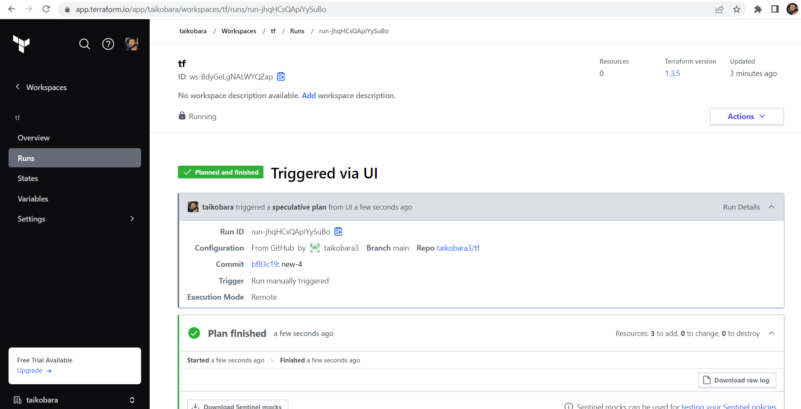
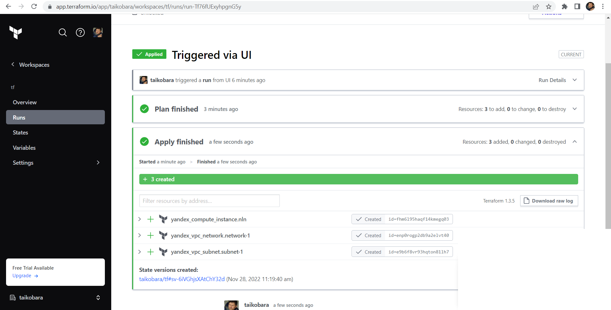
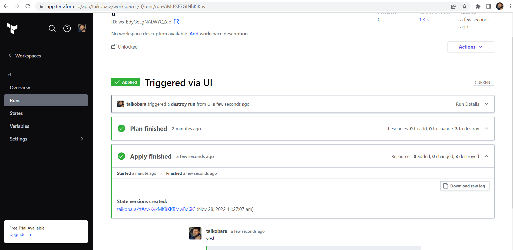
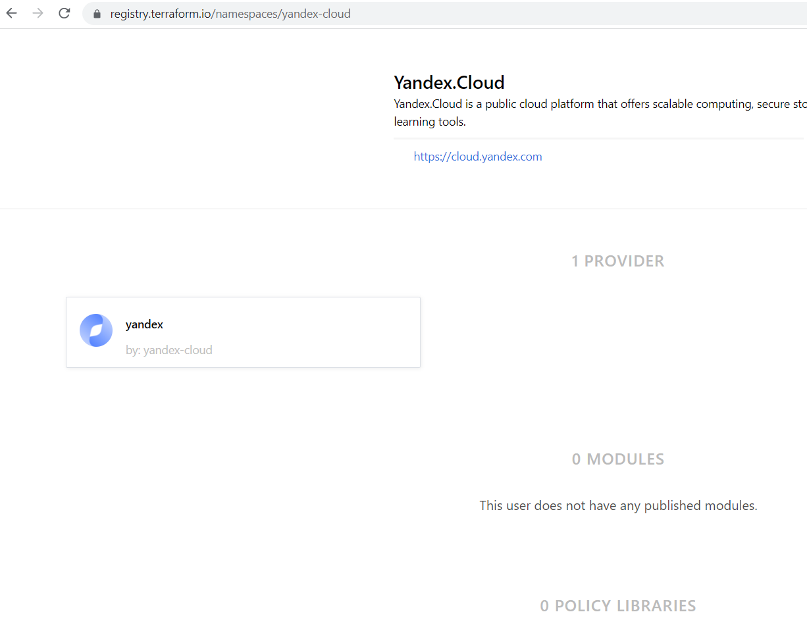

# Домашнее задание к занятию "7.4. Средства командной работы над инфраструктурой."

## Задача 1





## Задача 2

server.yaml:
```
repos:
- id: github.com/taikobara3/tf
  workflow: test
  allowed_overrides: [workflow]
  
workflows:
  custom:
    plan:
      steps:
      - plan:
          extra_args: ["-lock", "false"]
```

atlantis.yaml:
```
version: 3
projects:
- dir: .
  workspace: stage
  autoplan:
    when_modified: ["*.tf"]
    enabled: true
- dir: .
  workspace: prod
  autoplan:
    when_modified: ["*.tf"]
    enabled: true
```

## Задача 3

Официальных моделей для YC мне найти не удалось:



В нотации ec2 создание инстанса должно было выглядеть, наверное, как-то так:

```
module "ec2_cluster" {
  source  = "terraform-aws-modules/ec2-instance/aws"
  version = "~> 2.0"

  name = "nl-1"
  ami  = data.aws_ami.ubuntu.id

  instance_count = 1
  instance_type  = "t3.micro"

  monitoring             = true
  vpc_security_group_ids = ["sg-12345678"]
  subnet_id              = "subnet-eddcdzz4"

  tags = {
    Terraform   = "true"
    Environment = "prod"
  }
}
```